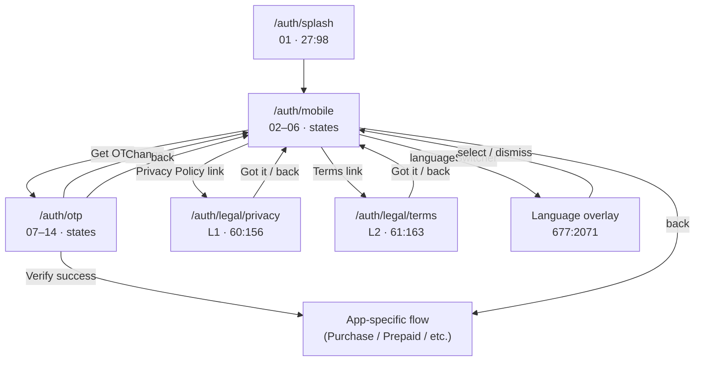
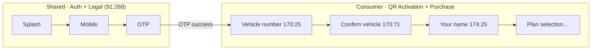

# Auth Foundation Audit — Shared · Auth + Legal

**App:** `@autolokate/onboarding`  
**Date:** 2026-06-17  
**Mode:** Audit only — no code changes, no implementation  
**Source of truth:** Figma section **`91:268`** · **Shared · Auth + Legal · common to all 3 apps · ✅ READY FOR DEV**  
**File:** [Autolokate · Consumer App](https://www.figma.com/design/FtHCUnE0HH586PtG5yJyG0/) (`FtHCUnE0HH586PtG5yJyG0`)

**Purpose:** Complete inventory before resetting Shared · Auth + Legal. Current R01–R06 implementation is architecturally invalid for this section.

**Related:** [AUTH_FIGMA_PARITY_SIGNOFF.md](./AUTH_FIGMA_PARITY_SIGNOFF.md) (visual parity audit · verdict NOT READY)

---

## Executive summary

Figma defines a **cross-app auth foundation** of **3 interactive surfaces + 2 legal readers + 1 overlay**, not a 6-step vehicle onboarding pipeline.

| Dimension | Figma Shared · Auth + Legal | Current code (`shared-auth` + `shared-legal`) |
|-----------|----------------------------|-----------------------------------------------|
| Interactive steps | Splash → **Mobile** → **OTP** | R01 vehicle → R02 RC → R03 mobile → R04 OTP → R05 name → R06 legal gate |
| Step progress | **5 segments** (`Step1of5` on Mobile, `Step2of5` on OTP) | **6 segments** (`SHARED_FLOW_STEP_COUNT = 6`) |
| Legal consent | **Inline checkbox on Mobile** | Standalone R06 gate |
| Legal documents | **L1 / L2 scroll readers** (linked from Mobile) | Not implemented |
| Total Figma frames | **18** (17 screens + 1 overlay) | 6 screens with wrong mapping |

**Verdict:** Current shared auth must be **reset**. R01, R02, R05, and R06 do **not** belong in Shared Auth. R03/R04 require full rebuild against Figma state matrix.

---

## 1. Screen inventory

### 1.1 Figma frames (section `91:268`)

| # | Screen name | Node ID | Purpose | Documented states |
|---|-------------|---------|---------|-------------------|
| 01 | Splash | `27:98` | App entry; logo + tagline + loading indicator | default (loading) |
| 02 | Mobile · Empty | `102:268` | Collect mobile; consent unchecked; CTA disabled | empty, disabled |
| 03 | Mobile · Filled | `44:133` | Mobile entered; consent unchecked; CTA disabled | filled, disabled |
| 04 | Mobile · Ready | `102:303` | Mobile + consent checked; CTA enabled | ready |
| 05 | Mobile · Error | `102:334` | Invalid mobile; field error | error |
| 06 | Mobile · Offline | `557:1606` | No connectivity; blocked submit | offline |
| 07 | OTP · Default | `103:324` | Empty OTP; resend countdown | empty, disabled |
| 08 | OTP · Typing | `29:100` | Partial digits entered | filled (partial) |
| 09 | OTP · Verifying | `103:408` | Submit in flight | verifying, loading |
| 10 | OTP · Success | `103:453` | Code accepted | success |
| 11 | OTP · Error | `103:364` | Wrong code | error |
| 12 | OTP · Network error | `556:1577` | Server unreachable | network error |
| 13 | OTP · Resend | `130:419` | Cooldown elapsed; resend link active | resend |
| 14 | OTP · Resend failed | `557:1647` | Resend API failed | resend failed |
| L1 | Privacy Policy | `60:156` | Scrollable policy reader | default |
| L2 | Terms & Conditions | `61:163` | Scrollable terms reader | default |
| — | Language picker (overlay) | `677:2071` | Bottom sheet language selection | default |

**Frame count:** 18 total (16 full-screen frames + 1 overlay + section root)

### 1.2 State variant matrix

#### Mobile (`102:268` family) — 5 states

| State | Node | Field | Checkbox | CTA | Helper / chip |
|-------|------|-------|----------|-----|---------------|
| Empty | `102:268` | placeholder "Mobile number" | Off | Disabled · **Get OTP** | **Enter your number to continue** |
| Filled | `44:133` | `98765 43210` | Off | Disabled | **Accept the terms to continue** |
| Ready | `102:303` | filled | **On** | **Enabled · Get OTP** | — |
| Error | `102:334` | error stroke | On | Disabled | **Enter a valid number to continue** · field: **Enter your 10-digit number, no 0 or +91 in front** |
| Offline | `557:1606` | filled | On | Disabled | **Offline, we'll send the code once you're back** · `AlOfflineChip`: **You're offline, we'll retry** |

All Mobile frames share:
- Progress: **`AlStepProgress/Step1of5`**
- Headline: **What's your number?**
- Body: **We'll send a code on WhatsApp (or SMS)**
- Trust row: **Encrypted at rest · never sold to third parties**
- Consent: **So Autolokate can keep you safe and run your vehicle services, I agree to the {Privacy Policy} and {Terms}. You can withdraw anytime.**
- Language switcher: **English** + chevron (top-right pill)

#### OTP (`103:324` family) — 8 states

| State | Node | OTP input | CTA | Status row |
|-------|------|-----------|-----|------------|
| Default | `103:324` | Empty | Disabled · **Verify** | **Resend code in 0:24** |
| Typing | `29:100` | Partial | Enabled/disabled per fill | Countdown |
| Verifying | `103:408` | Filled | **`AlButton/Primary·Loading`** | Countdown |
| Success | `103:453` | **`AlOtpInput/Success`** (green) | No footer CTA | — |
| Error | `103:364` | **`AlOtpInput/Error`** (amber) | **Verify** | **Incorrect code, try again** · **{Resend code}** · **`AlSmsFallback`**: Didn't get the code? **Get it by SMS** |
| Network error | `556:1577` | Filled | **Verify** | **Couldn't reach the server, tap Verify to retry** · Resend + SMS fallback |
| Resend | `130:419` | Filled | Disabled | **{Resend code}** active link: Resend failed | `557:1647` | Filled | Disabled | **Couldn't resend, check your connection and try again** · Resend + SMS fallback |

All OTP frames share:
- Progress: **`AlStepProgress/Step2of5`**
- Headline: **Enter the 6-digit code**
- Body: **Sent on WhatsApp to 98765 43210** + underlined **Change** link
- Content column gap: **24px** (vs Mobile **20px**)

#### Splash (`27:98`)

| Element | Copy / component |
|---------|------------------|
| Logo | `Logo` instance (`158:25`) |
| Tagline | **Your car's daily companion** |
| Loading | SVG progress bar |
| Ambient | Green radial tint |

#### Legal readers

| Screen | Node | Header | Footer CTA | Content |
|--------|------|--------|------------|---------|
| L1 · Privacy Policy | `60:156` | **Privacy Policy** + back | **Got it** | Last updated 17 Jun 2026 · What we collect · Why we use it · Your DPDP rights · How we protect it · Grievance Officer |
| L2 · Terms & Conditions | `61:163` | **Terms & Conditions** + back | **Got it** | Service description · Your responsibilities · Liability · Changes to these terms · Contact |

#### Language picker overlay (`677:2071`)

| Element | Copy |
|---------|------|
| Title | **Choose your language** |
| Rows | **English** ✓ · **हिंदी / Hindi** |
| Chrome | Scrim + bottom sheet, drag handle |

---

## 2. Flow order

### 2.1 Figma canonical order (Shared · Auth + Legal)

```
01 Splash
  ↓ (auto-advance / app bootstrap)
02–06 Mobile  [Step 1 of 5]
  ├─→ L1 Privacy Policy  (modal push from consent link)
  ├─→ L2 Terms & Conditions  (modal push from consent link)
  └─→ Language picker overlay  (sheet from languageSwitcher)
  ↓ Get OTP (requires: valid mobile + consent checked + online)
07–14 OTP  [Step 2 of 5]
  ├─ Change → back to Mobile
  ├─ Resend / SMS fallback / network retry (in-place state changes)
  └─ Success → exit Shared Auth (hand off to app-specific onboarding)
```

**Notes:**
- Steps 3–5 of the **5-segment progress bar** are **not defined in this Figma section**. They belong to downstream app flows (e.g. Consumer Purchase: vehicle, name, plan).
- **L1/L2 are readers**, not sequential gates. User returns to Mobile after **Got it**.
- **Consent is captured on Mobile**, not on a separate post-OTP screen.

### 2.2 Current code order (invalid for Shared Auth)

```
R01 Vehicle number     → shared.vehicle-number   (Purchase Figma 170:25)
R02 Vehicle details    → shared.vehicle-details  (Purchase Figma 170:71)
R03 Mobile number      → shared.mobile           (partial Mobile frames)
R04 OTP verification   → shared.otp              (partial OTP frames)
R05 Account creation   → shared.account          (Purchase Figma 174:25)
R06 Legal consent      → shared.legal            (invented gate — not in Figma)
```

Defined in:
- `apps/onboarding/src/flow/registry/config/shared-pipeline.config.ts`
- `apps/onboarding/src/features/shared-auth/auth-flow/SharedAuthSegment.tsx`
- `apps/onboarding/src/types/flow.ts` (`SHARED_FLOW_STEP_COUNT = 6`)

---

## 3. Exact route graph

### 3.1 Target route graph (from Figma — rebuild spec)



**State routing:** Mobile and OTP are **single routes with view-state props**, not separate URL segments per Figma frame (matches Emergency flow pattern).

**Skip / block paths:**

| From | Condition | Target |
|------|-----------|--------|
| Mobile | offline | stay on Mobile · offline state |
| Mobile | invalid number | stay · error state |
| Mobile | consent unchecked | stay · filled/disabled state |
| OTP | wrong code | stay · error state |
| OTP | network fail on verify | stay · network error state |
| OTP | resend fail | stay · resend failed state |

### 3.2 Current route graph (to remove / relocate)

| Route | Step ID | Belongs in Shared Auth? |
|-------|---------|-------------------------|
| `/shared/r01-vehicle-number` | `shared.vehicle-number` | **No** → Purchase |
| `/shared/r02-vehicle-details` | `shared.vehicle-details` | **No** → Purchase |
| `/shared/r03-mobile-number` | `shared.mobile` | **Partial** → rebuild as `/auth/mobile` |
| `/shared/r04-otp-verification` | `shared.otp` | **Partial** → rebuild as `/auth/otp` |
| `/shared/r05-account-creation` | `shared.account` | **No** → Purchase |
| `/shared/r06-legal-consent` | `shared.legal` | **No** → remove gate; add L1/L2 readers |

Also wired via `SharedAuthSegment` step index 0–5 and `PurchaseRoutes` redirect to `r06-legal-consent`.

---

## 4. Component inventory

### 4.1 Figma components used in section `91:268`

| Component | Figma ID | Used on | In `@autolokate/ui`? | In onboarding? |
|-----------|----------|---------|----------------------|------------------|
| Logo | `158:25` | Splash | ◐ (asset) | ✗ |
| StatusBar | `9:2` | All frames | ✗ (native) | ✗ |
| icon/arrow-left | `19:5` | All interactive | ✓ icons | ✓ shell back |
| AlStepProgress/Step1of5 | `85:26` | Mobile | ◐ generic step | ✗ wrong count (6) |
| AlStepProgress/Step2of5 | `85:32` | OTP | ◐ generic step | ✗ wrong index |
| AlTextField | `74:19` | Mobile | ✓ | ✓ R03 |
| AlCheckbox/Off · On | `81:25` · `81:23` | Mobile | ✓ | ✗ not on R03 |
| icon/shield-check | `18:11` | Mobile trust row | ✓ | ✗ |
| AlButton/Primary | `6:2` | Mobile ready, OTP, L1/L2 | ✓ | ✓ |
| AlButton/Primary·Disabled | `53:17` | Mobile/OTP disabled | ✓ | ◐ |
| AlButton/Primary·Loading | — | OTP verifying | ✓ | ✓ shell |
| AlOtpInput/Empty | `101:26` | OTP default | ✓ | ✓ |
| AlOtpInput | `75:19` | OTP typing | ✓ | ✓ |
| AlOtpInput/Filled | `552:2502` | OTP filled | ✓ | ◐ |
| AlOtpInput/Success | `101:46` | OTP success | ✓ | ◐ |
| AlOtpInput/Error | `101:33` | OTP error (amber) | ✓ (token drift) | ◐ red vs amber |
| AlSmsFallback | `649:2068` | OTP error/resend/network | **✗** | **✗** |
| AlOfflineChip | `580:1743` | Mobile offline | **✗** | **✗** |
| languageSwitcher | `559:1636` | Mobile top-right | **✗** | **✗** |
| Language picker sheet | `677:2071` | Overlay | **✗** | **✗** |
| ctaHelper | text node | Mobile footer | **✗** | **✗** |
| Change link | text node | OTP description | **✗** | **✗** |
| Consent block + hotspots | frame | Mobile | **✗** | **✗** (deferred to R06) |
| Legal reader scroll body | frame | L1/L2 | **✗** | **✗** |
| EmptyStateHero | — | — | onboarding comp | ✗ **invented** on R01/R02/R06 |
| AlPlateInput | — | — | ✓ | ✗ **wrong section** (R01) |
| AlVehicleRcCard | `170:79` | — | ✓ | ✗ **wrong section** (R02) |

### 4.2 Existing code screens (current mapping)

| Code | File | Figma Shared mapping | Valid? |
|------|------|---------------------|--------|
| R01 | `features/shared-auth/screens/r01-vehicle-number/` | None (`170:25` Purchase) | **Remove from Shared Auth** |
| R02 | `features/shared-auth/screens/r02-vehicle-details/` | None (`170:71` Purchase) | **Remove from Shared Auth** |
| R03 | `features/shared-auth/screens/r03-mobile-number/` | `02–06` partial | **Rebuild** |
| R04 | `features/shared-auth/screens/r04-otp-verification/` | `07–14` partial | **Rebuild** |
| R05 | `features/shared-auth/screens/r05-account-creation/` | None (`174:25` Purchase) | **Remove from Shared Auth** |
| R06 | `features/shared-legal/screens/r06-legal-consent/` | None (consent on Mobile; L1/L2 readers) | **Remove gate; add readers** |

Orchestration: `SharedAuthSegment.tsx` · routes in `routes.schema.ts` · shell via `FlowStepShell.tsx`

---

## 5. Missing components

Components/compositions required for Figma parity that do **not** exist in code:

| Priority | Component / composition | Figma ref | Needed for |
|----------|-------------------------|-----------|------------|
| P0 | **Inline consent block** (checkbox + linked Privacy/Terms copy) | `102:277` | Mobile all states |
| P0 | **Language switcher pill** | `559:1636` | Mobile |
| P0 | **Language picker bottom sheet** | `677:2071` | Mobile overlay |
| P0 | **Trust row** (shield-check + caption) | `102:280` | Mobile |
| P0 | **ctaHelper** footer caption | `129:420` | Mobile disabled/error/offline |
| P0 | **AlOfflineChip** | `580:1743` | Mobile offline |
| P0 | **AlSmsFallback** | `649:2068` | OTP error/network/resend-failed |
| P0 | **Change number link** (inline in OTP description) | `646:2057` | OTP all states |
| P0 | **Legal document reader** (scroll + Got it) | `60:156` · `61:163` | L1 · L2 |
| P0 | **Splash screen** | `27:98` | Entry |
| P1 | **AlStepProgress Step1of5 / Step2of5** (5 segments, correct placement above headline) | `85:26` · `85:32` | Mobile · OTP |
| P1 | **Resend code inline link** (underlined, not ghost button) | `103:364` | OTP error/resend |
| P1 | **Orange error ambient tint** on Mobile/OTP error | error frames | Error states |
| P2 | OTP **resendFailedMsg** banner | `557:1682` | Resend failed |
| P2 | Legal reader **section headings** layout | L1/L2 body | Document structure |

**DS gaps** (documented in FIGMA_RC2): `AlOtpInput/Error` uses red danger token; Figma specifies amber `#F5A623`.

---

## 6. Remove list

Items currently in **Shared Auth** that must be **removed or relocated** before rebuild:

### 6.1 Screens to remove from Shared Auth scope

| Item | Current location | Relocate to |
|------|------------------|-------------|
| R01 · Vehicle number | `shared-auth/screens/r01-vehicle-number` | **Consumer · QR Activation + Purchase** (`170:25`) |
| R02 · Confirm vehicle | `shared-auth/screens/r02-vehicle-details` | **Purchase** (`170:71`) |
| R05 · Your name | `shared-auth/screens/r05-account-creation` | **Purchase** (`174:25`) |
| R06 · Legal consent gate | `shared-legal/screens/r06-legal-consent` | **Delete gate**; consent → Mobile; docs → L1/L2 |

### 6.2 Config / architecture to remove or replace

| Item | File | Action |
|------|------|--------|
| `shared.vehicle-number` step | `shared-pipeline.config.ts` | Remove from Shared Auth pipeline |
| `shared.vehicle-details` step | `shared-pipeline.config.ts` | Remove |
| `shared.account` step | `shared-pipeline.config.ts` | Remove |
| `shared.legal` as sequential gate | `shared-pipeline.config.ts` | Replace with `legal.privacy` / `legal.terms` readers (linked, not gated) |
| `SHARED_FLOW_STEP_COUNT = 6` | `types/flow.ts` | Replace with **5** (Figma progress model) |
| R01–R02–R05 routes under `/shared/` | `routes.schema.ts` | Remove or move to `/journey/purchase/` |
| `SharedAuthSegment` 6-step reducer | `SharedAuthSegment.tsx` | Replace with Splash → Mobile → OTP graph |
| Invented `EmptyStateHero` states on auth | R01/R02/R06 | Remove — not in Shared Figma |
| Extra R03 caption "Standard SMS rates may apply" | R03 | Remove — not in Figma |
| R04 ghost "Resend OTP" button pattern | R04 | Replace with Figma inline resend link + SMS fallback |
| Description `text-transform: lowercase` | `flow-step-shell.css` | Fix — Figma uses sentence case |

### 6.3 Screens that do NOT belong in Shared Auth (summary)

These are **implemented under `shared-auth` today** but **absent from section `91:268`**:

1. **R01** — Vehicle number (Purchase)
2. **R02** — Vehicle RC confirm (Purchase)
3. **R05** — Account / name creation (Purchase)
4. **R06** — Standalone legal consent gate (Figma uses inline Mobile consent + L1/L2 readers)

---

## 7. Final Shared Auth structure

### 7.1 Canonical screen list (post-reset)

| ID | Screen | Route (proposed) | Figma nodes | Progress |
|----|--------|------------------|-------------|----------|
| S0 | Splash | `/auth/splash` | `27:98` | — |
| A1 | Mobile capture | `/auth/mobile` | `102:268` · `44:133` · `102:303` · `102:334` · `557:1606` | Step **1** of 5 |
| A2 | OTP verification | `/auth/otp` | `103:324` · `29:100` · `103:408` · `103:453` · `103:364` · `556:1577` · `130:419` · `557:1647` | Step **2** of 5 |
| L1 | Privacy Policy reader | `/auth/legal/privacy` | `60:156` | — |
| L2 | Terms & Conditions reader | `/auth/legal/terms` | `61:163` | — |
| — | Language picker | overlay on Mobile | `677:2071` | — |

**Total interactive auth steps in this section:** 2 (Mobile + OTP)  
**Total frames to implement:** 18 (including all state variants)

### 7.2 Copy & CTA reference (source of truth)

#### Mobile

| Element | Figma copy |
|---------|------------|
| Headline | What's your number? |
| Description | We'll send a code on WhatsApp (or SMS) |
| Field label/placeholder | Mobile number |
| Primary CTA | Get OTP |
| ctaHelper (empty) | Enter your number to continue |
| ctaHelper (filled, no consent) | Accept the terms to continue |
| ctaHelper (error) | Enter a valid number to continue |
| ctaHelper (offline) | Offline, we'll send the code once you're back |
| Field error | Enter your 10-digit number, no 0 or +91 in front |
| Consent | So Autolokate can keep you safe and run your vehicle services, I agree to the Privacy Policy and Terms. You can withdraw anytime. |
| Trust row | Encrypted at rest · never sold to third parties |
| Offline chip | You're offline, we'll retry |

#### OTP

| Element | Figma copy |
|---------|------------|
| Headline | Enter the 6-digit code |
| Description | Sent on WhatsApp to {number} · **Change** |
| Primary CTA | Verify |
| Resend (countdown) | Resend code in 0:24 |
| Resend (active) | Resend code (underlined link) |
| Error | Incorrect code, try again |
| Network error | Couldn't reach the server, tap Verify to retry |
| Resend failed | Couldn't resend, check your connection and try again |
| SMS fallback | Didn't get the code? **Get it by SMS** |

#### Legal readers

| Element | Figma copy |
|---------|------------|
| L1 title | Privacy Policy |
| L2 title | Terms & Conditions |
| Dismiss CTA | Got it |

### 7.3 Hand-off points

After OTP success (`103:453`), Shared Auth **ends**. Consumer app continues into **Purchase activation** (vehicle → confirm → name → plan) — those frames live outside section `91:268`.



### 7.4 Reuse from current codebase (keep, refactor)

| Asset | Reuse notes |
|-------|-------------|
| `FlowStepShell` | Keep shell; fix progress placement, step count, footer ctaHelper slot |
| `R03MobileNumberScreen` | Scaffold only — add consent, language, trust, offline, Figma copy |
| `R04OtpVerificationScreen` | Scaffold only — add Change, SMS fallback, network/resend-failed states |
| `auth-flow.validation.ts` | Mobile/OTP validation logic largely portable |
| `@autolokate/ui` primitives | AlTextField, AlOtpInput, AlButton, AlCheckbox — use as-is with state props |

---

## 8. Figma parity checklist (foundation)

| Frame | Node | In Shared Auth scope | Current code | Status |
|-------|------|---------------------|--------------|--------|
| 01 · Splash | `27:98` | ✓ | — | ✗ Missing |
| 02 · Mobile · Empty | `102:268` | ✓ | R03 partial | ◐ Rebuild |
| 03 · Mobile · Filled | `44:133` | ✓ | R03 partial | ◐ Rebuild |
| 04 · Mobile · Ready | `102:303` | ✓ | R03 partial | ◐ Rebuild |
| 05 · Mobile · Error | `102:334` | ✓ | R03 error partial | ◐ Rebuild |
| 06 · Mobile · Offline | `557:1606` | ✓ | — | ✗ Missing |
| 07 · OTP · Default | `103:324` | ✓ | R04 partial | ◐ Rebuild |
| 08 · OTP · Typing | `29:100` | ✓ | R04 partial | ◐ Rebuild |
| 09 · OTP · Verifying | `103:408` | ✓ | R04 loading | ◐ Rebuild |
| 10 · OTP · Success | `103:453` | ✓ | R04 success partial | ◐ Rebuild |
| 11 · OTP · Error | `103:364` | ✓ | R04 error partial | ◐ Rebuild |
| 12 · OTP · Network error | `556:1577` | ✓ | — | ✗ Missing |
| 13 · OTP · Resend | `130:419` | ✓ | R04 partial | ◐ Rebuild |
| 14 · OTP · Resend failed | `557:1647` | ✓ | — | ✗ Missing |
| L1 · Privacy Policy | `60:156` | ✓ | — | ✗ Missing |
| L2 · Terms & Conditions | `61:163` | ✓ | — | ✗ Missing |
| Language picker | `677:2071` | ✓ | — | ✗ Missing |

**Coverage:** 0 / 18 frames fully implemented · 9 partial · 9 missing · 4 code screens outside section

---

## 9. Appendix

### Figma URLs

| Frame | URL |
|-------|-----|
| Section | [91:268](https://www.figma.com/design/FtHCUnE0HH586PtG5yJyG0/?node-id=91-268) |
| Splash | [27:98](https://www.figma.com/design/FtHCUnE0HH586PtG5yJyG0/?node-id=27-98) |
| Mobile · Empty | [102:268](https://www.figma.com/design/FtHCUnE0HH586PtG5yJyG0/?node-id=102-268) |
| Mobile · Ready | [102:303](https://www.figma.com/design/FtHCUnE0HH586PtG5yJyG0/?node-id=102-303) |
| Mobile · Error | [102:334](https://www.figma.com/design/FtHCUnE0HH586PtG5yJyG0/?node-id=102-334) |
| Mobile · Offline | [557:1606](https://www.figma.com/design/FtHCUnE0HH586PtG5yJyG0/?node-id=557-1606) |
| OTP · Default | [103:324](https://www.figma.com/design/FtHCUnE0HH586PtG5yJyG0/?node-id=103-324) |
| OTP · Error | [103:364](https://www.figma.com/design/FtHCUnE0HH586PtG5yJyG0/?node-id=103-364) |
| OTP · Network error | [556:1577](https://www.figma.com/design/FtHCUnE0HH586PtG5yJyG0/?node-id=556-1577) |
| OTP · Resend failed | [557:1647](https://www.figma.com/design/FtHCUnE0HH586PtG5yJyG0/?node-id=557-1647) |
| Privacy Policy | [60:156](https://www.figma.com/design/FtHCUnE0HH586PtG5yJyG0/?node-id=60-156) |
| Terms | [61:163](https://www.figma.com/design/FtHCUnE0HH586PtG5yJyG0/?node-id=61-163) |
| Language picker | [677:2071](https://www.figma.com/design/FtHCUnE0HH586PtG5yJyG0/?node-id=677-2071) |

### Misplaced Purchase frames (not Shared Auth)

| Screen | Node | Section |
|--------|------|---------|
| R03 · Vehicle number | `170:25` | Consumer · QR Activation + Purchase |
| R05 · Confirm vehicle | `170:71` | Consumer · QR Activation + Purchase |
| R02 · Your name | `174:25` | Consumer · QR Activation + Purchase |

### Code files audited

| Path | Role |
|------|------|
| `apps/onboarding/src/flow/registry/config/shared-pipeline.config.ts` | Invalid 6-step pipeline |
| `apps/onboarding/src/features/shared-auth/auth-flow/SharedAuthSegment.tsx` | Invalid orchestration |
| `apps/onboarding/src/features/shared-auth/screens/r01–r05/` | Wrong / partial screens |
| `apps/onboarding/src/features/shared-legal/screens/r06-legal-consent/` | Wrong consent model |
| `apps/onboarding/src/components/flow-step-shell/FlowStepShell.tsx` | Shell (reuse with fixes) |
| `apps/onboarding/src/router/routes.schema.ts` | Route definitions |

---

**Audit complete.** No code was modified. Ready for Shared · Auth + Legal rebuild against section `91:268`.
