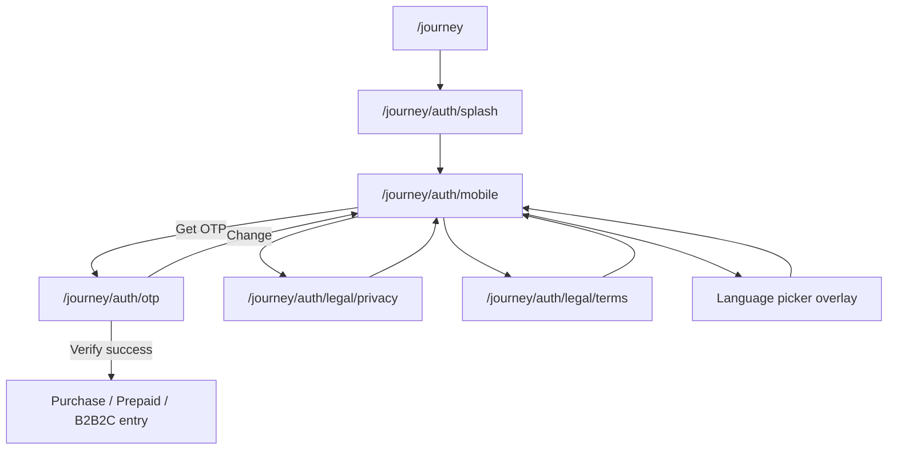

# Auth Rebuild Implementation

**Date:** 2026-06-17  
**Source of truth:** [AUTH_FOUNDATION_AUDIT.md](./AUTH_FOUNDATION_AUDIT.md) · Figma section **`91:268`**  
**App:** `@autolokate/onboarding`

---

## Summary

Shared · Auth + Legal has been rebuilt to match Figma:

**S0 Splash → A1 Mobile → A2 OTP → Activation entry**

Legal readers (L1/L2) are side routes from Mobile. Deprecated R01/R02/R05/R06 were **moved** to `purchase-activation/` (files preserved, re-export shims remain).

---

## Removed from Shared Auth (relocated)

| Screen | Old location | New location | Figma (actual) |
|--------|--------------|--------------|----------------|
| R01 · Vehicle Number | `shared-auth/screens/r01-*` | `purchase-activation/screens/r01-*` | Purchase `170:25` |
| R02 · Vehicle Details | `shared-auth/screens/r02-*` | `purchase-activation/screens/r02-*` | Purchase `170:71` |
| R05 · Account Creation | `shared-auth/screens/r05-*` | `purchase-activation/screens/r05-*` | Purchase `174:25` |
| R06 · Legal Consent gate | `shared-legal/screens/r06-*` | `purchase-activation/screens/r06-*` | Not in Shared Auth |

Re-export shims at old paths remain for backward compatibility.

---

## New screens

| ID | Screen | Path | Figma nodes |
|----|--------|------|-------------|
| S0 | Splash | `/journey/auth/splash` | `27:98` |
| A1 | Mobile | `/journey/auth/mobile` | `102:268` · `44:133` · `102:303` · `102:334` · `557:1606` |
| A2 | OTP | `/journey/auth/otp` | `103:324` · `29:100` · `103:408` · `103:453` · `103:364` · `556:1577` · `130:419` · `557:1647` |
| L1 | Privacy Policy | `/journey/auth/legal/privacy` | `60:156` |
| L2 | Terms & Conditions | `/journey/auth/legal/terms` | `61:163` |
| — | Language picker | overlay on Mobile | `677:2071` |

---

## Route graph

**Orchestration:** `journey/routes/AuthRoutes.tsx`  
**Routing constants:** `journey/auth/auth-routing.ts`

---

## New components

| Component | Location | Figma ref |
|-----------|----------|-----------|
| `AuthStepShell` | `components/auth-step-shell/` | Progress above headline, ctaHelper, no StatusBar |
| `TrustRow` | `components/compositions/trust-row/` | Mobile trust row |
| `InlineConsentBlock` | `components/compositions/inline-consent-block/` | Mobile consent |
| `LanguageSwitcher` | `components/compositions/language-switcher/` | `559:1636` |
| `LanguagePickerSheet` | `components/compositions/language-picker-sheet/` | `677:2071` |
| `AlSmsFallback` | `components/compositions/al-sms-fallback/` | `649:2068` |
| `AlOfflineChip` | `components/compositions/al-offline-chip/` | `580:1743` |

---

## Validation (demo)

| Field | Valid | Invalid | Notes |
|-------|-------|---------|-------|
| Mobile | `9999999999` | all others | Display: `99999 99999` |
| OTP | `123456` | all others | Expired: `000000` |

Resend cooldown: **24s** (Figma `0:24`).

---

## Shell fixes

- **Progress:** Step **1/5** on Mobile, **2/5** on OTP (`SHARED_AUTH_PROGRESS_TOTAL = 5`)
- **Placement:** Progress **above** headline (not below)
- **StatusBar:** Removed from auth screens (native chrome; Splash has no StatusBar in Figma)
- **Description:** Sentence case preserved (no forced lowercase)
- **Error tint:** Orange ambient on Mobile/OTP error via `ob-auth-shell--error`
- **Footer:** `ctaHelper` caption above CTA on Mobile disabled states

---

## Figma parity checklist

| Frame | Node | Implemented | Notes |
|-------|------|---------------|-------|
| 01 · Splash | `27:98` | ✓ | Logo, tagline, loading bar |
| 02 · Mobile · Empty | `102:268` | ✓ | |
| 03 · Mobile · Filled | `44:133` | ✓ | |
| 04 · Mobile · Ready | `102:303` | ✓ | |
| 05 · Mobile · Error | `102:334` | ✓ | |
| 06 · Mobile · Offline | `557:1606` | ✓ | `navigator.onLine` |
| 07 · OTP · Default | `103:324` | ✓ | |
| 08 · OTP · Typing | `29:100` | ✓ | |
| 09 · OTP · Verifying | `103:408` | ✓ | |
| 10 · OTP · Success | `103:453` | ✓ | Footer hidden |
| 11 · OTP · Error | `103:364` | ✓ | |
| 12 · OTP · Network error | `556:1577` | ✓ | Offline on verify |
| 13 · OTP · Resend | `130:419` | ✓ | |
| 14 · OTP · Resend failed | `557:1647` | ✓ | Offline on resend |
| L1 · Privacy Policy | `60:156` | ✓ | Figma copy |
| L2 · Terms | `61:163` | ✓ | Figma copy |
| Language picker | `677:2071` | ✓ | English · Hindi |

---

## Responsive QA

Dev preview (`?dev=1`) supports widths **320 · 360 · 375 · 390 · 414** and **light/dark** themes.

| Width | Result |
|-------|--------|
| 320 | OTP 6-cell row fits; consent wraps |
| 360–414 | Column max 393px centered |
| Light/Dark | Theme toggle via `data-theme` |

---

## Remaining gaps

| Gap | Severity | Notes |
|-----|----------|-------|
| OTP error border color | Minor | DS `AlOtpInput` error token vs Figma amber `#F5A623` (FIGMA_RC2) |
| Purchase vehicle/name steps | Expected | R01/R02/R05 relocated; not yet wired into `/journey/purchase` |
| Hindi copy | Minor | Language picker UI only; strings not localized |
| Splash loading animation | N/A | Figma static bar — no motion spec implemented |
| Light theme frame audit | Minor | Dark parity primary; light uses DS tokens |

---

## Key files

| Area | Path |
|------|------|
| Routes | `journey/routes/AuthRoutes.tsx` |
| Screens | `features/shared-auth/screens/s0-splash` · `a1-mobile` · `a2-otp` |
| Legal | `features/shared-legal/screens/l1-*` · `l2-*` |
| Validation | `features/shared-auth/auth-flow/auth-flow.validation.ts` |
| Pipeline | `flow/registry/config/shared-pipeline.config.ts` |
| Dev preview | `dev/ScreenDevApp.tsx` |

---

## Test plan

1. Home → select flow → lands on **Splash** → auto-advance to **Mobile**
2. Mobile empty → disabled CTA + helper **Enter your number to continue**
3. Enter `99999 99999` without consent → **Accept the terms to continue**
4. Check consent → **Get OTP** enabled → OTP screen
5. OTP `123456` → success → activation entry (purchase/prepaid/b2b2c)
6. OTP `000000` → expired error
7. OTP wrong code → error + resend + SMS fallback
8. Privacy/Terms links → readers → **Got it** → Mobile
9. Language picker → English/Hindi selection
10. Dev preview: all 16 auth frames at 320–414, light + dark
