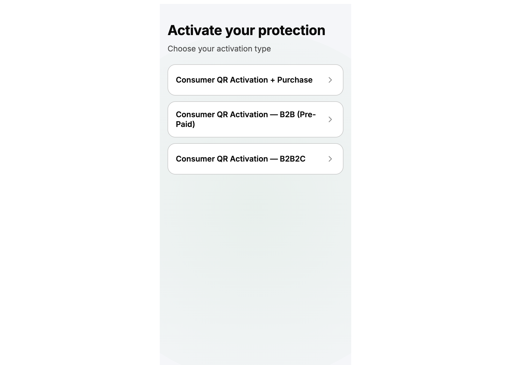

# B2B2C Welcome Loading Fix Report

**Issue:** `/journey/b2b2c/welcome` remained in loading state indefinitely.  
**Scope:** Welcome-screen state transition only (no auth / emergency / UI redesign).  
**Build:** `pnpm --filter @autolokate/onboarding build` ✓

---

## Root cause

`PartnerWelcomeScreen` passed an **inline arrow** to `useWelcomeLanding`:

```tsx
loadConfig: () => getDemoPartnerLandingEntitlement(variant),
```

That function received a **new reference on every render**. `useWelcomeLanding` listed `loadConfig` in its `useEffect` dependency array, so the effect re-ran after every successful fetch:

1. Fetch completes → `viewState = 'default'`, `config` set  
2. Re-render → new `loadConfig` reference  
3. Effect re-runs → `viewState = 'loading'`, fetch restarted  
4. Loop never reaches a stable success UI  

`PrepaidWelcomeScreen` used a **stable module function** (`getDemoPrepaidLandingEntitlement`) and was not affected by the infinite loop, but shared the wrong **600ms** delay instead of Figma’s **2s** loading duration.

---

## Before behavior

| Route | `?demo` | Behavior |
|-------|---------|----------|
| `/journey/b2b2c/welcome` | _(none)_ | Stuck on loading skeleton + “Loading your plan…” forever |
| `/journey/b2b2c/welcome/plan-rider` | _(none)_ | Same infinite loading |
| `/journey/b2b2c/welcome` | `loading` | Pinned loading (intended QA) |
| `/journey/b2b2c/welcome` | `error` | Could not reliably reach error (effect loop reset) |
| `/journey/prepaid/welcome` | _(none)_ | Resolved after **600ms** (too fast vs Figma) |

---

## After behavior

| Route | `?demo` | Behavior |
|-------|---------|----------|
| `/journey/b2b2c/welcome` | _(none)_ | Loading **2s** → Partner welcome **plan only** (Secure · Paid) |
| `/journey/b2b2c/welcome/plan-rider` | _(none)_ | Loading **2s** → Partner welcome **plan + rider** copy + addon row |
| `/journey/b2b2c/welcome` | `loading` | Pinned loading (no auto-resolve) |
| `/journey/b2b2c/welcome` | `error` | Loading **2s** → error panel + Retry CTA |
| `/journey/prepaid/welcome` | _(none)_ | Loading **2s** → Pre-paid welcome (Shield · Active · Included) |
| `/journey/prepaid/welcome` | `loading` / `error` | Same QA semantics as B2B2C |

---

## State transition diagram

```mermaid
stateDiagram-v2
  [*] --> loading: mount / retry

  loading --> loading: demo=loading (QA pinned)
  loading --> error: fetch fails OR demo=error after 2s
  loading --> default: fetch success after 2s

  error --> loading: Retry tapped
  default --> [*]: Activate my cover (unchanged)

  note right of loading
    fetchLandingEntitlement()
    delay = 2000ms
  end note

  note right of default
  plan only: riderCount = 0
  plan+rider: riderCount = 1
  end note
```

**View states:** `loading` · `default` (success) · `error`

---

## Code changes

| File | Change |
|------|--------|
| `features/b2b-shared/use-welcome-landing.ts` | `loadConfig` held in `useRef`; effect deps `[demo, loadAttempt]` only |
| `features/b2b-shared/fetch-landing-entitlement.ts` | `LANDING_FETCH_DELAY_MS` **600 → 2000**; removed unused 30s `demo=loading` branch |
| `features/qr-b2b2c/screens/partner-welcome/PartnerWelcomeScreen.tsx` | `useCallback`-stable `loadConfig` keyed on `variant` |

---

## Entitlement seed verification

After loading → `default`:

| Route | `planId` | `riderCount` | UI |
|-------|----------|--------------|-----|
| `/journey/b2b2c/welcome` | `secure` | `0` | Secure · ₹999/yr · Paid · no rider addon |
| `/journey/b2b2c/welcome/plan-rider` | `secure` | `1` | Body: “cover and rider” · rider addon row |
| `/journey/prepaid/welcome` | `shield` | `0` | Shield · Included · Active |

Config applied to session on **Activate my cover** via existing `applyLandingEntitlementToSession()` (unchanged).

---

## QA verification (preview build)

Verified on `http://127.0.0.1:4173` after fix:

- B2B2C default: loading CTA → after 2.5s → “Activate my cover” + Secure plan card  
- B2B2C plan-rider: body copy includes “cover and rider”  
- `?demo=loading`: still loading after 3s  
- `?demo=error`: error panel + Retry after 2s  
- Prepaid default: Shield + “Activate my cover” after 2s  

---

## Screenshots

### Success — B2B2C plan only (`/journey/b2b2c/welcome`)


### Error — `?demo=error`



### Loading skeleton (captured during 2s window)


---

## Files not modified

- Auth routes / screens  
- Emergency routes / screens  
- Welcome UI components / CSS  
- Purchase flow  
