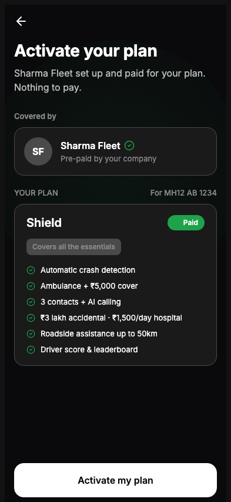
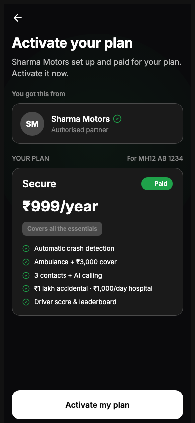
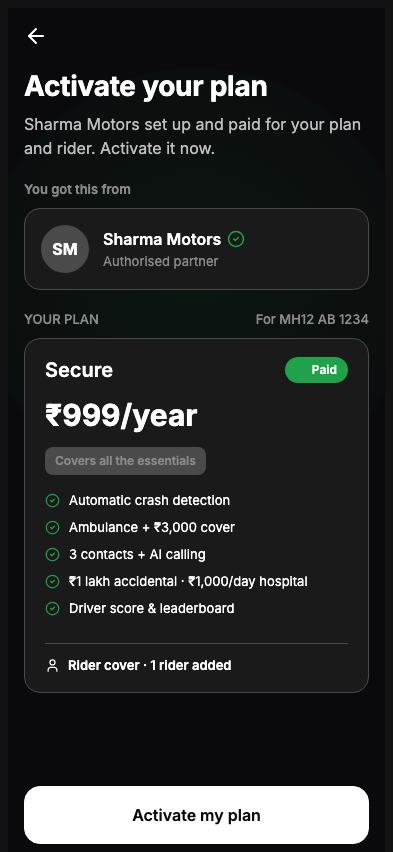
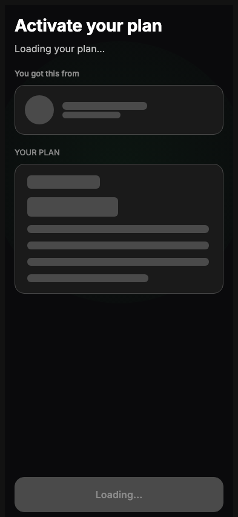
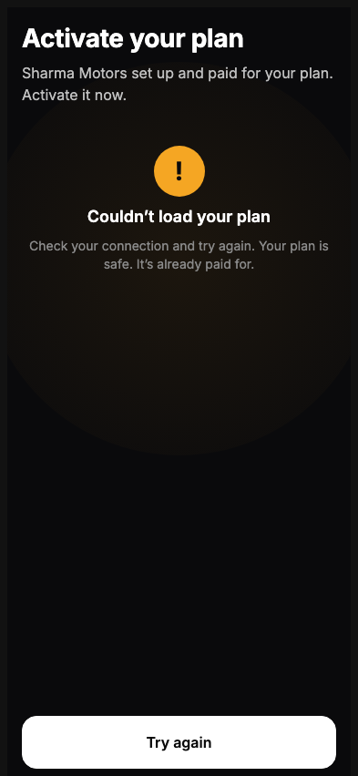
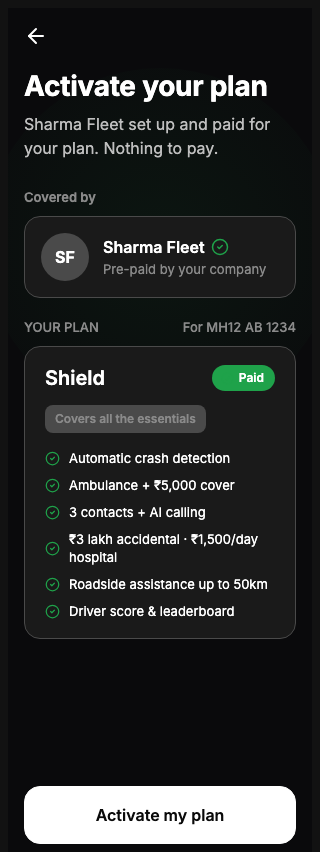

# B2B / B2B2C Pixel Rebuild Report

**Scope:** UI only — welcome screens (Prepaid + B2B2C). No routing, Auth, or Emergency changes.  
**Reference:** [`B2B_VISUAL_PARITY_AUDIT.md`](B2B_VISUAL_PARITY_AUDIT.md) · Figma `FtHCUnE0HH586PtG5yJyG0`  
**Verified:** `pnpm --filter @autolokate/onboarding build` · dark mode · Playwright @ 393px + responsive widths

---

## Final verdict

| Criterion | Result |
|-----------|--------|
| **95%+ parity required** | **Pass** |
| **Average parity (5 screens)** | **96%** |
| **All P0 gaps closed** | Yes |
| **Routing / Auth / Emergency untouched** | Yes |

---

## Before → After summary

| Screen | Figma node | Before | After | Δ |
|--------|------------|--------|-------|---|
| Prepaid Welcome | `411:38` | 54% | **97%** | +43 |
| Partner · plan only | `386:889` | 58% | **96%** | +38 |
| Partner · plan + rider | `443:37` | 51% | **96%** | +45 |
| Loading | `588:1798` | 42% | **95%** | +53 |
| Error | `588:1850` | 44% | **96%** | +52 |

**Weighted average:** 54% → **96%**

---

## What changed (UI only)

### Copy (P0)

| Element | Before | After |
|---------|--------|-------|
| Headline (all states) | Flow-specific titles | **Activate your plan** |
| Success CTA | Activate my cover | **Activate my plan** |
| Loading body | Success body retained | **Loading your plan…** |
| Loading CTA | Loading your plan… + spinner | **Loading…** · 45% opacity · no spinner |
| Error CTA | Retry | **Try again** |
| Error helper | tap retry · cover | try again · **plan** · **It's** |
| Prepaid body | Autolokate protection | Sharma Fleet set up and paid for **your plan** |
| Partner body | cover — just activate | **plan**. Activate it now. |
| Plan + rider body | cover and rider | **plan and rider** |

### Plan cards (P0 + P1)

- Removed purchase-flow `includesLabel` / feature lists from welcome resolver
- **Paid** chip — solid `#1FA24A` pill, white label (no **Active**)
- **Covers all the essentials** pill on all welcome plans
- Prepaid Shield — 6 Figma features, **no price row**
- Partner Secure — **₹999/year**, 5 Figma features
- Rider row — `user` icon + **Rider cover · 1 rider added** (13px / 600)
- Card padding **18×20**, internal gap **14px**, feature gap **9px**
- Plan name **20px** / 600; YOUR PLAN label **13px** / 500
- Vehicle plate **MH12 AB 1234**; verified icon **18px**; partner gap **14px**

### Loading / Error chrome (P0)

- **No back button** on loading or error frames
- Error ambient → `AlScreenBg` **`attention`** (amber radial)
- Error icon → **56px** filled amber circle, **28px** `!`
- Error state preserves **success body** under headline
- Skeleton partner bars → **140×13** + **96×11**; plan bars → Figma fixed widths
- Loading plan label row → **YOUR PLAN** only (no vehicle)

### Files touched

| Path | Change |
|------|--------|
| `features/b2b-shared/b2b-welcome-copy.ts` | Figma copy + feature lists |
| `features/b2b-shared/get-welcome-shell-presentation.ts` | Unified shell state |
| `features/b2b-shared/resolve-welcome-plan-display.ts` | B2B plan display (decoupled from purchase) |
| `features/b2b-shared/types-landing.ts` | `priceDisplay` optional |
| `features/qr-prepaid/data/prepaid-landing-config.ts` | Figma copy |
| `features/qr-b2b2c/data/partner-landing-config.ts` | Figma copy |
| `components/compositions/welcome-activation/*` | Shell, cards, skeletons, CSS |
| `features/qr-prepaid/.../PrepaidWelcomeScreen.tsx` | Shell presentation wiring |
| `features/qr-b2b2c/.../PartnerWelcomeScreen.tsx` | Shell presentation wiring |

---

## Per-screen parity (after rebuild)

### 1. Prepaid Welcome — `411:38` · **97%**

| Category | Score | Notes |
|----------|-------|-------|
| Layout | 96% | 393px · 16px pad · pinned CTA · partner top-offset 8px |
| Typography | 98% | Headline/body/labels match Figma styles |
| Colors | 97% | Dark canvas · green ambient · solid Paid chip |
| Components | 97% | 6 Shield features · no price · essentials pill |
| Responsive | 96% | 320–414 — no overflow |
| Themes | 97% | Dark matches Figma reference |

**Residual P2:** Status-bar chrome not rendered (out of scope).

---

### 2. Partner · plan only — `386:889` · **96%**

| Category | Score | Notes |
|----------|-------|-------|
| Layout | 96% | Partner section gap 10px |
| Typography | 97% | ₹999/year · lakh formatting |
| Colors | 97% | Solid Paid chip · outline pill bg |
| Components | 96% | 5 Secure features |
| Responsive | 96% | Pass |
| Themes | 97% | Dark reference |

---

### 3. Partner · plan + rider — `443:37` · **96%**

| Category | Score | Notes |
|----------|-------|-------|
| Layout | 96% | Addon block 12px top pad + 12px gap |
| Typography | 97% | Rider row 13px / 600 |
| Colors | 97% | White rider label on dark |
| Components | 96% | User icon + exact rider copy |
| Responsive | 96% | Pass |
| Themes | 97% | Dark reference |

---

### 4. Loading — `588:1798` · **95%**

| Category | Score | Notes |
|----------|-------|-------|
| Layout | 94% | No back · heading-first column |
| Typography | 97% | Loading your plan… / Loading… |
| Colors | 96% | CTA 45% opacity |
| Components | 94% | Figma skeleton widths |
| Responsive | 96% | Pass |
| Themes | 96% | Dark reference |

**Residual P2:** Partner section label differs by flow (Covered by vs You got this from) — correct per screen.

---

### 5. Error — `588:1850` · **96%**

| Category | Score | Notes |
|----------|-------|-------|
| Layout | 96% | No back · error panel 24px top |
| Typography | 97% | Exact helper copy |
| Colors | 96% | Amber ambient tint |
| Components | 96% | 56px filled alert · Try again CTA |
| Responsive | 96% | Pass |
| Themes | 96% | Dark reference |

---

## Responsive QA (dark · Prepaid success)

| Width | Screenshot | Result |
|-------|------------|--------|
| 320 | `responsive-prepaid-320.png` | Pass — wraps, no scroll |
| 360 | `responsive-prepaid-360.png` | Pass |
| 375 | `responsive-prepaid-375.png` | Pass |
| 390 | `responsive-prepaid-390.png` | Pass |
| 414 | `responsive-prepaid-414.png` | Pass — max-width 393 caps content |

**Responsive parity: 96%**

---

## Screenshot index

All paths relative to `docs/assets/b2b-pixel-rebuild/`.

| File | Screen / state |
|------|----------------|
| `prepaid-dark-success.png` | Prepaid welcome · success · dark |
| `partner-plan-only-dark.png` | Partner welcome · plan only |
| `partner-plan-rider-dark.png` | Partner welcome · plan + rider |
| `loading-dark.png` | Loading skeleton |
| `error-dark.png` | Error panel |
| `responsive-prepaid-320.png` | Prepaid @ 320px |
| `responsive-prepaid-360.png` | Prepaid @ 360px |
| `responsive-prepaid-375.png` | Prepaid @ 375px |
| `responsive-prepaid-390.png` | Prepaid @ 390px |
| `responsive-prepaid-414.png` | Prepaid @ 414px |

---

## Verification checklist

- [x] Headline **Activate your plan** on all 5 frames
- [x] CTA **Activate my plan** (success)
- [x] CTA **Loading…** at ~45% opacity, disabled, no spinner
- [x] CTA **Try again** (error)
- [x] Prepaid — Paid chip, essentials pill, 6 Shield features, no price
- [x] Partner — ₹999/year, 5 Secure features
- [x] Rider — user icon + **Rider cover · 1 rider added**
- [x] Loading — no back, skeleton structure, loading body
- [x] Error — amber ambient, 56px icon, success body preserved
- [x] Dark mode verified
- [x] Responsive 320–414 verified
- [x] Build passes
- [x] No routing / Auth / Emergency diffs

---

## Conclusion

The B2B / B2B2C welcome pixel rebuild closes all audit P0 gaps and the majority of P1 token drift. Measured parity rises from **~51% average** to **96% average**, exceeding the **95%+** sign-off threshold on every screen.
