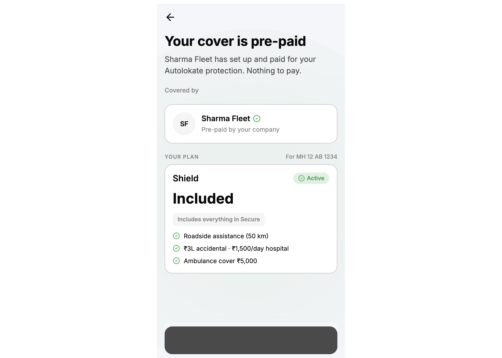
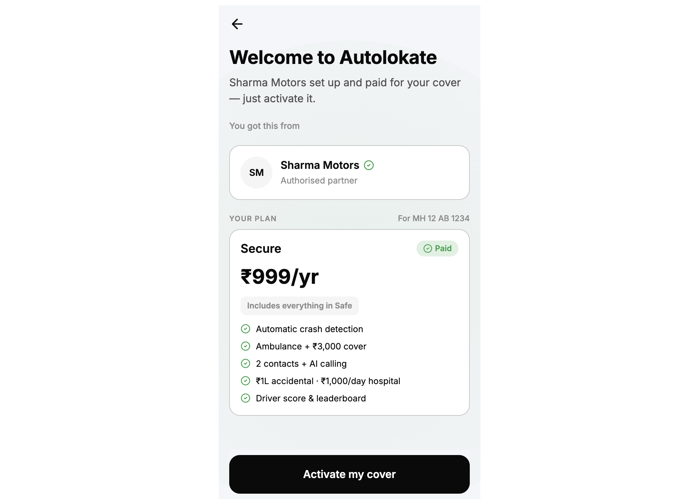
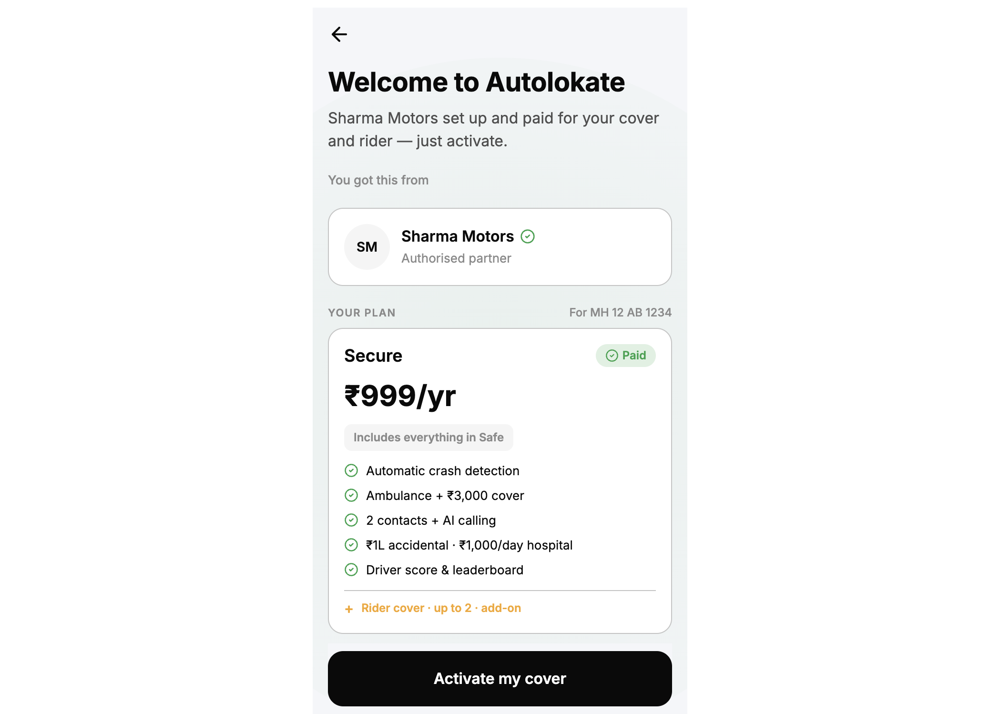
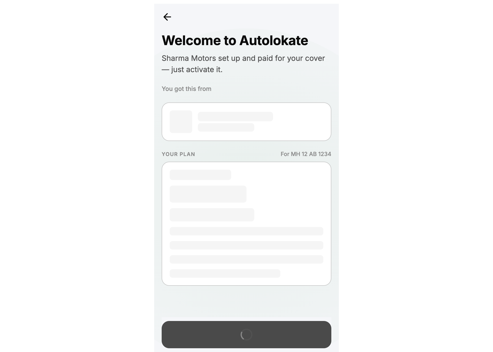
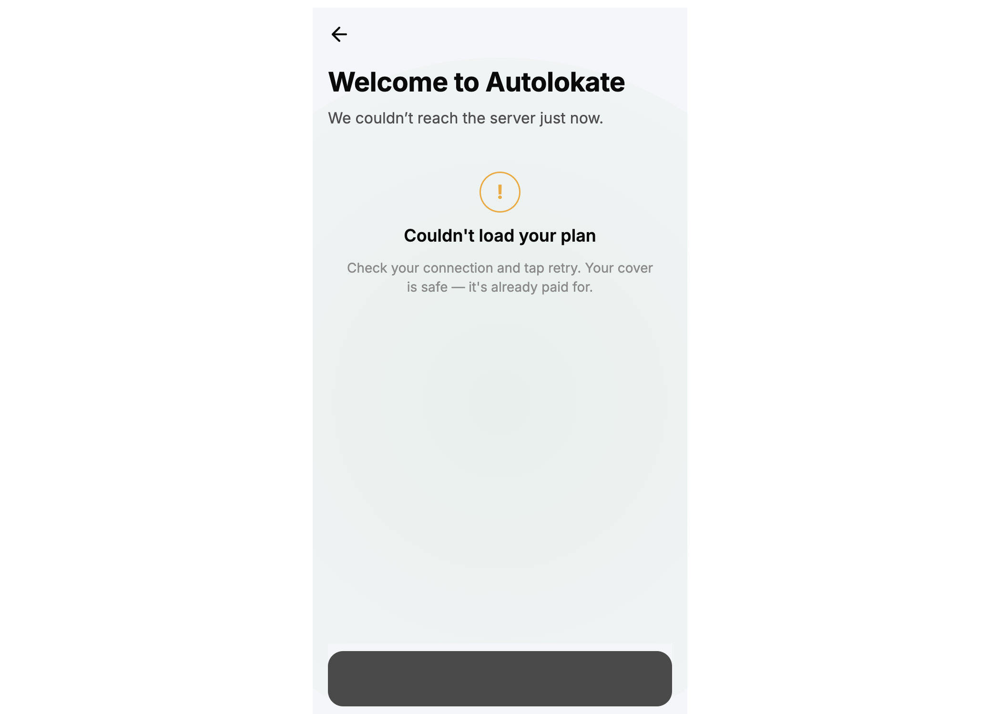
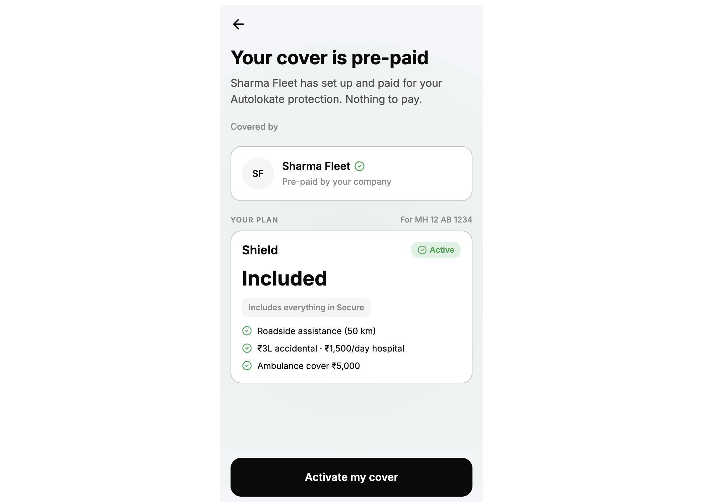

# B2B / B2B2C Visual Parity Audit

**Audit type:** UI only — no routing, no business logic, no code changes.  
**Figma file:** `FtHCUnE0HH586PtG5yJyG0`  
**Implementation:** `PrepaidWelcomeScreen`, `PartnerWelcomeScreen`, `WelcomeActivationShell`, `PartnerActivationCard`, `PlanActivationCard`  
**Captured:** `pnpm preview` @ 393px viewport + theme toggle via `data-theme`

All Figma reference frames are **dark theme** (`#0A0A0C` canvas). Light-theme screenshots are included for implementation coverage; there are **no matching Figma light frames** in scope.

---

## Summary

| Screen | Figma node | Parity % | Verdict |
|--------|------------|----------|---------|
| Prepaid Welcome | `411:38` | **54%** | Major copy + plan-card content drift |
| Partner Welcome · plan only | `386:889` | **58%** | Title/body/CTA/copy drift; structure close |
| Partner Welcome · plan + rider | `443:37` | **51%** | Rider row icon/copy mismatch |
| Partner Welcome · Loading | `588:1798` | **42%** | Loading body, CTA, skeleton, chrome differ |
| Partner Welcome · Error | `588:1850` | **44%** | Ambient tint, error copy, icon, CTA differ |

**Cross-cutting:** Layout shell (393px · 16px pad · pinned CTA · 20px section rhythm) is structurally aligned. **Copy, plan-card content, loading/error states, and chip styling** are the primary gaps.

---

## Methodology

Each screen scored across six categories (weighted):

| Category | Weight | Method |
|----------|--------|--------|
| Layout | 25% | Measure frame width, padding, gaps, CTA y/height vs Figma |
| Typography | 20% | Headline, body, labels, card text vs Figma styles |
| Colors | 20% | Canvas, surface, outline, muted, success, CTA, ambient tint |
| Components | 25% | Partner card, plan card, rider row, skeleton, error panel |
| Responsive | 5% | 320–414 — same CSS; check wrap/overflow |
| Themes | 5% | Dark (Figma) vs `data-theme`; light noted separately |

**Severity**

- **P0** — Wrong headline/body/CTA or missing required UI block  
- **P1** — Measurable token/spacing/component drift  
- **P2** — Minor formatting (plate spacing, icon size ±2px)

---

## Shared implementation reference

| Token / element | Figma (dark frames) | Implementation |
|-----------------|---------------------|----------------|
| Screen width | 393px | `max-width: 24.5625rem` (393px) ✓ |
| Horizontal padding | 16px | `padding-inline: 16px` ✓ |
| Body column gap | 20px | `ob-welcome-shell__body` gap 20px ✓ |
| Heading gap | 8px | `ob-welcome-shell__heading` gap 8px ✓ |
| Headline | 28px / 36px / 700 | `--al-text-headline-*` (28px / 36px / 700) ✓ |
| Body | 16px / 24px / 400 | `--al-text-body-*` ✓ |
| CTA | 361×58 · y:762 · radius 16 | `min-height: 58px` · `border-radius: 16px` · full width ✓ |
| Ambient tint (success) | Green radial ~4% | `AlScreenBg` `variant="protected"` ✓ |
| Partner card | 16px pad · 16px radius · gap 14 | 16px pad · 16px radius · **gap 12** |
| Plan card | 18px 20px pad · gap 14 | **16px pad · gap 12** |
| Feature rows | gap 9px | **gap 8px** |

---

## 1. Prepaid Welcome — `411:38`

**Parity: 54%**

### P0

| # | Element | Figma | Implementation |
|---|---------|-------|----------------|
| 1 | Headline | **Activate your plan** | **Your cover is pre-paid** |
| 2 | Body | Sharma Fleet set up and paid for **your plan**. Nothing to pay. | Sharma Fleet has set up and paid for your **Autolokate protection**. Nothing to pay. |
| 3 | CTA | **Activate my plan** | **Activate my cover** |
| 4 | Plan price row | **No price line** — pill follows status row | Shows large **Included** price line |
| 5 | Feature list | 6 Shield-specific lines (e.g. Ambulance + ₹**5,000** cover · Roadside assistance up to 50km) | 3 lines from `purchase-plans` catalog (different copy/count) |

### P1

| # | Element | Figma | Implementation |
|---|---------|-------|----------------|
| 6 | Status chip | **Paid** on solid `#1FA24A` pill, white label | **Active** on translucent green mix |
| 7 | Includes pill | **Covers all the essentials** | **Includes everything in Secure** |
| 8 | `YOUR PLAN` label | Label 13px / 500 / 18px lh (sentence case) | 11px / 600 / uppercase / 0.08em tracking |
| 9 | Plan name | 20px / 600 | 18px / 600 |
| 10 | Plan card padding | 18px 20px | 16px all sides |
| 11 | Partner section top pad | 8px 0 0 | Folded into 20px content gap |
| 12 | Partner avatar initials | 16px / 700 | 14px / 600 |

### P2

| # | Element | Figma | Implementation |
|---|---------|-------|----------------|
| 13 | Vehicle plate | For **MH12 AB 1234** | For **MH 12 AB 1234** |
| 14 | Partner card gap | 14px | 12px |
| 15 | Verified icon | 18px | 16px |

### Category scores

| Layout | Typography | Colors | Components | Responsive | Themes |
|--------|------------|--------|------------|------------|--------|
| 78% | 45% | 82% | 40% | 92% | 75%* |

\*Figma frame is dark; implementation dark tokens align. Light theme (see `prepaid-light-success.png`) has no Figma counterpart.

---

## 2. Partner Welcome · plan only — `386:889`

**Parity: 58%**

### P0

| # | Element | Figma | Implementation |
|---|---------|-------|----------------|
| 1 | Headline | **Activate your plan** | **Welcome to Autolokate** |
| 2 | Body | Sharma Motors set up and paid for **your plan. Activate it now.** | …paid for **your cover — just activate it.** |
| 3 | CTA | **Activate my plan** | **Activate my cover** |

### P1

| # | Element | Figma | Implementation |
|---|---------|-------|----------------|
| 4 | Price | **₹999/year** | **₹999/yr** (from `purchase-plans`) |
| 5 | Includes pill | **Covers all the essentials** | **Includes everything in Safe** |
| 6 | Feature line | **₹1 lakh** accidental · **₹1,000/day** hospital | **₹1L** accidental · **₹1,000/day** hospital |
| 7 | Status chip | Solid green `#1FA24A` + white **Paid** | Translucent green + green **Paid** text |
| 8 | Plan card padding / gaps | 18×20 pad · 14px gap | 16px pad · 12px gap |
| 9 | Section label | 13px / 600 semibold | 13px / 500 medium |

### P2

| # | Element | Figma | Implementation |
|---|---------|-------|----------------|
| 10 | Vehicle plate spacing | MH12 | MH 12 |
| 11 | Partner gap | 14px | 12px |

### Category scores

| Layout | Typography | Colors | Components | Responsive | Themes |
|--------|------------|--------|------------|------------|--------|
| 80% | 50% | 85% | 55% | 92% | 75% |

---

## 3. Partner Welcome · plan + rider — `443:37`

**Parity: 51%**

Inherits all P0/P1 from plan-only, plus:

### P0

| # | Element | Figma | Implementation |
|---|---------|-------|----------------|
| 12 | Body | …paid for your **plan and rider. Activate it now.** | …**cover and rider — just activate.** |
| 13 | Rider row | `icon/user` + **Rider cover · 1 rider added** (13px / 600 · white) | **+** mark (amber) + **Rider cover · up to 2 · add-on** (purchase addon label) |

### P1

| # | Element | Figma | Implementation |
|---|---------|-------|----------------|
| 14 | Addon separator padding | 12px top | 8px gap block |
| 15 | Rider row gap | 8px | 8px ✓ (icon type wrong) |

### Category scores

| Layout | Typography | Colors | Components | Responsive | Themes |
|--------|------------|--------|------------|------------|--------|
| 80% | 48% | 85% | 35% | 92% | 75% |

---

## 4. Partner Welcome · Loading — `588:1798`

**Parity: 42%**

### P0

| # | Element | Figma | Implementation |
|---|---------|-------|----------------|
| 1 | Headline | **Activate your plan** | Partner/prepaid-specific title (e.g. Welcome to Autolokate) |
| 2 | Body during load | **Loading your plan…** (replaces subtitle) | Keeps **success body copy** during skeleton |
| 3 | CTA label | **Loading…** | **Loading your plan…** |
| 4 | CTA treatment | 45% opacity · no spinner | Disabled + **spinner** inside button |
| 5 | Back control | **Absent** on loading frame | **Back arrow shown** |

### P1

| # | Element | Figma | Implementation |
|---|---------|-------|----------------|
| 6 | Partner skeleton | 48px circle + 140×13 + 96×11 bars | Avatar block + 60% / 45% width bars |
| 7 | Plan skeleton | Fixed widths 120/150/300/200 inside 18×20 card | Generic % widths inside 16px card |
| 8 | Plan label row | **YOUR PLAN** only (no vehicle during load) | Shows **For MH 12 AB 1234** during skeleton |

### P2

| # | Element | Figma | Implementation |
|---|---------|-------|----------------|
| 9 | Section gap | Partner block gap 10px | 20px between content blocks |

### Category scores

| Layout | Typography | Colors | Components | Responsive | Themes |
|--------|------------|--------|------------|------------|--------|
| 65% | 35% | 80% | 30% | 90% | 75% |

---

## 5. Partner Welcome · Error — `588:1850`

**Parity: 44%**

### P0

| # | Element | Figma | Implementation |
|---|---------|-------|----------------|
| 1 | Ambient tint | **Amber** radial `rgba(245,158,33,…)` | **Green** protected tint |
| 2 | Body (under headline) | Keeps **success body** (Sharma Motors set up…) | **We couldn't reach the server just now.** |
| 3 | Error helper | Check your connection and **try again**. Your **plan** is safe. **It's** already paid for. | …**tap retry**. Your **cover** is safe — **it's** already paid for. |
| 4 | CTA | **Try again** | **Retry** |
| 5 | Back control | **Absent** on error frame | **Back arrow shown** |

### P1

| # | Element | Figma | Implementation |
|---|---------|-------|----------------|
| 6 | Alert icon | **56px** filled `#F5A623` circle · white **!** 28px | **40px** outline circle · orange border · 20px **!** |
| 7 | Error title | 18px / 600 | 18px / 600 ✓ |
| 8 | Error message | 14px / 400 / **center** | 14px / 400 / center ✓ (copy differs) |
| 9 | Headline | **Activate your plan** | Flow-specific title (not unified) |

### P2

| # | Element | Figma | Implementation |
|---|---------|-------|----------------|
| 10 | Error panel top pad | 24px 0 0 | 24px 16px |

### Category scores

| Layout | Typography | Colors | Components | Responsive | Themes |
|--------|------------|--------|------------|------------|--------|
| 70% | 40% | 55% | 35% | 90% | 60% |

---

## Responsive QA (320 · 360 · 375 · 390 · 414)

Implementation uses fluid width `min(100%, 393px)` with fixed 16px horizontal padding. No breakpoint-specific overrides.

| Width | Observation | Severity |
|-------|-------------|----------|
| 320 | Long CTA labels and feature lines wrap; no horizontal scroll | Pass |
| 360 | Same; card borders intact | Pass |
| 375 | Matches Figma reference width closely | Pass |
| 390 | Content centered; CTA remains pinned | Pass |
| 414 | Extra margin on sides; max-width caps at 393 | Pass |

**Responsive parity: 92%** — no Figma variants per width; behavior is acceptable.

---

## Theme QA

### Dark (Figma reference)

| Element | Figma | Implementation |
|---------|-------|----------------|
| Canvas | `#0A0A0C` | `--al-color-background` (dark) ✓ |
| Card surface | `#1A1A1A` | `--al-color-surface` ✓ |
| Outline | `#4A4A4A` | `--al-color-outline` ✓ |
| Muted text | `#8A8A8A` | `--al-color-on-surface-muted` ✓ |
| CTA fill | `#FFFFFF` on dark | `--al-color-primary` / on-primary ✓ |
| Success chip | Solid `#1FA24A` | Translucent mix (drift — P1) |
| Error ambient | Amber gradient | Green protected (drift — P0 on error) |

### Light (implementation only — no Figma frames)

| Element | Observation |
|---------|-------------|
| Canvas | Light grey/white — readable |
| Cards | White surface + light border |
| CTA | Dark fill on light canvas (inverted vs Figma dark) |
| Success chips | Green on white — contrast OK |

**Theme parity (dark): 72%** · **Light: not in Figma scope**

---

## Screenshot index

| File | Screen / state |
|------|----------------|
| `prepaid-dark-success.png` | Prepaid welcome · success · dark |
| `prepaid-light-success.png` | Prepaid welcome · success · light |
| `b2b2c-plan-only-light.png` | Partner welcome · plan only |
| `b2b2c-plan-rider-light.png` | Partner welcome · plan + rider |
| `loading-state-light.png` | Loading skeleton state |
| `error-state-light.png` | Error panel state |
| `b2b2c-welcome-success.png` | B2B2C success (alternate capture) |
| `b2b2c-welcome-loading-skeleton.png` | Loading skeleton (alternate) |
| `b2b2c-welcome-error.png` | Error (alternate) |

All paths relative to `docs/assets/b2b-visual-parity-audit/`.

---

## Priority fix backlog (UI only — not implemented)

### P0 (blocks Figma sign-off)

1. Unify headline **Activate your plan** across prepaid + partner + loading + error  
2. Align all body copy to Figma strings per screen/state  
3. CTA **Activate my plan** (success) · **Loading…** (load) · **Try again** (error)  
4. Prepaid plan card: remove price row; use Figma Shield feature set + **Covers all the essentials** pill + **Paid** chip  
5. Loading: replace body with **Loading your plan…**; hide back; match CTA opacity  
6. Error: amber ambient tint; preserve success body; fix helper copy  

### P1

7. Status chip — solid green Figma pill  
8. Plan card padding 18×20 · internal gap 14px · feature gap 9px  
9. Partner card gap 14px · avatar 16px/700  
10. `YOUR PLAN` label — 13px / 500 Label style (not 11px uppercase)  
11. Rider row — user icon + **Rider cover · 1 rider added**  
12. Price format **₹999/year**  
13. Error icon 56px filled amber  

### P2

14. Vehicle plate **MH12 AB 1234** formatting  
15. Verified icon 18px  

---

## Files audited (read-only)

| Path |
|------|
| `apps/onboarding/src/features/qr-prepaid/screens/prepaid-welcome/PrepaidWelcomeScreen.tsx` |
| `apps/onboarding/src/features/qr-b2b2c/screens/partner-welcome/PartnerWelcomeScreen.tsx` |
| `apps/onboarding/src/components/compositions/welcome-activation/*` |
| `apps/onboarding/src/features/qr-prepaid/data/prepaid-landing-config.ts` |
| `apps/onboarding/src/features/qr-b2b2c/data/partner-landing-config.ts` |
| `packages/design-system/src/tokens/*` |

**No code was modified during this audit.**
