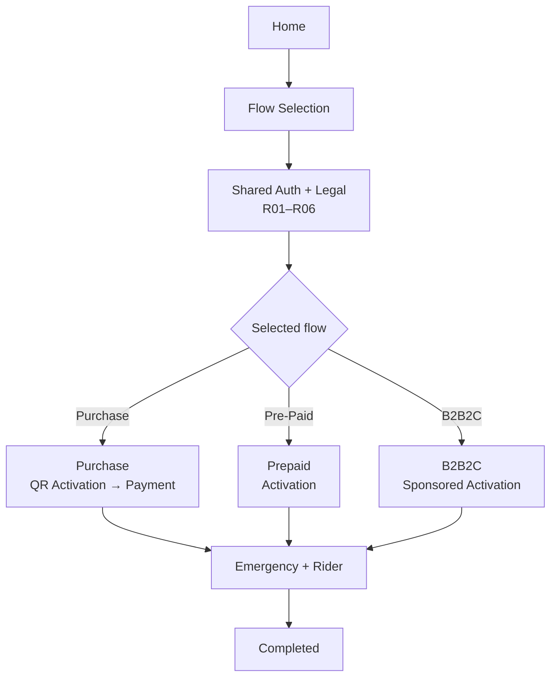
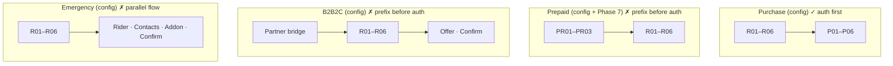
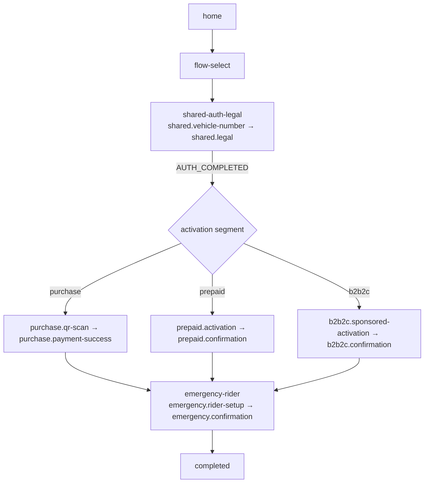
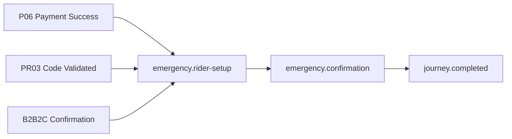

# Flow Architecture Alignment Report — Phase 8.5

**App:** `@autolokate/onboarding`  
**Mode:** Architecture review only — no code, screens, B2B, or B2B2C implementation  
**Date:** 2026-06-17  
**Inputs:** Final product journey · `flows.config.ts` · routes schema · Phase 7 Prepaid · Phase 5 Purchase · Phase 8 Auth  
**Related:** [ONBOARDING_ARCHITECTURE.md](./ONBOARDING_ARCHITECTURE.md) · [AUTH_FLOW_SIGNOFF.md](./AUTH_FLOW_SIGNOFF.md) · [PHASE_7_PREPAID.md](./PHASE_7_PREPAID.md)

---

## Executive summary

The codebase implements **three runnable surface areas** (Shared Auth, Purchase screens, Prepaid screens) plus **declarative flow configs** for five flow IDs. The **final product journey** requires a **single orchestrated path**:

**Home → Flow Selection → Shared Auth + Legal → Selected activation flow → Emergency + Rider → Completed**

Today, flows are modeled as **independent linear graphs** that embed or prefix the shared pipeline differently. Only **Purchase** matches the target **auth-then-activation** order. **Prepaid** and **B2B2C** configs (and Phase 7 implementation) invert auth relative to flow-specific steps. **Emergency** is a **parallel top-level flow**, not a universal post-activation suffix. There is **no Home**, **no FlowSelector**, and **`AUTH_COMPLETED` is a terminal dead-end** instead of a handoff.

**Recommendation:** Introduce a **Journey Orchestrator** layer above per-flow step lists; reorder config to **`[flow-select] + shared + [activation suffix] + [emergency suffix]`**; migrate Prepaid prefix steps to post-auth activation.

**Alignment score: 58 / 100 (C+)** — strong screen/composition reuse, weak topology vs product.

---

## 1. Final product journey (target)



### Target phase model

| Phase | User-facing | Purpose |
|-------|-------------|---------|
| 0 | Home | Entry, resume, deep-link landing |
| 1 | Flow Selection | Choose Purchase · Pre-Paid · B2B2C |
| 2 | Shared Auth + Legal | R01–R06 once per journey |
| 3 | Activation | Flow-specific (varies) |
| 4 | Emergency + Rider | Universal add-on |
| 5 | Completed | Terminal success |

**Out of scope for this alignment:** Fleet **B2B** (`b2b` org-verify flow) — exists in config but is **not** in the three consumer flow-selection options.

---

## 2. Current topology (as implemented)

### 2.1 Runtime (what actually runs)

| Entry | Component | Behavior |
|-------|-----------|----------|
| `/` (default) | `AuthFlowApp` | R01→R06 only → `AUTH_COMPLETED` |
| `?dev=1` | `ScreenDevApp` | Manual screen picker (Shared + Purchase + Prepaid) |

No Home, no FlowSelector, no journey orchestrator, no router.

### 2.2 Declarative flow graphs (`flows.config.ts`)

Pattern: `withSharedPipeline(prefix, suffix)` = **prefix + R01–R06 + suffix**

| Flow ID | Current order | Step count |
|---------|---------------|------------|
| **purchase** | R01–R06 → P01–P06 | 6 + 6 = 12 |
| **prepaid** | PR01–PR03 → R01–R06 | 3 + 6 = 9 |
| **b2b2c** | Partner bridge → R01–R06 → Offer → Confirm | 1 + 6 + 2 = 9 |
| **b2b** | Org verify → R01–R06 → Fleet → Confirm | 1 + 6 + 2 = 9 |
| **emergency** | R01–R06 → Rider → Contacts → Addon → Confirm | 6 + 4 = 10 |
| **shared** | R01–R06 only | 6 |
| **auth** / **legal** | Subsets | partial |



### 2.3 Screen inventory vs journey

| Area | Screens | Wired to journey? |
|------|---------|-------------------|
| Shared Auth + Legal | R01–R06 | ✓ via `AuthFlowApp` |
| Purchase | P01–P06 | Dev preview only |
| Prepaid | PR01–PR03 | Dev preview only |
| Emergency | None built | Config only |
| B2B2C | None built | Config only |
| Home / Flow Select | None | — |

---

## 3. Mismatch matrix

| # | Target requirement | Current state | Severity | Affected |
|---|-------------------|---------------|----------|----------|
| M1 | **Home** before flow selection | Missing | High | All flows |
| M2 | **Flow Selection** before auth | Missing | **Critical** | All flows |
| M3 | **Shared Auth + Legal once** after selection | Auth is isolated; Prepaid/B2B2C run auth *after* flow-specific prefix in config | **Critical** | Prepaid, B2B2C |
| M4 | **Purchase** after auth: QR Activation → Payment | Auth→P01–P06 correct; **`purchase.qr-scan` not in graph**; “QR Activation” not explicit | Medium | Purchase |
| M5 | **Prepaid** after auth: Activation only | **PR01–PR03 before R01–R06** (Phase 7) | **Critical** | Prepaid |
| M6 | **B2B2C** after auth: Sponsored Activation | Partner bridge **before** shared pipeline | **Critical** | B2B2C |
| M7 | **Emergency + Rider** after activation, all flows | Emergency is **separate flow** with duplicated shared embed | **Critical** | Emergency |
| M8 | **`AUTH_COMPLETED` handoff** to selected flow | Terminal view; no `selectedFlow` routing | **Critical** | Phase 8 |
| M9 | **Completed** terminal after Emergency | No unified completion | High | All |
| M10 | Deep link `/activate/:token` resolves flow | Schema points to R01 only | Medium | Router |
| M11 | ONBOARDING_ARCHITECTURE.md graphs | Outdated (5-step shared, wrong prepaid order) | Low | Docs |
| M12 | Fleet B2B in registry | Present but **not** in product selection trio | Info | B2B (deferred) |

---

## 4. Proposed corrected flow topology

### 4.1 Canonical journey graph

Single **`consumer-activation`** journey composed from **segments** (not independent flow IDs):



### 4.2 Corrected step order by selected flow

| Phase | Step IDs (proposed) | Screens (existing / planned) |
|-------|---------------------|------------------------------|
| **Flow select** | `journey.flow-select` | **FlowSelector** (new) |
| **Shared** | `shared.vehicle-number` … `shared.legal` | R01–R06 (reuse) |
| **Purchase activation** | `purchase.qr-scan` → `purchase.plan-select` … `purchase.payment-success` | QrScan (new) + P01–P06 |
| **Prepaid activation** | `prepaid.entry` → `prepaid.activation-code` → `prepaid.code-validation` | PR01–PR03 *(move after auth)* |
| **B2B2C activation** | `b2b2c.partner-bridge` → `b2b2c.offer-select` → `b2b2c.confirmation` | TBD |
| **Emergency** | `emergency.rider-setup` … `emergency.confirmation` | TBD |
| **Completed** | `journey.completed` | Completion screen |

### 4.3 Config pattern change

**Replace** per-flow `withSharedPipeline(prefix, suffix)` with:

```typescript
// Conceptual — not implemented in Phase 8.5
const consumerJourney = {
  segments: [
    { id: 'flow-select', steps: ['journey.flow-select'] },
    { id: 'shared', steps: SHARED_PIPELINE_STEP_IDS },
    { id: 'activation', stepsByFlow: { purchase: [...], prepaid: [...], b2b2c: [...] } },
    { id: 'emergency', steps: EMERGENCY_SUFFIX_STEP_IDS },
    { id: 'completed', steps: ['journey.completed'] },
  ],
};
```

**Keep** standalone `shared`, `auth`, `legal` flow IDs for **segment testing** and dev preview.

---

## 5. FlowSelector definition

### 5.1 Responsibility

| Function | Description |
|----------|-------------|
| Present three consumer options | Purchase · Pre-Paid · B2B2C |
| Persist selection | Survives refresh until journey completes or resets |
| Gate auth entry | User cannot enter R01 without `selectedFlow` |
| Deep-link override | `/activate/:token` API may pre-select flow (skip manual select) |

### 5.2 UI composition (future)

| DS / composition | Usage |
|------------------|-------|
| `FlowStepShell` or `AppShell` | Layout |
| `AlButton` / card pattern | Flow options |
| No local buttons/inputs | DS-only rule preserved |

### 5.3 Flow selection options

| Option ID | Label | Maps to `FlowId` | Post-auth first step |
|-----------|-------|------------------|----------------------|
| `purchase` | Consumer QR Activation + Purchase | `purchase` | `purchase.qr-scan` *(recommended)* or `purchase.plan-select` |
| `prepaid` | Consumer QR Activation — B2B (Pre-Paid) | `prepaid` | `prepaid.entry` |
| `b2b2c` | Consumer QR Activation — B2B2C | `b2b2c` | `b2b2c.partner-bridge` |

**Not shown in selector:** Fleet B2B (`b2b`) — separate entry (org invite URL).

---

## 6. State model

### 6.1 Journey state (orchestrator)

```typescript
type ActivationFlowId = 'purchase' | 'prepaid' | 'b2b2c';

type JourneyPhase =
  | 'home'
  | 'flow-select'
  | 'shared-auth'
  | 'activation'
  | 'emergency'
  | 'completed';

type AuthStatus = 'pending' | 'AUTH_COMPLETED';

type JourneyState = {
  phase: JourneyPhase;
  selectedFlow: ActivationFlowId | null;
  authStatus: AuthStatus;
  /** Index within SHARED_PIPELINE_STEP_IDS when phase === 'shared-auth' */
  sharedStepIndex: number;
  /** Index within activation segment for selectedFlow */
  activationStepIndex: number;
  /** Index within emergency suffix */
  emergencyStepIndex: number;
  session: {
    qrToken?: string;
    plate?: string;
    mobile?: string;
    otpVerified?: boolean;
    legalAccepted?: boolean;
    activationCode?: string;
    partnerSessionId?: string;
  };
};
```

### 6.2 `selectedFlow` persistence

| Store | Key | Contents | TTL |
|-------|-----|----------|-----|
| `sessionStorage` | `al-journey-v1` | Full `JourneyState` JSON | Tab session |
| `localStorage` | `al-selected-flow` | `ActivationFlowId` only | Until explicit reset |
| Optional API | Session cookie | Server-authoritative flow from QR token | Production |

**Rules:**

1. Set `selectedFlow` on FlowSelector confirm (before R01).
2. Clear on **Completed** or explicit “Start over”.
3. On refresh mid-auth: resume R01–R06 from `sharedStepIndex` if `authStatus !== AUTH_COMPLETED`.
4. On refresh post-auth: resume activation segment if `authStatus === AUTH_COMPLETED`.

### 6.3 `AUTH_COMPLETED` handoff

**Current (Phase 8):**

```
R06 success → AuthCompletedView → STOP
```

**Target:**

```
R06 success → authStatus = AUTH_COMPLETED
            → phase = 'activation'
            → activationStepIndex = 0
            → render resolveActivationEntry(selectedFlow)
```

| `selectedFlow` | First activation step | Screen |
|----------------|----------------------|--------|
| `purchase` | `purchase.qr-scan` | QrScan *(new)* → then P01 |
| `prepaid` | `prepaid.entry` | PR01 |
| `b2b2c` | `b2b2c.partner-bridge` | TBD |

**Guard:** If `selectedFlow === null` at R06 complete → redirect to FlowSelector (should not happen if gating works).

**Event shape:**

```typescript
type AuthCompletedEvent = {
  type: 'AUTH_COMPLETED';
  selectedFlow: ActivationFlowId;
  session: JourneyState['session'];
};
```

---

## 7. Post-auth entry points

### 7.1 Purchase — where it starts

| Layer | Current | Target | Action |
|-------|---------|--------|--------|
| Config | `shared.*` → `purchase.plan-select` | `shared.*` → `purchase.qr-scan` → … → `purchase.payment-success` | Insert `purchase.qr-scan` into graph |
| Product label | “QR Activation + Purchase” | QR Activation **then** Payment | QrScan = activation; P01–P06 = plan + payment |
| Screens | P01–P06 built | + QrScan screen | New screen (not Phase 8.5) |

**Recommended first step after auth:** `purchase.qr-scan`  
**Alternative (MVP):** Skip QrScan; treat P01 as activation entry — *document as product debt*.

### 7.2 Prepaid — where it starts

| Layer | Current (Phase 7) | Target | Action |
|-------|-------------------|--------|--------|
| Config | PR01–PR03 → R01–R06 | R01–R06 → PR01–PR03 | **Reorder config** |
| Product label | “Activation” after auth | PR01–PR03 = activation segment | No shared prefix on prepaid flow ID |
| Phase 7 screens | Valid presentational assets | Reposition in journey only | No screen rewrite required |

**Recommended first step after auth:** `prepaid.entry` (PR01)

### 7.3 B2B2C — where it starts

| Layer | Current | Target | Action |
|-------|---------|--------|--------|
| Config | `b2b2c.partner-bridge` **before** shared | **After** shared | Reorder config |
| Product label | Sponsored Activation | Partner bridge + offer + confirm | Build when scheduled |

**Recommended first step after auth:** `b2b2c.partner-bridge`

---

## 8. Emergency + Rider merge point

### 8.1 Target behavior

Emergency is **not** a competing top-level journey. It is a **mandatory or default-included suffix** after any activation flow completes successfully (before **Completed**).



### 8.2 Current vs target

| Aspect | Current `emergency` flow | Target |
|--------|------------------------|--------|
| Position | Standalone flow ID | Suffix segment on consumer journey |
| Shared pipeline | Embedded R01–R06 again | **Reuse** prior auth (no repeat) |
| Entry guard | `guard.qr-valid` at flow start | `guard.legal-accepted` + activation complete |
| Merge trigger | N/A | Last step of activation segment success |

### 8.3 Proposed emergency step IDs (unchanged)

1. `emergency.rider-setup`
2. `emergency.contact-capture`
3. `emergency.plan-addon`
4. `emergency.confirmation`

**Handoff:** Activation success event → `phase = 'emergency'`, `emergencyStepIndex = 0`.

**Note:** Purchase P03 (Rider Selection) overlaps conceptually with emergency rider setup — alignment should **dedupe or split concerns** (plan rider cover vs emergency rider contacts) in a future product pass.

---

## 9. Route strategy

### 9.1 Current routes

| Path | Maps to | Issue |
|------|---------|-------|
| `/` | R01 (redirect) | Skips Home + FlowSelector |
| `/activate/:token` | R01 | Should resolve flow + phase |
| `/shared/r01-*` … `/shared/r06-*` | Shared steps | OK as segment routes |
| `/purchase/p01-*` | Purchase steps | OK but no auth gate |
| `/prepaid/pr01-*` | Prepaid steps | OK but wrong journey order |
| `/flow/purchase` etc. | Shell only | No step routing |

### 9.2 Target route hierarchy

| Path | Phase | Step resolver |
|------|-------|---------------|
| `/` | Home | — |
| `/select-flow` | Flow Selection | `journey.flow-select` |
| `/journey/shared/:stepSlug` | Auth | `shared.*` |
| `/journey/purchase/:stepSlug` | Activation | `purchase.*` |
| `/journey/prepaid/:stepSlug` | Activation | `prepaid.*` |
| `/journey/b2b2c/:stepSlug` | Activation | `b2b2c.*` |
| `/journey/emergency/:stepSlug` | Emergency | `emergency.*` |
| `/journey/completed` | Done | `journey.completed` |
| `/activate/:token` | Bootstrap | API → `{ selectedFlow, phase, step }` |

### 9.3 Navigation ownership

| Layer | Owns |
|-------|------|
| **JourneyOrchestrator** | Phase transitions, `selectedFlow`, AUTH_COMPLETED handoff |
| **FlowEngine** | Step index, guards, next/previous within active segment |
| **react-router** | URL ↔ step sync (Phase 9+) |
| **ScreenDevApp** | Isolated component QA (`?dev=1`) — not production journey |

---

## 10. State strategy summary

| Concern | Strategy |
|---------|----------|
| Flow selection | `localStorage` + in-memory; API override from QR |
| Auth progress | `sessionStorage` `sharedStepIndex` + form fields in `session` |
| AUTH_COMPLETED | Set once at R06; unlock activation segment |
| Activation progress | Per-flow step index keyed by `selectedFlow` |
| Emergency progress | Shared suffix index after activation |
| Dev preview | **`?dev=1`** remains isolated; does not write journey state |
| Analytics | `recordTransition` on phase boundaries + step transitions |

---

## 11. Migration plan

### Phase 9 — Orchestrator (no new product screens)

| Task | Risk | Notes |
|------|------|-------|
| Add `JourneyOrchestrator` + state types | Low | Wraps existing `AuthFlowApp` logic |
| Add FlowSelector screen | Medium | New UI; DS-only |
| Wire AUTH_COMPLETED → activation router | Medium | Replace `AuthCompletedView` terminal |
| Reorder `flows.config.ts` prepaid + b2b2c | **High** | Config-only; breaks Phase 7 doc assumptions |
| Extract `EMERGENCY_SUFFIX` shared constant | Low | DRY emergency steps |
| Deprecate standalone `emergency` flow ID | Medium | Replace with suffix reference |
| Update `routeCatalog` + `/journey/*` paths | Medium | Schema first, router Phase 9b |
| Keep `?dev=1` ScreenDevApp | Low | Unchanged |

### Phase 9b — Router + API

| Task | Risk |
|------|------|
| Install `react-router-dom` | Low |
| Implement `FlowEngine` | Medium |
| `/activate/:token` resolution | Medium |
| Guard runtime | Medium |

### Phase 10 — Activation gaps

| Task | Flow |
|------|------|
| Build `purchase.qr-scan` | Purchase |
| Reposition prepaid dev docs + tests | Prepaid |
| Build B2B2C screens | B2B2C |
| Build Emergency suffix screens | All |
| Unified Completed screen | All |

### Prepaid-specific migration (Phase 7 → aligned)

| Step | Action |
|------|--------|
| 1 | Change `flows.config` prepaid to `withSharedPipeline([], ['prepaid.entry', 'prepaid.activation-code', 'prepaid.code-validation'])` |
| 2 | Update Phase 7 docs / dev preview labels (prefix → suffix) |
| 3 | **No PR screen rewrites** — same components, new graph position |
| 4 | Optional: rename “Pre-paid entry” copy to post-auth context |

---

## 12. Impact analysis

| Artifact | Impact | Mitigation |
|----------|--------|------------|
| **Phase 8 `AuthFlowApp`** | Must become segment inside orchestrator; AUTH_COMPLETED becomes handoff not terminal | Extend, don’t rewrite R01–R06 |
| **Phase 7 Prepaid** | Config order inverted vs implementation narrative | Reorder config; screens unchanged |
| **Phase 5 Purchase** | Order already correct; missing QrScan | Add step to graph when screen exists |
| **`flows.config.ts`** | Prepaid, B2B2C, Emergency need structural change | Single migration PR |
| **`ONBOARDING_ARCHITECTURE.md`** | Stale graphs | Update in Phase 9 |
| **`ScreenDevApp`** | Still valid for pixel QA | Keep parallel to journey |
| **`featureRegistry`** | May add `journey` feature module | Low |
| **Compositions inventory** | Emergency/post-auth reuse counts increase | Update inventory metadata |
| **Guards** | `guard.voucher-valid` redirect should target post-auth prepaid step | Update catalog |
| **B2B fleet flow** | Unchanged; separate from consumer selector | Document as parallel product |

---

## 13. Side-by-side topology

### Current (simplified)

```
[AuthFlowApp: R01–R06 → AUTH_COMPLETED (dead end)]

Purchase config:  R01–R06 → P01–P06
Prepaid config:   PR01–PR03 → R01–R06
B2B2C config:     Partner → R01–R06 → Offer
Emergency config: R01–R06 → Emergency steps
```

### Target

```
Home → FlowSelector → R01–R06 → AUTH_COMPLETED
                              ↓
              ┌─────────────────┼─────────────────┐
              ↓                 ↓                 ↓
         Purchase act.    Prepaid act.      B2B2C act.
              └─────────────────┼─────────────────┘
                              ↓
                    Emergency + Rider
                              ↓
                         Completed
```

---

## 14. Decision checklist (pre B2B / B2B2C build)

| # | Decision | Recommendation |
|---|----------|----------------|
| 1 | Auth before or after prepaid code entry? | **After** — user selects Pre-Paid, completes auth, then enters code |
| 2 | Auth before or after B2B2C partner bridge? | **After** — sponsored activation follows identity |
| 3 | Is Emergency optional? | Product default: **included suffix**; allow skip flag in session if product requires |
| 4 | Purchase first step after auth? | **`purchase.qr-scan`** then P01–P06 |
| 5 | Replace AUTH_COMPLETED terminal? | **Yes** — hand off to activation |
| 6 | Keep fleet B2B in same app? | **Yes**, separate entry — not in FlowSelector trio |
| 7 | Build B2B2C before orchestrator? | **No** — align topology first (Phase 9) |

---

## 15. Alignment score

| Dimension | Weight | Score | Notes |
|-----------|--------|-------|-------|
| Shared screen reuse (R01–R06) | 15% | 95 | Built and signed off |
| Purchase order vs target | 15% | 85 | Auth→payment OK; QrScan missing |
| Prepaid order vs target | 15% | 35 | Prefix before auth |
| B2B2C order vs target | 10% | 30 | Prefix before auth; not built |
| Emergency placement | 15% | 25 | Parallel flow, not suffix |
| Journey orchestration | 20% | 40 | No Home/Selector/handoff |
| Route/schema readiness | 10% | 55 | Partial catalog |

### **Overall alignment: 58 / 100 (C+)**

**Interpretation:** Screen-level work is ahead of journey-level architecture. **Do not build B2B2C screens** until Phase 9 orchestrator lands. **Prepaid config reorder** is low-cost and should precede any new prepaid wiring.

---

## 16. Verdict

Phase 8.5 identifies a **structural gap**: the repo optimizes for **per-flow linear configs** while the product specifies a **hub-and-spoke journey** (select → auth once → branch → emergency → done).

**Required before B2B / B2B2C implementation:**

1. **Journey Orchestrator** with FlowSelector and `selectedFlow` persistence  
2. **AUTH_COMPLETED → activation** handoff  
3. **Config reorder** for Prepaid and B2B2C (auth before flow-specific steps)  
4. **Emergency as universal suffix**, not standalone shared-embedded flow  
5. **Route schema** update for `/journey/*` segments  

**No code changes in Phase 8.5** — this document is the alignment baseline for Phase 9 migration.

---

## Appendix A — File references

| File | Role |
|------|------|
| `apps/onboarding/src/flow/registry/config/flows.config.ts` | Current flow graphs |
| `apps/onboarding/src/flow/registry/config/shared-pipeline.config.ts` | R01–R06 order |
| `apps/onboarding/src/router/routes.schema.ts` | Route catalog |
| `apps/onboarding/src/features/shared-auth/auth-flow/AuthFlowApp.tsx` | Isolated auth runtime |
| `apps/onboarding/src/main.tsx` | Auth-only default entry |
| `docs/PHASE_7_PREPAID.md` | Prepaid prefix documentation (conflicts with target) |
| `docs/AUTH_FLOW_SIGNOFF.md` | AUTH_COMPLETED terminal behavior |

## Appendix B — Guard realignment (future)

| Guard | Current redirect | Proposed |
|-------|------------------|----------|
| `guard.qr-valid` | Entry | Home / activate token |
| `guard.voucher-valid` | `prepaid.activation-code` | Post-auth `prepaid.entry` |
| `guard.partner-session` | `b2b2c.partner-bridge` | Post-auth `b2b2c.partner-bridge` |
| `guard.legal-accepted` | `shared.legal` | Pre-activation gate |
