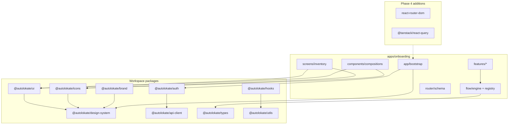

# Onboarding Application Architecture

**Phase:** 3 — Architecture only  
**Status:** Awaiting approval before screen / route / UI implementation  
**App:** `@autolokate/onboarding` (renamed from `apps/pwa`)  
**Figma:** [Autolokate · Consumer App](https://www.figma.com/design/FtHCUnE0HH586PtG5yJyG0/Autolokate-%C2%B7-Consumer-App?node-id=5-2)

---

## Executive summary

The onboarding application is a production React app scaffold with **feature-first architecture**, a **declarative flow engine**, and **shared-step deduplication**. No screens, routes, layouts, or UI have been implemented — only TypeScript architecture, inventories, and folder structure.

**Design system rule:** Use only `@autolokate/design-system`, `@autolokate/ui`, `@autolokate/icons`, and `@autolokate/brand`. No local buttons, inputs, chips, or duplicate components.

---

## Product areas

| # | Product area | Feature module | Flow ID |
|---|--------------|----------------|---------|
| 1 | Consumer · QR Activation + Purchase | `features/qr-purchase` | `purchase` |
| 2 | Consumer · QR Activation — B2B | `features/qr-b2b` | `b2b` |
| 3 | Consumer · QR Activation — B2B (Pre-Paid) | `features/qr-prepaid` | `prepaid` |
| 4 | Consumer · QR Activation — B2B2C | `features/qr-b2b2c` | `b2b2c` |
| 5 | Consumer · Emergency + Rider | `features/emergency` | `emergency` |
| 6 | Shared · Auth + Legal | `features/shared-auth`, `features/shared-legal` | `auth`, `legal` |

---

## Folder structure

```
apps/onboarding/
├── package.json                 # @autolokate/onboarding
├── tsconfig.json
└── src/
    ├── index.ts                 # Public architecture exports
    │
    ├── app/                     # Bootstrap sequence (no React mount yet)
    │   ├── bootstrap.ts
    │   └── index.ts
    │
    ├── router/                  # Route schema only — no react-router
    │   ├── routes.schema.ts
    │   └── index.ts
    │
    ├── providers/               # Provider inventory
    │   ├── inventory.ts
    │   └── index.ts
    │
    ├── layouts/                 # Layout slot inventory
    │   ├── inventory.ts
    │   └── index.ts
    │
    ├── flow/
    │   ├── engine/              # FlowEngine interface (contract)
    │   │   ├── types.ts
    │   │   └── index.ts
    │   ├── registry/            # Flow + shared step definitions
    │   │   ├── shared-steps.ts  # ← single source: Vehicle→Legal
    │   │   ├── flows.ts
    │   │   └── index.ts
    │   ├── guards/
    │   │   ├── catalog.ts
    │   │   └── index.ts
    │   └── index.ts
    │
    ├── features/
    │   ├── registry.ts
    │   ├── shared-auth/
    │   ├── shared-legal/
    │   ├── qr-purchase/
    │   ├── qr-b2b/
    │   ├── qr-prepaid/
    │   ├── qr-b2b2c/
    │   ├── emergency/
    │   └── index.ts
    │
    ├── screens/                 # Empty — inventory in screens/inventory.ts
    │   ├── inventory.ts
    │   ├── shared/              # .gitkeep
    │   ├── purchase/
    │   ├── b2b/
    │   ├── b2b2c/
    │   ├── prepaid/
    │   └── emergency/
    │
    ├── components/
    │   └── compositions/        # Cross-flow composition inventory
    │       ├── inventory.ts
    │       └── index.ts
    │
    ├── hooks/                   # Hook inventory (deferred)
    ├── utils/                   # Util inventory (deferred)
    └── types/
        ├── flow.ts              # StepId, ScreenId, FlowDefinition, …
        └── index.ts
```

---

## Flow architecture

### Shared pipeline (never duplicated)

All QR activation flows embed the same five steps from `flow/registry/shared-steps.ts`:

```
Vehicle → Mobile → OTP → Account → Legal
```

| Step ID | Screen | Guard |
|---------|--------|-------|
| `shared.vehicle` | VehicleConfirm | `guard.qr-valid` |
| `shared.mobile` | MobileCapture | `guard.vehicle-confirmed` |
| `shared.otp` | OtpVerify | `guard.vehicle-confirmed` |
| `shared.account` | AccountSetup | `guard.otp-verified` |
| `shared.legal` | LegalConsent | `guard.authenticated` |

Flows **reference** these IDs — they are never redefined per feature.

### Flow graphs

Each flow assembles: `[flow-specific prefix] + sharedPipeline + [flow-specific suffix]`

#### Purchase (`purchase`)

```
QR Scan
  → Vehicle → Mobile → OTP → Account → Legal   (shared)
  → Plan Select → Payment → Confirmation
```

#### B2B (`b2b`)

```
Org Verify
  → Vehicle → Mobile → OTP → Account → Legal   (shared)
  → Fleet Assign → Confirmation
```

#### Pre-Paid (`prepaid`)

```
Voucher Redeem
  → Vehicle → Mobile → OTP → Account → Legal   (shared)
  → Balance Check → Confirmation
```

#### B2B2C (`b2b2c`)

```
Partner Bridge
  → Vehicle → Mobile → OTP → Account → Legal   (shared)
  → Offer Select → Confirmation
```

#### Emergency (`emergency`)

```
Vehicle → Mobile → OTP → Account → Legal   (shared)
  → Rider Setup → Contact Capture → Plan Add-on → Confirmation
```

#### Standalone segments

- **Auth** (`auth`): Mobile → OTP → Account  
- **Legal** (`legal`): Legal only  

### Flow engine contract

`flow/engine/types.ts` defines the `FlowEngine` interface:

| Method | Purpose |
|--------|---------|
| `getFlow()` | Active flow definition |
| `getContext()` | Runtime step + session state |
| `evaluateGuards()` | Pre-step guard checks |
| `resolveNext()` / `resolvePrevious()` | Navigation with shared-step awareness |
| `recordTransition()` | Analytics hook |

**Implementation deferred** to Phase 4 after architecture approval.

### Guards

| Guard ID | Redirect step |
|----------|---------------|
| `guard.qr-valid` | — (entry) |
| `guard.vehicle-confirmed` | `shared.vehicle` |
| `guard.otp-verified` | `shared.otp` |
| `guard.authenticated` | `shared.mobile` |
| `guard.legal-accepted` | `shared.legal` |
| `guard.org-verified` | `b2b.org-verify` |
| `guard.voucher-valid` | `prepaid.voucher-redeem` |
| `guard.partner-session` | `b2b2c.partner-bridge` |

---

## Route architecture

**Not implemented** — schema only in `router/routes.schema.ts`.

### URL design

| Path | Purpose |
|------|---------|
| `/` | Entry redirect |
| `/activate/:token` | QR deep-link — resolves flow type |
| `/flow/purchase` | Purchase flow shell |
| `/flow/b2b` | B2B flow shell |
| `/flow/prepaid` | Pre-paid flow shell |
| `/flow/b2b2c` | B2B2C flow shell |
| `/flow/emergency` | Emergency flow shell |
| `/shared/auth` | Standalone auth segment |
| `/shared/legal` | Standalone legal segment |
| `/flow/:flowId/step/:stepId` | Optional step deep-link (Phase 4+) |

### Routing strategy (planned)

1. QR token hits `/activate/:token` → API resolves flow type → redirect to `/flow/{id}`  
2. `FlowShell` layout wraps active flow; `FlowEngineProvider` drives step content  
3. Shared steps render from `screens/shared/` regardless of parent flow  
4. Browser back/forward delegated to flow engine, not ad-hoc history  

**Dependencies added in Phase 4:** `react-router-dom`, `@tanstack/react-query`

---

## Layout architecture

| Layout | Slots | Usage |
|--------|-------|-------|
| `AppShell` | status-bar, content | Root |
| `FlowShell` | header, progress, content, footer | Active QR flow |
| `AuthShell` | header, content, footer | Standalone auth |
| `LegalShell` | header, content, footer | Standalone legal |
| `StepScreen` | content, footer | Step viewport inside FlowShell |

All layouts compose **only** `@autolokate/ui` primitives (`AlContainer`, `AlStack`, `AlStepProgress`, `AlButton`, etc.).

---

## Provider architecture

| Provider | Package | Phase |
|----------|---------|-------|
| ThemeProvider | `@autolokate/design-system` | Bootstrap |
| AuthProvider | `@autolokate/auth` | Auth |
| FlowEngineProvider | local | Bootstrap |
| QueryClientProvider | `@tanstack/react-query` | Data |
| RouterProvider | react-router-dom | Bootstrap |

Bootstrap sequence (`app/bootstrap.ts`):

```
load-theme → init-auth → resolve-qr-entry → select-flow → mount-shell
```

---

## Shared screen inventory

22 screens inventoried in `screens/inventory.ts`. Implementation folders exist but are empty.

### Shared (`screens/shared/`)

| Screen ID | Figma | Used by |
|-----------|-------|---------|
| VehicleConfirm | R05 Confirm vehicle | All QR flows |
| MobileCapture | INPUTS · Mobile | All flows |
| OtpVerify | INPUTS · OTP | All flows |
| AccountSetup | — | All flows |
| LegalConsent | — | All flows + shared-legal |

### Purchase (`screens/purchase/`)

| Screen ID | Figma |
|-----------|-------|
| QrScan | QR entry |
| PlanSelect | R06 Choose plan |
| Payment | Checkout |
| PurchaseConfirmation | Success |

### B2B (`screens/b2b/`)

| Screen ID | Description |
|-----------|-------------|
| OrgVerify | Organization verification |
| FleetAssign | Fleet vehicle assignment |
| B2bConfirmation | Activation complete |

### Pre-Paid (`screens/prepaid/`)

| Screen ID | Description |
|-----------|-------------|
| VoucherRedeem | Voucher entry |
| BalanceCheck | Balance summary |
| PrepaidConfirmation | Activation complete |

### B2B2C (`screens/b2b2c/`)

| Screen ID | Description |
|-----------|-------------|
| PartnerBridge | Partner session handoff |
| OfferSelect | Partner offer selection |
| B2b2cConfirmation | Activation complete |

### Emergency (`screens/emergency/`)

| Screen ID | Description |
|-----------|-------------|
| RiderSetup | Rider profile |
| EmergencyContactCapture | Contact list |
| EmergencyPlanAddon | Rider / emergency add-on |
| EmergencyConfirmation | Setup complete |

---

## Shared composition inventory

Cross-flow UI groupings identified in `components/compositions/inventory.ts`. **Not implemented** — documented for Phase 4+ and potential `@autolokate/ui` promotion.

| Composition | DS components | Flows | Promote to core? |
|-------------|---------------|-------|------------------|
| **VehicleSummary** | AlVehicleRcCard, AlField, AlChip, AlButton | All QR | Yes |
| **PlanSummary** | AlPlanCard, AlStack, AlText, AlButton | purchase, b2b2c, emergency | Yes |
| **PaymentSummary** | AlField, AlDivider, AlText, AlButton | purchase | No |
| **EmergencyContactSummary** | AlAvatar, AlField, AlQuickAction, AlStack | emergency | Yes |
| **LegalConsentBlock** | AlCheckbox, AlText, AlButton | All | Yes |
| OwnerContactCard | AlAvatar, AlField, AlStack | Most QR | No |
| FormFieldStack | AlTextField, AlPlateInput, AlInput, AlOtpInput | All | No |
| FlowProgressHeader | AlIconButton, AlStepProgress, AlHeading | All flows | No |
| ActivationSuccess | AlIcon, AlHeading, AlText, AlButton | All flows | No |

Existing ui-preview compositions (`FormSectionComposition`, `VehicleInfoComposition`, `PlanCardComposition`, `ContactCardComposition`) validate DS parity — onboarding compositions will mirror these patterns without duplicating primitives.

---

## Potential future core components

Compositions flagged `promoteToCore: true` should graduate to `@autolokate/ui` once used in 2+ flows with stable APIs:

| Candidate | Rationale |
|-----------|-----------|
| **AlVehicleSummary** | Wraps AlVehicleRcCard + confirm pattern — 5 flows |
| **AlPlanSummary** | Selected plan recap — 3 flows |
| **AlEmergencyContactSummary** | Contact list pattern — emergency + future flows |
| **AlLegalConsentBlock** | Standard legal checkbox + links — all flows |

**Rule:** Implement first in `apps/onboarding/src/components/compositions/`. Promote to `@autolokate/ui` only after API stabilizes across flows.

---

## Dependency graph



### Current `package.json` dependencies

```
@autolokate/api-client
@autolokate/auth
@autolokate/brand
@autolokate/design-system
@autolokate/hooks
@autolokate/icons
@autolokate/types
@autolokate/ui
@autolokate/utils
```

React and router **intentionally omitted** until UI phase approval.

---

## Migration plan from `apps/pwa`

### What existed

| Before | State |
|--------|-------|
| `apps/pwa/` | Empty placeholder (`.gitkeep` only) |
| `apps/qr-flow/` | Empty placeholder — **not merged yet** |

### What was done (Phase 3)

| Action | Detail |
|--------|--------|
| Rename | `apps/pwa` → `apps/onboarding` |
| Package | `@autolokate/onboarding` with typecheck build |
| Scaffold | Full feature-first folder tree |
| Flow registry | 7 flows + shared step catalog |
| Inventories | Screens, compositions, providers, layouts, routes |
| PWA naming | Removed — no service worker, no manifest in this phase |

### Recommended next steps (after approval)

| Phase | Work |
|-------|------|
| **4a Bootstrap** | Add Vite + React 19, `index.html`, theme import, provider tree |
| **4b Router** | Install react-router-dom, wire `routeCatalog` |
| **4c Flow engine** | Implement `FlowEngine` with context + guard evaluation |
| **4d Shared screens** | Build `screens/shared/*` first (Vehicle → Legal) |
| **4e Flow screens** | Purchase → B2B → Pre-paid → B2B2C → Emergency |
| **4f Compositions** | Extract reusable blocks; promote stable ones to `@autolokate/ui` |
| **Cleanup** | Remove `apps/qr-flow` placeholder (consolidated into onboarding) |

### Naming migration checklist

- [x] Directory: `apps/pwa` → `apps/onboarding`
- [x] Package: `@autolokate/onboarding`
- [ ] CI/deploy configs — update when deployment pipeline is defined
- [ ] Environment variables — `VITE_API_BASE_URL` etc. in Phase 4
- [ ] Remove `apps/qr-flow` — pending approval

---

## Design system usage rules

1. **Import components only from `@autolokate/ui`** — never create local `Button`, `Input`, `Chip`  
2. **Import icons only from `@autolokate/icons`**  
3. **Import theme from `@autolokate/design-system/theme.css`**  
4. **Import brand marks from `@autolokate/brand`**  
5. **Compositions** live in `components/compositions/` until promoted  
6. **Screen files** compose DS components + compositions — no raw HTML form controls  
7. **Reference ui-preview** (`apps/ui-preview`) for component states and Figma parity  

---

## Verification

```bash
pnpm --filter @autolokate/onboarding build    # TypeScript architecture compile
pnpm --filter @autolokate/onboarding lint     # ESLint pass
```

---

## Approval gate

**Do not proceed** with the following until this document is approved:

- Screen components  
- Route wiring (react-router)  
- Layout rendering  
- Mock / placeholder UI  
- Flow engine runtime implementation  
- API integration hooks  

**Awaiting approval.**
