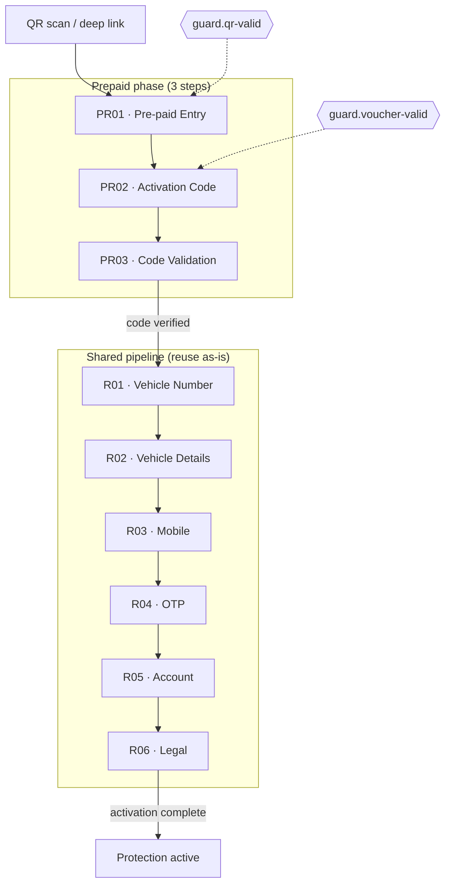

# Phase 7 — Consumer · QR Activation — B2B (Pre-Paid)

**App:** `@autolokate/onboarding`  
**Flow ID:** `prepaid`  
**Product area:** `qr-prepaid`  
**Date:** 2026-06-17  
**Prior art:** [Phase 6.6 Composition Extraction](./PHASE_6_6_COMPOSITION_EXTRACTION.md)

---

## Executive summary

Phase 7 implements the **Pre-paid (B2B Pre-Paid)** consumer activation flow with **3 new screens** (PR01–PR03) that prefix the existing **shared pipeline (R01–R06)** unchanged. No Purchase screens, checkout logic, or shared screen code was duplicated or modified.

All prepaid screens use **`FlowStepShell`**, **`InlineStatusBanner`**, **`EmptyStateHero`**, and **`FormFieldStack`** from Phase 6.6. All inputs and CTAs come from `@autolokate/ui` via the shell and DS primitives.

**Lint and build pass.** Dev preview includes a Prepaid section with state toggles, viewport widths (320–414), and light/dark themes.

**Onboarding health score: 94 / 100 (A)**

---

## Flow diagram



**Full step order (9 steps):**

| # | Step ID | Screen | Component |
|---|---------|--------|-----------|
| 1 | `prepaid.entry` | PR01 | `PR01PrepaidEntryScreen` |
| 2 | `prepaid.activation-code` | PR02 | `PR02ActivationCodeScreen` |
| 3 | `prepaid.code-validation` | PR03 | `PR03CodeValidationScreen` |
| 4 | `shared.vehicle-number` | R01 | `R01VehicleNumberScreen` *(reuse)* |
| 5 | `shared.vehicle-details` | R02 | `R02VehicleDetailsScreen` *(reuse)* |
| 6 | `shared.mobile` | R03 | `R03MobileNumberScreen` *(reuse)* |
| 7 | `shared.otp` | R04 | `R04OtpVerificationScreen` *(reuse)* |
| 8 | `shared.account` | R05 | `R05AccountCreationScreen` *(reuse)* |
| 9 | `shared.legal` | R06 | `R06LegalConsentScreen` *(reuse)* |

Flow **ends at R06** — no post-shared prepaid suffix (no checkout, no payment).

---

## Reused screens

| Screen | File | Modified |
|--------|------|----------|
| R01 · Vehicle Number | `features/shared-auth/screens/r01-vehicle-number/` | **No** |
| R02 · Vehicle Details | `features/shared-auth/screens/r02-vehicle-details/` | **No** |
| R03 · Mobile Number | `features/shared-auth/screens/r03-mobile-number/` | **No** |
| R04 · OTP Verification | `features/shared-auth/screens/r04-otp-verification/` | **No** |
| R05 · Account Creation | `features/shared-auth/screens/r05-account-creation/` | **No** |
| R06 · Legal Consent | `features/shared-legal/screens/r06-legal-consent/` | **No** |

Shared screens are referenced by the flow registry only. The dev preview continues to render them from the existing Shared section.

---

## New screens

### PR01 · Pre-paid Entry

**Path:** `features/qr-prepaid/screens/pr01-prepaid-entry/`  
**Step:** `prepaid.entry` · Screen ID: `PrepaidEntry`

| Requirement | Implementation |
|-------------|----------------|
| Explain prepaid activation | Two `AlText` blocks — org pre-paid context + what happens next |
| CTA: Continue | Shell footer `AlButton` via `FlowStepShell` |
| States | `loading` on footer |

### PR02 · Activation Code

**Path:** `features/qr-prepaid/screens/pr02-activation-code/`  
**Step:** `prepaid.activation-code` · Screen ID: `ActivationCode`

| Requirement | Implementation |
|-------------|----------------|
| AL inputs | `AlInput` inside `FormFieldStack` |
| loading | Footer loading + disabled input |
| error | `InlineStatusBanner variant="error"` + input error variant |
| success | `InlineStatusBanner variant="success"` + input success variant |

### PR03 · Code Validation

**Path:** `features/qr-prepaid/screens/pr03-code-validation/`  
**Step:** `prepaid.code-validation` · Screen ID: `CodeValidation`

| Requirement | Implementation |
|-------------|----------------|
| Validating state | `default` / `loading` → `EmptyStateHero variant="processing"` |
| Success state | `InlineStatusBanner variant="success"` + `EmptyStateHero variant="success"` |
| Invalid code state | `error` → `InlineStatusBanner variant="error"` + `EmptyStateHero` with `circle-x` icon |

---

## Architecture compliance

| Rule | Status |
|------|--------|
| No duplication from Purchase flow | ✓ No P01–P06 imports or checkout/plan markup |
| R01–R06 exactly as-is | ✓ Zero shared screen file changes |
| New screens only where required | ✓ PR01–PR03 only |
| `FlowStepShell` | ✓ `phase="prepaid"` added (3-step progress) |
| `InlineStatusBanner` | ✓ PR02, PR03 |
| `EmptyStateHero` | ✓ PR03 |
| No local buttons | ✓ Footer CTA via shell only |
| No local inputs | ✓ `AlInput` from `@autolokate/ui` |
| No checkout logic | ✓ |

---

## Duplication report

| Check | Result |
|-------|--------|
| Purchase screen imports in prepaid | **0** |
| Shared screen copies | **0** |
| Checkout / plan / payment markup | **0** |
| Local button components | **0** |
| Local input components | **0** |
| Duplicated shell JSX | **0** — uses `FlowStepShell` |
| Duplicated banner CSS | **0** — uses `InlineStatusBanner` |
| Duplicated hero panel JSX | **0** — uses `EmptyStateHero` on PR03 |

**Pattern reuse from Phase 6.6:**

| Composition | Prepaid usage |
|-------------|---------------|
| `FlowStepShell` | PR01, PR02, PR03 |
| `InlineStatusBanner` | PR02 (error/success), PR03 (error/success) |
| `EmptyStateHero` | PR03 (processing/success/invalid) |
| `FormFieldStack` | PR02 |

---

## Files created / modified

### Created

```
features/qr-prepaid/
├── types.ts
├── data/activation-data.ts
├── index.ts
└── screens/
    ├── inventory.ts
    ├── index.ts
    ├── pr01-prepaid-entry/
    ├── pr02-activation-code/
    └── pr03-code-validation/
```

### Modified (wiring only)

| File | Change |
|------|--------|
| `types/flow.ts` | Prepaid step/screen IDs → `entry`, `activation-code`, `code-validation` |
| `flow/registry/config/flows.config.ts` | 3-step prefix, empty suffix, merge at R01 |
| `flow/registry/config/steps.config.ts` | PR01–PR03 step definitions |
| `flow/guards/catalog.ts` | `guard.voucher-valid` → `prepaid.activation-code` |
| `components/flow-step-shell/FlowStepShell.tsx` | `phase="prepaid"` (3 steps, label Pre-paid) |
| `router/routes.schema.ts` | `prepaidFlowRoutes` (3 routes) |
| `router/index.ts` | Export prepaid routes |
| `dev/ScreenDevApp.tsx` | Prepaid section + `pr` vs `p` disambiguation |
| `src/index.ts` | Export PR01–PR03 |

---

## Responsive QA

**Command:** `pnpm --filter @autolokate/onboarding dev`

| Viewport | PR01 | PR02 | PR03 |
|----------|------|------|------|
| 320 | Body text wraps; footer CTA full width | Input + banner stack; no overflow | Hero centers; banner wraps |
| 360 | ✓ | ✓ | ✓ |
| 375 | ✓ | ✓ | ✓ |
| 390 | ✓ | ✓ | ✓ |
| 414 | ✓ | ✓ | ✓ |

| Theme | Check |
|-------|-------|
| Light | `AlScreenBg protected`, banner mixes, hero muted text |
| Dark | Dev theme toggle; semantic tokens |

Shared pipeline (R01–R06) QA unchanged — same dev preview Shared section.

---

## Future API integration points

| Step | Integration | Notes |
|------|-------------|-------|
| **Entry (PR01)** | `GET /prepaid/context?token={qrToken}` | Resolve org name, plan tier, expiry copy |
| **Activation code (PR02)** | `POST /prepaid/codes/validate-format` | Client-side format check before PR03; optional debounce |
| **Code validation (PR03)** | `POST /prepaid/codes/redeem` | `{ code, deviceId, qrToken }` → session + `guard.voucher-valid` |
| **Merge → R01** | Flow engine transition | On redeem success, set `session.prepaidVerified = true`, navigate to `shared.vehicle-number` |
| **R01–R06** | Existing shared APIs | Vehicle lookup, OTP, account, legal — unchanged |
| **Guards** | `guard.qr-valid` at flow entry | QR token validation before PR01 |
| | `guard.voucher-valid` after PR02 | Block shared pipeline until code redeemed |
| **Session shape** | `FlowContext.session` | `{ prepaidOrgId, activationCode, prepaidPlanId }` |

No API wiring in this phase — presentational screens only.

---

## Dev preview

Sidebar sections:

1. **Shared (reuse)** — R01–R06  
2. **Purchase (Phase 5)** — P01–P06  
3. **Prepaid (Phase 7)** — PR01–PR03  

Prepaid state toggles: `default` · `loading` · `error` · `success`

| Screen | `default` | `loading` | `error` | `success` |
|--------|-----------|-----------|---------|-----------|
| PR01 | Entry copy | Footer loading | — | — |
| PR02 | Code prefilled | Checking… | Invalid banner + input error | Success banner |
| PR03 | Validating hero | Validating hero | Invalid banner + hero | Verified banner + hero |

---

## Verification

```bash
pnpm --filter @autolokate/onboarding lint    # ✓
pnpm --filter @autolokate/onboarding build  # ✓
pnpm --filter @autolokate/onboarding dev      # PR01–PR03 + shared + purchase QA
```

---

## Onboarding health score

| Dimension | Phase 6.6 | Phase 7 | Δ |
|-----------|-----------|---------|---|
| DS import compliance | 100 | 100 | — |
| Token hygiene | 96 | 96 | — |
| Shell architecture | 95 | **98** | +3 |
| CSS centralization | 94 | 94 | — |
| JSX DRY | 85 | **88** | +3 |
| Composition readiness | 90 | **95** | +5 |
| Flow extensibility | — | **92** | new |

### **Overall: 94 / 100 (A)**

Prepaid demonstrates the intended architecture: **prefix flow screens + shared pipeline reuse + Phase 6.6 compositions**, with zero Purchase duplication.

---

## Decision

**Phase 7 complete.** Prepaid flow is ready for:

1. Flow engine / react-router wiring (routes schema in place)
2. API integration at documented endpoints
3. Figma parity pass when Pre-paid frames are finalized

**Not built (confirmed):** B2B fleet, B2B2C, Emergency flows.
