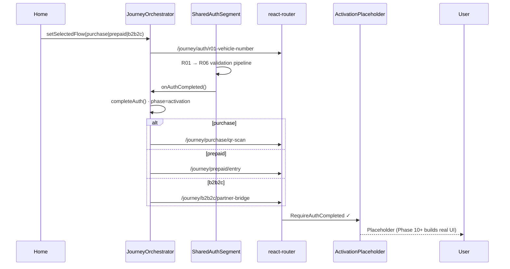

# Phase 9 — Journey Orchestrator

**App:** `@autolokate/onboarding`  
**Date:** 2026-06-17  
**Scope:** Architecture + navigation only — no activation UI, B2B2C screens, emergency screens, or design-system changes  
**Baseline:** [FLOW_ALIGNMENT_REPORT.md](./FLOW_ALIGNMENT_REPORT.md) (58 / 100 pre-Phase-9)

---

## Executive summary

Phase 9 introduces a **Journey Orchestrator** layer that implements the approved product topology:

**Home → Flow Selection → Shared Auth (R01–R06) → Activation (by flow) → Emergency → Completed**

`AUTH_COMPLETED` is no longer a terminal dead-end in the journey path — it hands off to flow-specific activation placeholders. `?dev=1` continues to load `ScreenDevApp` for isolated screen QA.

---

## 1. Route map

| Path | Phase | Component | Notes |
|------|-------|-----------|-------|
| `/` | — | Redirect | → `/journey` |
| `/journey` | `home` / `flow-select` | `HomeScreen` | Three consumer flows + theme toggle |
| `/journey/auth/*` | `shared-auth` | `SharedAuthSegment` | R01–R06; guarded by `RequireSelectedFlow` |
| `/journey/purchase/*` | `activation` | `ActivationPlaceholderScreen` | Entry: `/journey/purchase/qr-scan` |
| `/journey/prepaid/*` | `activation` | `ActivationPlaceholderScreen` | Entry: `/journey/prepaid/entry` |
| `/journey/b2b2c/*` | `activation` | `ActivationPlaceholderScreen` | Entry: `/journey/b2b2c/partner-bridge` |
| `/journey/emergency/*` | `emergency` | `EmergencyPlaceholderScreen` | Routing contract only |
| `/journey/completed` | `completed` | `JourneyCompletedScreen` | Terminal success + start over |
| `?dev=1` (any URL) | — | `ScreenDevApp` | Unchanged dev preview |

### Auth sub-paths (URL contract; step driven by segment state today)

| Path slug | Step |
|-----------|------|
| `/journey/auth/r01-vehicle-number` | R01 |
| `/journey/auth/r02-vehicle-details` | R02 |
| … | … |
| `/journey/auth/r06-legal-consent` | R06 → handoff |

### Activation entry paths (placeholders)

| Flow | `selectedFlow` | Entry path | Step ID |
|------|----------------|------------|---------|
| Purchase | `purchase` | `/journey/purchase/qr-scan` | `purchase.qr-scan` |
| Pre-Paid | `prepaid` | `/journey/prepaid/entry` | `prepaid.entry` |
| B2B2C | `b2b2c` | `/journey/b2b2c/partner-bridge` | `b2b2c.partner-bridge` |

### Emergency suffix (contract only)

| Path | Step ID |
|------|---------|
| `/journey/emergency/rider-setup` | `emergency.rider-setup` |
| `/journey/emergency/contact-capture` | `emergency.contact-capture` |
| `/journey/emergency/plan-addon` | `emergency.plan-addon` |
| `/journey/emergency/confirmation` | `emergency.confirmation` |

---

## 2. State map

### Journey phases (`JourneyPhase`)

```
home → flow-select → shared-auth → activation → emergency → completed
```

| Phase | Set when | UI surface |
|-------|----------|------------|
| `home` | App load / `clearJourney()` | Home |
| `flow-select` | `setSelectedFlow()` | Transient (same Home action) |
| `shared-auth` | Flow chosen → navigate auth | R01–R06 |
| `activation` | `completeAuth()` + activation route | Placeholder |
| `emergency` | Simulated activation complete | Placeholder |
| `completed` | Simulated emergency complete | Completed |

### Persisted state

| Key | Storage | Field | Values |
|-----|---------|-------|--------|
| `al-journey-v1` | `sessionStorage` | Full journey blob | `{ selectedFlow, authStatus, session }` |
| `al-selected-flow` | `localStorage` | `selectedFlow` | `purchase` \| `prepaid` \| `b2b2c` |
| `al-onboarding-theme` | `localStorage` | Theme | `light` \| `dark` |

### Context API (`useJourney`)

| Property / method | Purpose |
|-------------------|---------|
| `selectedFlow` | Active consumer flow |
| `authStatus` | `pending` \| `AUTH_COMPLETED` |
| `session` | Reserved for future form persistence |
| `phase` | Current journey phase |
| `setSelectedFlow(flow)` | Persist flow + set phase `flow-select` |
| `completeAuth()` | Set `authStatus = AUTH_COMPLETED`, phase `activation` |
| `clearJourney()` | Reset persistence + phase `home` |
| `setPhase(phase)` | Explicit phase transitions |

### Route guards

| Guard | Condition | Redirect |
|-------|-----------|----------|
| `RequireSelectedFlow` | No `selectedFlow` | `/journey` |
| `RequireAuthCompleted` | No flow or auth pending | `/journey/auth/r01-vehicle-number` |

---

## 3. `selectedFlow` lifecycle

```mermaid
flowchart TD
  START([App load]) --> LOAD{localStorage<br/>al-selected-flow?}
  LOAD -->|yes| RESTORE[Restore selectedFlow<br/>sessionStorage merge]
  LOAD -->|no| HOME[phase: home]
  RESTORE --> HOME

  HOME --> PICK[User picks flow on Home]
  PICK --> SET[setSelectedFlow]
  SET --> PERSIST[Write localStorage + sessionStorage]
  PERSIST --> AUTH_NAV[Navigate /journey/auth/r01]
  AUTH_NAV --> AUTH[phase: shared-auth]

  AUTH --> R06[R06 complete]
  R06 --> COMPLETE[completeAuth]
  COMPLETE --> BRANCH{selectedFlow}

  BRANCH -->|purchase| PUR[/journey/purchase/qr-scan]
  BRANCH -->|prepaid| PRE[/journey/prepaid/entry]
  BRANCH -->|b2b2c| B2C[/journey/b2b2c/partner-bridge]

  PUR --> ACT[phase: activation]
  PRE --> ACT
  B2C --> ACT

  ACT --> CLEAR[clearJourney on completed]
  CLEAR --> HOME
```

**Rules:**

1. `selectedFlow` is written on Home selection and survives refresh via `localStorage`.
2. Auth segment requires `selectedFlow`; activation routes require `AUTH_COMPLETED`.
3. `?dev=1` bypasses the orchestrator — dev preview does not write journey state.
4. Fleet **B2B** (`b2b` flow ID) is **not** in the Home trio — unchanged parallel product.

---

## 4. Activation handoff diagram

Replaces the Phase 8 **AUTH_COMPLETED terminal** (`AuthCompletedView`) in the production journey path.



**Legacy path:** `AuthFlowApp` (standalone import / tests) still shows `AuthCompletedView` when `onAuthCompleted` sets local completed state — not used by `JourneyOrchestrator`.

---

## 5. Emergency handoff diagram

Emergency is a **universal post-activation suffix** in the journey model. Phase 9 defines routing only.

```mermaid
flowchart LR
  ACT[Activation complete<br/>future: real screens] --> EM_ENTRY[/journey/emergency/rider-setup]
  EM_ENTRY --> EM1[emergency.rider-setup]
  EM1 --> EM2[emergency.contact-capture]
  EM2 --> EM3[emergency.plan-addon]
  EM3 --> EM4[emergency.confirmation]
  EM4 --> DONE[/journey/completed]

  subgraph phase9 [Phase 9 scope]
    PH[ActivationPlaceholder] -->|Simulate| EM_ENTRY
    EP[EmergencyPlaceholder] -->|Simulate| DONE
  end
```

**Note:** `flows.config.ts` `emergency` flow ID still embeds R01–R06 for declarative registry compatibility. Runtime journey uses the suffix after shared auth + activation — full config deprecation is Phase 10.

---

## 6. Module layout

```
apps/onboarding/src/journey/
├── JourneyOrchestrator.tsx    # BrowserRouter + JourneyProvider + routes
├── JourneyContext.tsx         # Phase + persistence context
├── activation-routing.ts      # Entry paths + emergency contract
├── constants.ts               # Paths, labels, storage keys
├── persistence.ts             # sessionStorage / localStorage
├── types.ts
├── journey.css
├── guards/JourneyRouteGuards.tsx
├── routes/
│   ├── JourneyRoutes.tsx
│   └── JourneySharedAuthRoute.tsx
└── screens/
    ├── HomeScreen.tsx
    ├── ActivationPlaceholderScreen.tsx
    ├── EmergencyPlaceholderScreen.tsx
    └── JourneyCompletedScreen.tsx

apps/onboarding/src/features/shared-auth/auth-flow/
├── SharedAuthSegment.tsx      # Extracted R01–R06 (onAuthCompleted hook)
└── AuthFlowApp.tsx            # Standalone + AUTH_COMPLETED terminal
```

---

## 7. Config alignment changes

| File | Change |
|------|--------|
| `flows.config.ts` | **prepaid:** auth before `prepaid.entry` suffix |
| `flows.config.ts` | **b2b2c:** `b2b2c.partner-bridge` moved to post-auth suffix |
| `flow/guards/catalog.ts` | `guard.voucher-valid` → `prepaid.entry` |
| `router/routes.schema.ts` | Added `routePaths.journey.*` + `journeyOrchestratorRoutes` |
| `main.tsx` | Default: `JourneyOrchestrator`; `?dev=1` → `ScreenDevApp` |

**Unchanged (deferred):**

- Purchase graph still starts at `purchase.plan-select` in config (`purchase.qr-scan` is journey entry only until Phase 10).
- Emergency declarative flow still includes shared pipeline prefix.
- No new activation, B2B2C, or emergency screen implementations.

---

## 8. Home screen

- **Shows:** Three consumer flow options (labels from `flowLabels`) + Light/Dark theme toggle.
- **No header, no browser chrome** — full-viewport AL layout using existing `AlButton`, `AlHeading`, `AlStack`, `AlText`.
- **Theme:** `setThemeMode` + `data-theme` + `al-onboarding-theme` persistence.

---

## 9. Dev mode

| URL | Entry |
|-----|-------|
| `/` | Journey orchestrator |
| `/?dev=1` | ScreenDevApp |
| `/journey?dev=1` | ScreenDevApp |

Dev preview remains isolated from journey persistence.

---

## 10. Alignment score after implementation

| Dimension | Weight | Pre (8.5) | Post (9) | Notes |
|-----------|--------|-----------|----------|-------|
| Shared screen reuse (R01–R06) | 15% | 95 | 95 | Unchanged — same screens |
| Purchase order vs target | 15% | 85 | 85 | Journey entry = `qr-scan`; config graph unchanged |
| Prepaid order vs target | 15% | 35 | **90** | Config reordered: auth → suffix |
| B2B2C order vs target | 10% | 30 | **80** | Partner bridge post-auth in config + routing |
| Emergency placement | 15% | 25 | **55** | Journey suffix routing contract; config + screens deferred |
| Journey orchestration | 20% | 40 | **92** | Home, selector, handoff, guards, persistence |
| Route/schema readiness | 10% | 55 | **85** | `/journey/*` in router + schema |

### **Overall alignment: 82 / 100 (B)**

**Delta:** +24 points from Phase 8.5 baseline (58 → 82).

**Remaining gaps for Phase 10+:**

1. Real activation screens (purchase QR scan, prepaid PR screens in journey context, B2B2C partner bridge).
2. Emergency suffix screens + deprecate standalone `emergency` flow graph.
3. URL ↔ step sync within auth segment (slug-driven step index).
4. `purchase.qr-scan` inserted into `flows.config.ts` purchase graph.
5. `/activate/:token` bootstrap API resolution.

---

## 11. Verification

```bash
pnpm --filter @autolokate/onboarding lint
pnpm --filter @autolokate/onboarding build
pnpm --filter @autolokate/onboarding dev
```

**Manual smoke path:**

1. Open `/` → Home with three flows.
2. Select Pre-Paid → complete R01–R06 → land on `/journey/prepaid/entry` placeholder.
3. Simulate Emergency → `/journey/emergency/rider-setup` → Simulate Completed → `/journey/completed`.
4. Start over → Home.
5. Open `/?dev=1` → ScreenDevApp (not journey).

---

## 12. Related documents

| Document | Relationship |
|----------|--------------|
| [FLOW_ALIGNMENT_REPORT.md](./FLOW_ALIGNMENT_REPORT.md) | Phase 8.5 baseline + recommendations |
| [AUTH_FLOW_SIGNOFF.md](./AUTH_FLOW_SIGNOFF.md) | R01–R06 implementation sign-off |
| [PHASE_7_PREPAID.md](./PHASE_7_PREPAID.md) | Prepaid screens (dev preview; graph position updated) |
| [ONBOARDING_ARCHITECTURE.md](./ONBOARDING_ARCHITECTURE.md) | Update recommended in Phase 10 |

---

## Verdict

Phase 9 delivers the **Journey Orchestrator** architecture approved in the alignment report: phased navigation, flow persistence, auth-to-activation handoff, emergency routing contract, and schema updates — without building activation, B2B2C, or emergency product screens.

**Do not build B2B2C or emergency UI until Phase 10 activation gaps are scheduled.**
