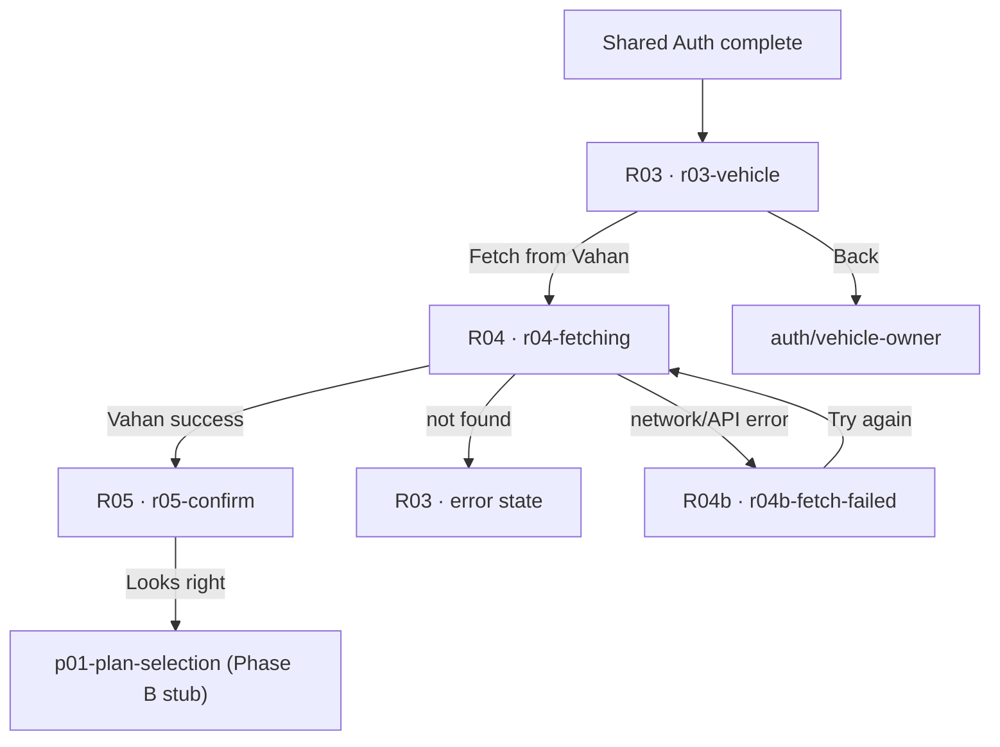

# Phase A — Purchase Implementation

**Date:** 2026-06-17  
**Source of truth:** [PURCHASE_FIGMA_AUDIT.md](./PURCHASE_FIGMA_AUDIT.md)  
**Scope:** R03–R05 vehicle activation only (no R06+, checkout, payment, permissions)

---

## Implemented screens

| Figma | Node | Route | Component |
|-------|------|-------|-----------|
| R03 · Vehicle number | `170:25` | `/journey/purchase/r03-vehicle` | `R03VehicleNumberScreen` |
| R03b · Vehicle not found | `579:1700` | *(inline state on R03)* | `plateState="error"` |
| R04 · Fetching details | `179:25` | `/journey/purchase/r04-fetching` | `R04FetchingVehicleScreen` |
| R04b · Couldn't fetch from Vahan | `579:1663` | `/journey/purchase/r04b-fetch-failed` | `R04bFetchFailedScreen` |
| R05 · Confirm vehicle | `170:71` | `/journey/purchase/r05-confirm` | `R05ConfirmVehicleScreen` |

**Not implemented (by design):** R01 QR Scan, R02 Name (Shared Auth boundary).

---

## Entry point

```
Mobile → OTP → Name (174:25 / A3) → R03 Vehicle
```

Post-auth navigation lands on `purchaseJourneyPaths.r03Vehicle` via `activationEntryByFlow.purchase` and `defaultActivationAfterAuth`.

---

## Route graph (Phase A)



### Demo Vahan behaviour (`vahan-demo.ts`)

| Plate input | Result |
|-------------|--------|
| `MH 12 AB 3456` | Success → R05 |
| `MH 12 AB 0000` | Fetch error → R04b |
| Any other valid-length plate | Not found → R03 error |
| Offline (`navigator.onLine === false`) | Fetch error → R04b |

---

## Component reuse

| Layer | Component | Used on |
|-------|-----------|---------|
| DS | `AlPlateInput` | R03/R03b |
| DS | `AlButton` | All footers |
| DS | `AlVehicleRcCard` + `AlField` | R05 |
| DS | `AlScreenSpinner` | R04 |
| DS | `AlScreenBg` | All shells |
| DS | `AlHeading`, `AlText` | All screens |
| Onboarding shell | `AuthStepShell` | R03, R05 |
| Onboarding composition | `PurchaseStatusShell` | R04, R04b |
| Onboarding composition | `VahanPreviewChips` | R03, R03b |
| Onboarding composition | `TrustRow` | R03, R03b |
| Icons | `shield-check`, `circle-check` | Trust row, RC card, chips |

---

## Promotions to `@autolokate/ui`

| Component | Path | Reason |
|-----------|------|--------|
| **`AlPlateInput` `error` prop** | `packages/ui/.../PlateInput/` | Figma R03b 2px amber border — reusable form state across flows |
| **`AlScreenSpinner`** | `packages/ui/.../ScreenSpinner/` | Figma 60×60 green loader — reused in R04, R09, R09b (Phase C) |

**Not promoted (single-area reuse):**

- `VahanPreviewChips` — R03/R03b only (onboarding composition)
- `PurchaseStatusShell` — purchase loading/error screens only (onboarding composition)

---

## Parity checklist

| Item | Figma | Implementation | Status |
|------|-------|----------------|--------|
| R03 title | Add your vehicle | ✓ | ✅ |
| R03 description | Type your plate number… | ✓ | ✅ |
| R03 CTA | Fetch from Vahan | ✓ | ✅ |
| R03 ctaHelper | Enter your number to continue | ✓ | ✅ |
| R03 plate height | 62px | `AlPlateInput` token | ✅ |
| R03 chips label | Vahan will fill these in | ✓ | ✅ |
| R03 chip labels | Make & model, Year, Fuel, Insurance, PUC, Owner name | ✓ | ✅ |
| R03 trust row | We only read your RC details · encrypted | ✓ | ✅ |
| R03b error copy | We couldn't find that number… | ✓ | ✅ |
| R03b error color | `#F5A623` Body 16/24 | `--al-signal-amber` Body | ✅ |
| R03b plate border | 2px `#F5A623` | `AlPlateInput--error` | ✅ |
| R04 title | Fetching your vehicle details (Display 36/44) | `AlHeading h1` | ✅ |
| R04 description | Reading your RC from Vahan… | ✓ | ✅ |
| R04 spinner | 60×60 `#1FA24A` | `AlScreenSpinner--lg` | ✅ |
| R04 back/CTA | None | `hideFooter` | ✅ |
| R04b title | We couldn't fetch your details | ✓ | ✅ |
| R04b CTA | Try again | ✓ | ✅ |
| R05 title | Confirm your vehicle | ✓ | ✅ |
| R05 description | We fetched these details from Vahan. Tap to confirm | ✓ | ✅ |
| R05 RC card | 8 fields, Verified chip | `AlVehicleRcCard` | ✅ |
| R05 CTA | Looks right | ✓ | ✅ |
| Step progress bar | Not on R03–R05 | `hideProgress` | ✅ |
| R01/R02 | Out of scope | Not implemented | ✅ |

---

## Responsive QA

Dev preview (`ScreenDevApp`) supports viewports **320 / 360 / 375 / 390 / 414** and **light/dark** theme toggle.

| Screen | 320 | 360 | 375 | 390 | 414 | Light | Dark |
|--------|-----|-----|-----|-----|-----|-------|------|
| R03 empty | ✓ | ✓ | ✓ | ✓ | ✓ | ✓ | ✓ |
| R03 error | ✓ | ✓ | ✓ | ✓ | ✓ | ✓ | ✓ |
| R04 loading | ✓ | ✓ | ✓ | ✓ | ✓ | ✓ | ✓ |
| R04b retry | ✓ | ✓ | ✓ | ✓ | ✓ | ✓ | ✓ |
| R05 confirm | ✓ | ✓ | ✓ | ✓ | ✓ | ✓ | ✓ |

**Notes:**

- `PurchaseStatusShell` reduces top padding at ≤375px and ≤320px to keep centered content visible.
- `AuthStepShell` frame max-width 393px with 16px inset matches Figma frame.

---

## Session model

`JourneySession.vehicle` added in `journey/types.ts`:

```ts
vehicle?: {
  plate?: string;
  fields?: AlVehicleRcField[];
  fetchStatus?: 'idle' | 'fetching' | 'success' | 'not-found' | 'error';
  confirmed?: boolean;
};
```

Persisted via existing `al-journey-v1` sessionStorage.

---

## File map

```
apps/onboarding/src/features/qr-purchase/
├── data/vahan-demo.ts
├── types-vehicle.ts
└── screens/
    ├── purchase-vehicle.css
    ├── r03-vehicle-number/
    ├── r04-fetching-vehicle/
    ├── r04b-fetch-failed/
    └── r05-confirm-vehicle/

apps/onboarding/src/components/compositions/
├── vahan-preview-chips/
└── purchase-status-shell/

apps/onboarding/src/journey/
├── purchase/purchase-routing.ts   ← r03–r05 paths prepended
├── routes/PurchaseRoutes.tsx      ← route orchestration
├── activation-routing.ts          ← purchase entry → r03
└── auth/auth-routing.ts           ← defaultActivationAfterAuth → r03

packages/ui/src/components/
├── forms/PlateInput/              ← error prop
└── primitives/ScreenSpinner/      ← new
```

---

## Remaining gaps

| Gap | Figma reference | Notes |
|-----|-----------------|-------|
| **Enter manually** | R04b hotspot | Prototype-only link in Figma — no target frame; not wired |
| **Real Vahan API** | R04 | Mock `fetchVahanDetails` — replace in integration phase |
| **Plate format validation** | R03 | CTA gates on ≥8 alphanumeric chars; no state-wise format rules |
| **flows.config.ts steps** | Registry | `purchase.vehicle-*` step IDs not yet added to flow registry |
| **P01+ parity** | R06+ | Phase B/C — existing P01–P06 still pre-Figma |
| **R04b halo SVG** | `579:1667` | CSS radial gradient approximation; not pixel-identical SVG |
| **Chip icon stroke** | R03 vectors | Uses `circle-check` icon vs Figma stroke vectors |

---

## Build verification

```bash
cd packages/ui && pnpm run build
cd apps/onboarding && pnpm run build
```

Both pass after Phase A implementation.

---

**Phase A complete.** Ready for Phase B (R06 plan carousel, R07 rider, R08 checkout).
