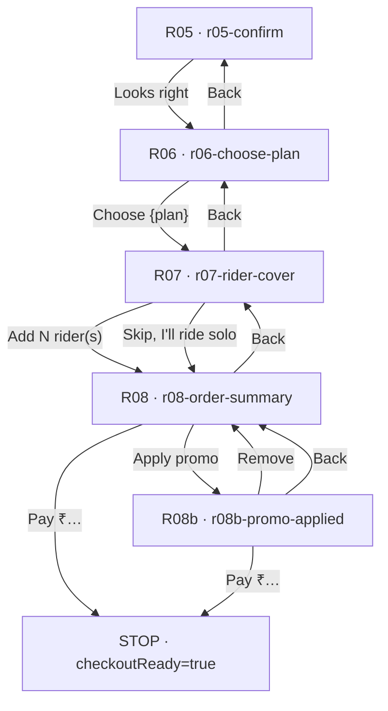
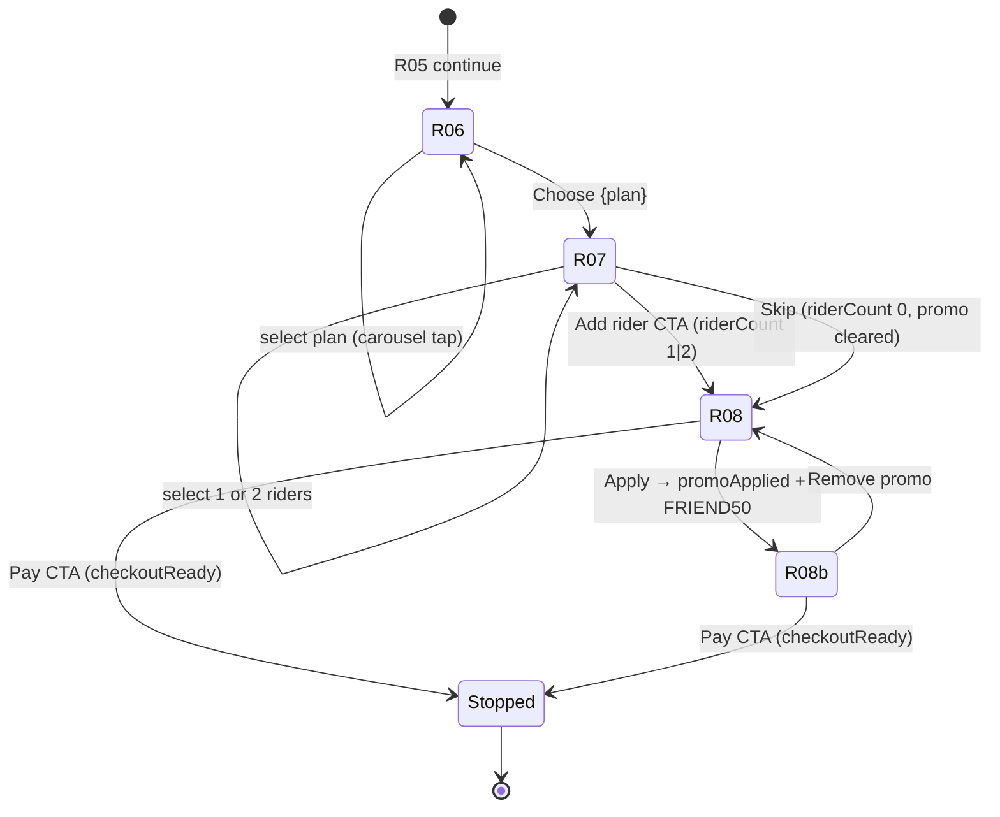

# Phase B — Purchase Checkout Implementation

**Date:** 2026-06-17  
**Source of truth:** Figma · Consumer · QR Activation + Purchase · section `167:434`  
**Scope:** R06 Choose Plan · R07 Add Rider Cover · R08 Order Summary · R08b Promo Applied  
**Stop gate:** Pay CTA sets `checkoutReady` only — **no R09+ payment screens**

---

## Implemented screens

| Figma | Node | Route | Component |
|-------|------|-------|-----------|
| R06 · Choose plan | `183:25` · `243:49` · `243:76` · `243:103` | `/journey/purchase/r06-choose-plan` | `R06ChoosePlanScreen` |
| R07 · Add rider cover | `186:25` | `/journey/purchase/r07-rider-cover` | `R07RiderCoverScreen` |
| R08 · Order summary | `190:25` | `/journey/purchase/r08-order-summary` | `R08OrderSummaryScreen` |
| R08b · Promo applied | `333:37` | `/journey/purchase/r08b-promo-applied` | `R08bPromoAppliedScreen` |

**Not implemented (by design):** R09 Processing · R10 Payment Success · R10b Payment Failed · R14 Permissions · R15 Activation Complete

---

## Route graph



### Guards

| Route | Redirect if |
|-------|-------------|
| R06 | `vehicle.confirmed !== true` → R05 |
| R07 | no `purchase.selectedPlanId` or vehicle unconfirmed → R06 |
| R08 | no `purchase.selectedPlanId` → R06 |
| R08b | `promoApplied !== true` or missing `promoCode` → R08 |

### Session bootstrap (R05 → R06)

On R05 **Looks right**, purchase session resets:

```ts
purchase: {
  selectedPlanId: 'secure',  // DEFAULT_PURCHASE_PLAN_ID
  riderCount: 1,
  promoApplied: false,
  promoCode: null,
  checkoutReady: false,
}
```

---

## State graph



### `JourneySession.purchase`

```ts
type PurchaseCheckoutSession = {
  selectedPlanId?: 'safe' | 'secure' | 'shield' | 'shield-plus';
  riderCount?: 0 | 1 | 2;
  promoCode?: string | null;
  promoApplied?: boolean;
  checkoutReady?: boolean;  // Phase B stop gate
};
```

Persisted via existing `al-journey-v1` sessionStorage.

---

## Plan catalog (all four Figma tiers)

| ID | Name | Price | Badge | Tall card |
|----|------|-------|-------|-----------|
| `safe` | Safe | ₹99/yr | — | 340px |
| `secure` | Secure | ₹999/yr | MOST POPULAR | 366px |
| `shield` | Shield | ₹1,999/yr | — | 340px |
| `shield-plus` | Shield+ | ₹2,999/yr | — | 340px |

Source: `apps/onboarding/src/features/qr-purchase/data/purchase-plans.ts`

Default selection: **Secure** (`DEFAULT_PURCHASE_PLAN_ID`).

---

## Plan selection matrix

Totals from `buildOrderSummary()` — rider prices fixed per Figma R07/R08 example (not plan-scaled).

| Plan | Plan ₹ | + 1 rider | + 2 riders | Skip (0 riders) |
|------|--------|-----------|------------|-----------------|
| Safe | 99 | 1,048 | 1,897 | 99 |
| Secure | 999 | 1,948 | 2,797 | 999 |
| Shield | 1,999 | 2,948 | 3,797 | 1,999 |
| Shield+ | 2,999 | 3,948 | 4,797 | 2,999 |

**With promo `FRIEND50` (−₹100):** subtract 100 from Total on R08b.

| Example | Lines | Total | Pay CTA |
|---------|-------|-------|---------|
| Secure · 1 rider | Secure plan ₹999/yr · Rider cover × 1 +₹949 | ₹1,948 | Pay ₹1,948 |
| Secure · skip | Secure plan ₹999/yr | ₹999 | Pay ₹999 |
| Shield+ · 2 riders · promo | Shield+ plan ₹2,999/yr · Rider × 2 +₹1,798 · Promo FRIEND50 −₹100 | ₹4,697 | Pay ₹4,697 |

GST note: `Inclusive of 18% GST (₹…)` computed via `computeGstInclusive()`.

---

## Rider matrix

| Action | `riderCount` | Summary line | CTA on R07 |
|--------|--------------|--------------|------------|
| 1 rider selected | `1` | Rider cover × 1 · +₹949 | Add 1 rider · ₹949 |
| 2 riders selected | `2` | Rider cover × 2 · +₹1,798 | Add 2 riders · ₹1,798 |
| Skip | `0` | *(no rider line)* | — |

Rider option cards: 5% OFF (1 rider, strike ₹999 → ₹949) · 10% OFF (2 riders, strike ₹1,998 → ₹1,798).

---

## Dynamic plan context

Selected plan appears on **R07 · R08 · R08b** via `getPlanContextLabel()`:

```
{Plan name} plan · {priceLabel}
```

Example: `Secure plan · ₹999/yr`

R06 footer CTA: `Choose {plan.name}` (updates on carousel selection).

---

## Reused compositions (documented — not promoted to `@autolokate/ui`)

| Composition | Path | Used on | Reuse count |
|-------------|------|---------|-------------|
| **PlanCarousel** | `components/compositions/plan-carousel/` | R06 | 1 |
| **RiderCoverOptions** | `components/compositions/rider-cover-options/` | R07 | 1 |
| **PromoCodeField** | `components/compositions/promo-code-field/` | R08, R08b | **2** |
| **OrderSummaryCard** | `components/compositions/order-summary-card/` | R08, R08b | **2** |
| **AuthStepShell** | `components/auth-step-shell/` | R06–R08b (+ Phase A) | 4+ |
| **`buildOrderSummary()`** | `data/purchase-pricing.ts` | R08, R08b | **2** |
| **`getPlanContextLabel()`** | `data/purchase-pricing.ts` | R07, R08, R08b | **3** |

### DS primitives used (already in `@autolokate/ui`)

| Primitive | Used on |
|-----------|---------|
| `AlPlanCard` | R06 carousel (4 cards) |
| `AlButton` | Shell footer |
| `AlHeading`, `AlText` | Shell + summary |
| `AlIcon` `circle-check` | Plan features, rider radio, promo applied |

### DS tweak for Phase B

| Change | Path | Figma spec |
|--------|------|------------|
| Selected plan ring | `PlanCard.css` `.al-plan-card--selected` | 2px `#1FA24A` border + `0 0 18px rgba(31,163,74,0.28)` shadow |

---

## Figma parity checklist

| Item | Figma | Implementation | Status |
|------|-------|----------------|--------|
| R06 title | Choose your plan | ✓ | ✅ |
| R06 description | From daily essentials… | ✓ | ✅ |
| R06 carousel | 270×340 cards, 14px gap | `16.875rem` × `21.25rem`, gap 14px | ✅ |
| R06 Secure tall | 366px height | `--tall` min-height 22.875rem | ✅ |
| R06 hint | ‹ Tap a card… › | ✓ | ✅ |
| R06 CTA | Choose {plan} | dynamic footer | ✅ |
| R06 selection | Green ring + shadow | `AlPlanCard--selected` | ✅ |
| R07 title / description | Add rider cover? / Cover whoever… | ✓ | ✅ |
| R07 cards | 16px radius, discount chips | `ob-rider-cover-option` | ✅ |
| R07 selected border | 2px green | `--selected` | ✅ |
| R07 skip link | Skip, I'll ride solo | ✓ | ✅ |
| R07 CTA | Add N rider(s) · ₹… | `getRiderCtaLabel()` | ✅ |
| R08 title | Review & pay | ✓ | ✅ |
| R08 promo row | Have a promo code? / Apply | `PromoCodeField` empty | ✅ |
| R08 summary card | Plan · rider · total · GST | `OrderSummaryCard` | ✅ |
| R08 gateway note | Pay securely by UPI… | ✓ | ✅ |
| R08 CTA | Pay ₹{total} | dynamic | ✅ |
| R08b promo applied | Check + code + Remove | `PromoCodeField` applied | ✅ |
| R08b promo line | Promo · FRIEND50 · −₹100 | green value | ✅ |
| Step progress bar | None on purchase frames | `hideProgress` | ✅ |
| Card surfaces | `#1A1A1A` bg · `#4A4A4A` border | `--al-neutral-900/700` | ✅ |

---

## Responsive QA

Dev preview (`ScreenDevApp` → **Purchase · Phase B**) supports viewports **320 / 360 / 375 / 390 / 414** and **light/dark** theme toggle.

| Screen | 320 | 360 | 375 | 390 | 414 | Light | Dark |
|--------|-----|-----|-----|-----|-----|-------|------|
| R06 · all 4 plans | ✓ | ✓ | ✓ | ✓ | ✓ | ✓ | ✓ |
| R07 · 1 rider | ✓ | ✓ | ✓ | ✓ | ✓ | ✓ | ✓ |
| R08 · no promo | ✓ | ✓ | ✓ | ✓ | ✓ | ✓ | ✓ |
| R08b · FRIEND50 | ✓ | ✓ | ✓ | ✓ | ✓ | ✓ | ✓ |

**Notes:**

- R06 carousel uses horizontal scroll + `scroll-snap-align: center`; negative inline margin exposes peek at adjacent cards.
- `AuthStepShell` max-width 393px with 16px inset matches Figma frame.
- Phase B card surfaces use explicit `--al-neutral-900` for Figma dark card parity in both themes (cards remain dark-surface styled in light mode, matching Figma export frames).

---

## File map

```
apps/onboarding/src/features/qr-purchase/
├── types-checkout.ts
├── data/
│   ├── purchase-plans.ts      ← 4-plan catalog
│   └── purchase-pricing.ts    ← summary + GST + rider CTA labels
└── screens/
    ├── purchase-phase-b.css
    ├── r06-choose-plan/
    ├── r07-rider-cover/
    ├── r08-order-summary/
    └── r08b-promo-applied/

apps/onboarding/src/components/compositions/
├── plan-carousel/
├── rider-cover-options/
├── promo-code-field/
└── order-summary-card/

apps/onboarding/src/journey/
├── purchase/purchase-routing.ts   ← r06–r08b paths
├── routes/PurchaseRoutes.tsx      ← R06–R08b route orchestration
└── progress/purchase-route-progress.ts

packages/ui/src/components/primitives/PlanCard/
└── PlanCard.css                   ← selected ring shadow
```

---

## Remaining gaps

| Gap | Notes |
|-----|-------|
| **Promo entry UX** | R08 Apply is one-tap demo — applies hardcoded `FRIEND50`; no text input / validation UI |
| **Payment handoff** | Pay CTA only sets `checkoutReady: true`; R09 not wired (Phase C) |
| **`purchaseStepPathSequence`** | Includes R08b as terminal step; live graph treats R08b as optional promo branch |
| **Plan context line** | `{Plan} plan · {price}` above R07/R08 content supports dynamic summary requirement; not a separate Figma frame element |
| **R07 back-after-skip** | If user skipped (`riderCount: 0`) then navigates back, UI defaults display to 1 rider until re-selected |
| **Legacy P01–P06** | Pre-Figma dev routes retained; not in active journey |
| **Pixel signoff** | Side-by-side Figma overlay QA not run in CI; dev preview available for manual pass |
| **Real promo API** | Replace demo apply with backend validation in integration phase |

---

## Build verification

```bash
pnpm --filter @autolokate/ui --filter @autolokate/onboarding build
```

Both packages pass after Phase B implementation.

---

## Verdict

### **READY FOR PHASE C**

Phase B screens R06–R08b are implemented with four-plan catalog, rider skip/add paths, dynamic order summary, promo apply/remove branch, and journey wiring from R05 through checkout stop gate. Payment (R09+) intentionally not built.
