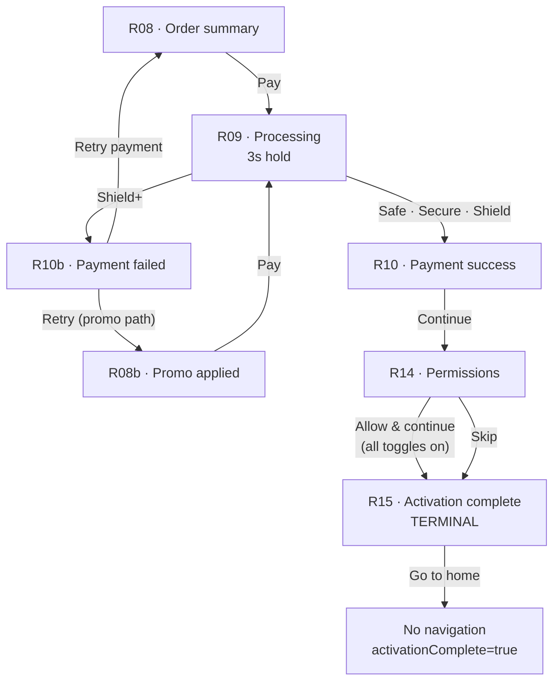
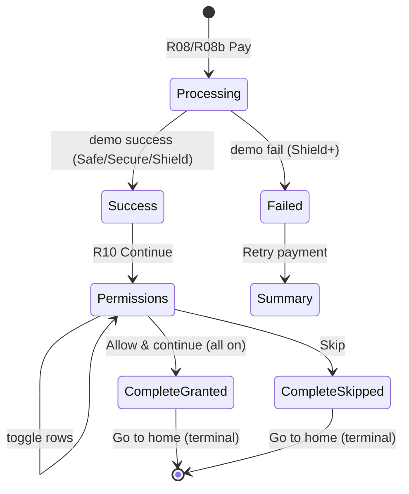

# Phase C — Payment, Permissions & Activation Complete

**Date:** 2026-06-17  
**Source of truth:** Figma · Consumer · QR Activation + Purchase · section `167:434`  
**Scope:** R09 Processing · R10 Success · R10b Failed · R14 Permissions · R15 Activation Complete  
**Not in scope:** Real payment gateway · R09b · R10c · B2B2C · Prepaid

---

## Implemented screens

| Figma | Node | Route | Component |
|-------|------|-------|-----------|
| R09 · Processing payment | `192:25` | `/journey/purchase/r09-processing-payment` | `R09ProcessingPaymentScreen` |
| R10 · Payment success | `193:25` | `/journey/purchase/r10-payment-success` | `R10PaymentSuccessScreen` |
| R10b · Payment failed | `194:25` | `/journey/purchase/r10b-payment-failed` | `R10bPaymentFailedScreen` |
| R14 · Permissions | `32:132` | `/journey/purchase/r14-permissions` | `R14PermissionsScreen` |
| R14b · All on (dev) | `764:2199` | *(inline state on R14)* | all toggles on → Allow CTA |
| R15 · Activation complete | `171:59` | `/journey/purchase/r15-activation-complete` | `R15ActivationCompleteScreen` |

---

## Route graph



### Guards

| Route | Redirect if |
|-------|-------------|
| R09 | `paymentStatus !== 'processing'` or `checkoutReady !== true` → R08/R08b |
| R10 | `paymentStatus !== 'success'` → R08/R08b |
| R10b | `paymentStatus !== 'failed'` → R08/R08b |
| R14 | `paymentStatus !== 'success'` → R08/R08b |
| R15 | payment not success or `permissionOutcome` not `granted`/`skipped` → R14 |

---

## State graph



### Session extensions (`JourneySession.purchase`)

```ts
paymentStatus?: 'idle' | 'processing' | 'success' | 'failed'
paidAmountInr?: number
permissions?: { location, crashDetection, notifications: boolean }
permissionOutcome?: 'pending' | 'granted' | 'skipped'
activationComplete?: boolean
```

---

## Payment matrix (demo routing)

| Plan | `selectedPlanId` | Demo outcome | Next screen |
|------|------------------|--------------|-------------|
| Safe | `safe` | Success | R10 |
| Secure | `secure` | Success | R10 |
| Shield | `shield` | Success | R10 |
| Shield+ | `shield-plus` | **Failed** | R10b |

**Processing hold:** `PAYMENT_PROCESSING_MS = 3000` (3 seconds on R09).

**Dynamic R10 copy:** `₹{total} paid · your {Plan} plan is now active` via `getPaymentSuccessDescription()`.

**Retry (R10b):** Resets `paymentStatus` to `idle`, returns to R08 or R08b based on `promoApplied`.

---

## Permission matrix

| Permission | Icon | Recommended copy | Off consequence |
|------------|------|------------------|-----------------|
| Location | `map-pin` | Recommended · Guide help to your exact spot in a crash | Off · we can't guide help to your spot in a crash |
| Crash detection | `shield-check` | Recommended · Sense a serious impact automatically | Off · you won't be auto-alerted in a crash |
| Notifications | `bell` | Renewals, bookings and safety alerts | Off · you may miss renewals and safety alerts |

| User action | `permissionOutcome` | CTA state | Next |
|-------------|---------------------|-----------|------|
| All toggles off | `pending` | ctaHelper only · no primary CTA | — |
| All toggles on | — | **Allow & continue** visible | R15 (`granted`) |
| **Skip** link | `skipped` | Always available | R15 (`skipped`) |

Off-consequence amber text hidden when toggle is on (Figma R14b).

---

## Dynamic R15 copy

| Field | Source |
|-------|--------|
| Title | `{Plan} is active` |
| Description | `{plate} is now protected by {Plan}. Crash detection is live` |
| Chip | `{Plan} · active` (AlChip green) |
| Plate | `session.vehicle.plate` |

**Terminal behaviour:** `Go to home` sets `activationComplete: true` and disables CTA — **no route navigation** (no dashboard).

---

## Reused compositions (documented — not promoted to `@autolokate/ui`)

| Composition / primitive | Path | Used on | Reuse |
|-------------------------|------|---------|-------|
| **PurchaseStatusShell** | `compositions/purchase-status-shell/` | R09, R10, R10b, R15 | **4** |
| **PermissionRow** | `compositions/permission-row/` | R14 | 1 |
| **AuthStepShell** | `auth-step-shell/` | R14 | 1 |
| **AlScreenSpinner** | `@autolokate/ui` | R09 | 1 |
| **`payment-success-halo`** | `@autolokate/icons` | R10 | 1 |
| **`fetch-failed-halo`** | `@autolokate/icons` | R10b | 1 |
| **`activation-complete-halo`** | `@autolokate/icons` | R15 | 1 |

`PurchaseStatusShell.bodyAccessory` extended for R15 green chip placement after description.

---

## Figma parity checklist

| Item | Figma | Implementation | Status |
|------|-------|----------------|--------|
| R09 title | Processing your payment (Display) | `PurchaseStatusShell` h1 | ✅ |
| R09 description | Securing your payment… | ✓ | ✅ |
| R09 loader | 60×60 `#1FA24A` | `AlScreenSpinner` lg | ✅ |
| R09 CTA | None | `hideFooter` | ✅ |
| R10 hero | Green halo 240×240 + check | `payment-success-halo` | ✅ |
| R10 CTA | Continue | ✓ | ✅ |
| R10b hero | Amber halo + circle-x | `fetch-failed-halo` | ✅ |
| R10b CTA | Retry payment | ✓ | ✅ |
| R14 cards | 3 rows · 16px radius · toggles | `PermissionRow` | ✅ |
| R14 ctaHelper | Turn on all permissions… | ✓ | ✅ |
| R14 Allow | Allow & continue (all on) | gated on all toggles | ✅ |
| R14 Skip | — | Skip link (journey req.) | ✅ |
| R15 hero | Green radial halo + shield | `activation-complete-halo` | ✅ |
| R15 chip | Secure · active | `AlChip` green | ✅ |
| R15 CTA | Go to home (terminal) | disabled after tap | ✅ |
| No back | R09/R10/R10b/R15 | `PurchaseStatusShell` | ✅ |

---

## Responsive QA

Dev preview (`ScreenDevApp` → **Purchase · Phase C**) supports **320 / 360 / 375 / 390 / 414** and **light/dark**.

| Screen | 320 | 360 | 375 | 390 | 414 | Light | Dark |
|--------|-----|-----|-----|-----|-----|-------|------|
| R09 · Processing | ✓ | ✓ | ✓ | ✓ | ✓ | ✓ | ✓ |
| R10 · Success | ✓ | ✓ | ✓ | ✓ | ✓ | ✓ | ✓ |
| R10b · Failed | ✓ | ✓ | ✓ | ✓ | ✓ | ✓ | ✓ |
| R14 · All off | ✓ | ✓ | ✓ | ✓ | ✓ | ✓ | ✓ |
| R14b · All on | ✓ | ✓ | ✓ | ✓ | ✓ | ✓ | ✓ |
| R15 · Complete | ✓ | ✓ | ✓ | ✓ | ✓ | ✓ | ✓ |

**Notes:**

- `PurchaseStatusShell` responsive padding matches Phase A R04/R04b.
- Permission cards stack vertically with 12px gap; toggle column fixed at 46px.

---

## File map

```
apps/onboarding/src/features/qr-purchase/
├── types-checkout.ts              ← payment + permission session types
├── data/
│   ├── purchase-payment-demo.ts   ← Shield+ fail rule · 3s hold
│   └── purchase-permissions.ts    ← R14 copy catalog
└── screens/
    ├── r09-processing-payment/
    ├── r10-payment-success/
    ├── r10b-payment-failed/
    ├── r14-permissions/
    └── r15-activation-complete/

apps/onboarding/src/components/compositions/
└── permission-row/

packages/icons/src/generated/
├── payment-success-halo.tsx
└── activation-complete-halo.tsx

apps/onboarding/src/journey/
├── purchase/purchase-routing.ts
└── routes/PurchaseRoutes.tsx      ← R09–R15 orchestration
```

---

## Remaining gaps

| Gap | Notes |
|-----|-------|
| **Real payment gateway** | Demo timer only — no Razorpay/Cashfree/PhonePe/API |
| **R09b / R10c** | Extended confirming / ambiguous states not in Phase C scope |
| **R15 exit** | Go to home is terminal — no `/journey/home` or dashboard wired |
| **Legacy P01–P06** | Dev-only Phase 5 routes retained |
| **OS permission prompts** | Toggle UI only — no native permission APIs |
| **Pixel signoff** | Side-by-side Figma overlay QA manual via dev preview |

---

## Build verification

```bash
pnpm --filter @autolokate/icons --filter @autolokate/ui --filter @autolokate/onboarding build
```

All pass after Phase C implementation.

---

## Verdict

### **PURCHASE FLOW COMPLETE**

Consumer QR Activation + Purchase journey is implemented from **R03 through R15** with demo payment routing, permission grant/skip paths, and terminal activation screen. Payment gateway integration deferred to a future integration phase.
