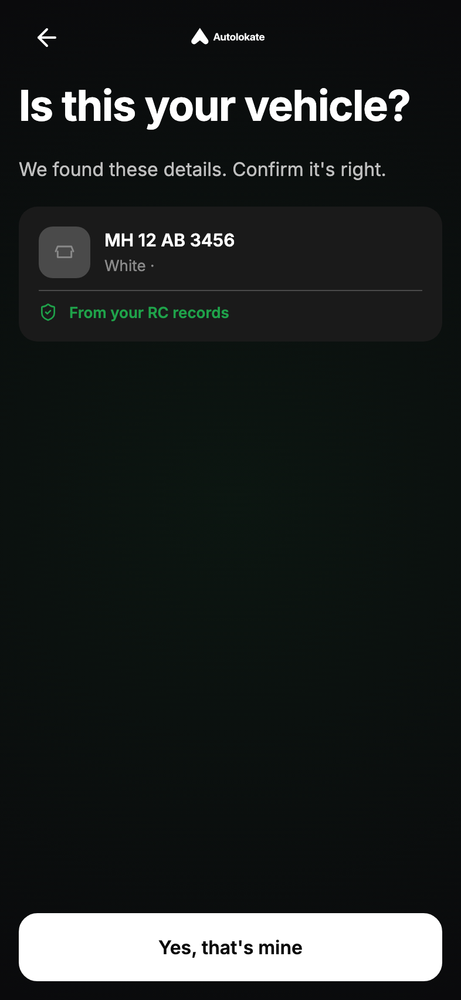
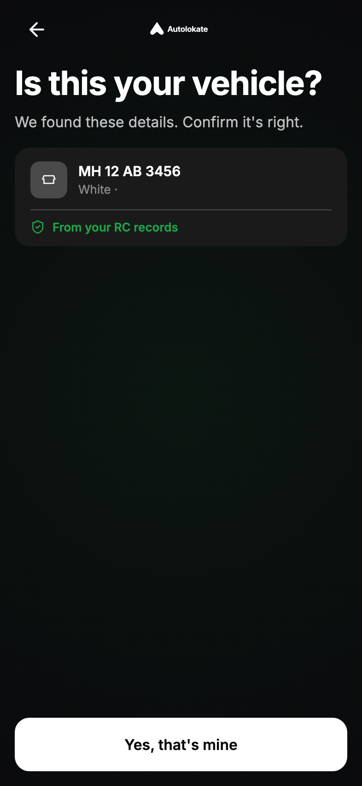
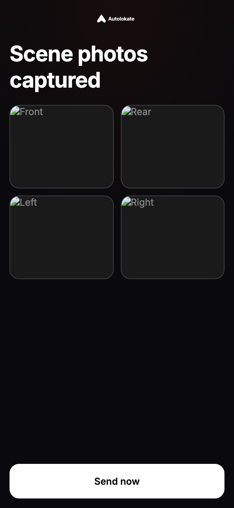
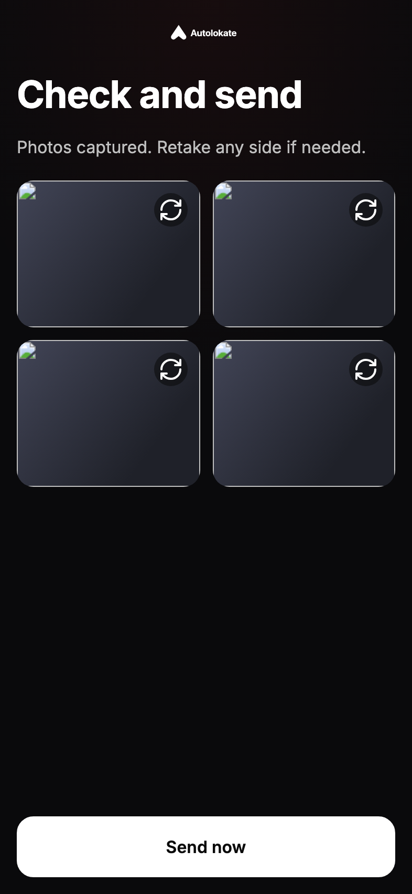
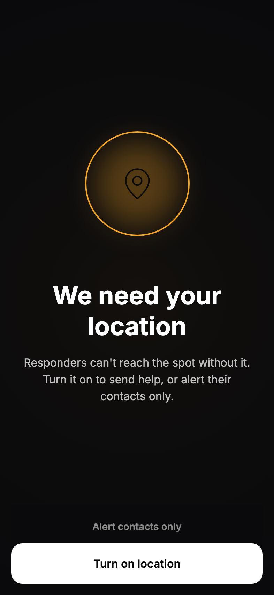
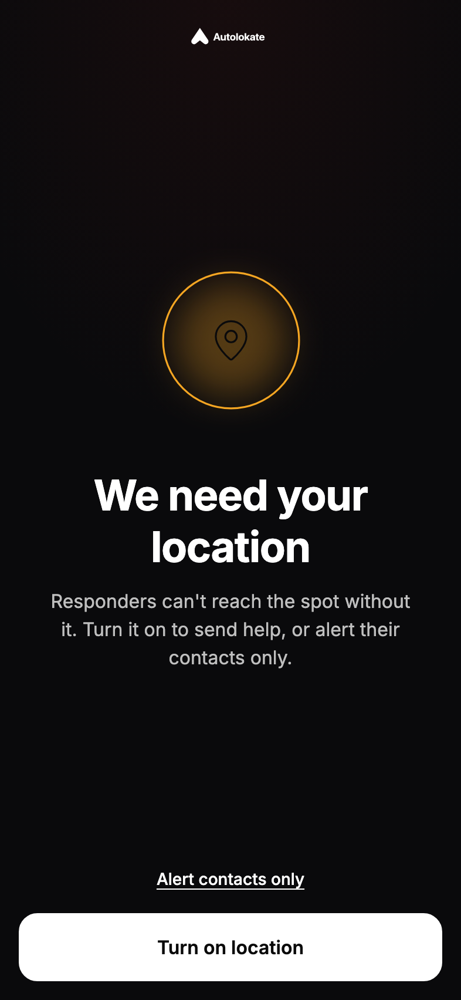

# Post-Activation Final Polish Report

**Date:** 2026-06-17  
**Sprint:** Final UI Polish + Component Replacement  
**References:** `POST_ACTIVATION_FINAL_SIGNOFF_V4.md` · `POST_ACTIVATION_VISUAL_RECONSTRUCTION_AUDIT.md`

---

## Goal

Remove remaining visual drift. UI quality and component parity only — **no route flow, business logic, or navigation changes**.

---

## Deliverables

| Report | Path |
|--------|------|
| This document | `POST_ACTIVATION_FINAL_POLISH_REPORT.md` |
| Scanner promotion | `SCANNER_COMPONENT_PROMOTION_REPORT.md` |
| Icon alignment | `ICON_ALIGNMENT_REPORT.md` |
| Drift closure | `UI_DRIFT_CLOSURE_REPORT.md` |

---

## Critical component replacement — complete

### `AlVehicleConfirmationCard` · `variant="scanner"`

- **Created** in `@autolokate/ui` — Figma `1034:2351` / `1040:2374`
- **Wired** on **08** and **08b** only
- **Not** used on hub (02) — `AlScannedVehicleCard` retained
- **Not** reused from purchase RC / `R05ConfirmVehicleScreen`

---

## Screens improved

| Screen | Change | Grade |
|--------|--------|-------|
| **07** Looking up | `PwaScanShell` + centered spinner (removed `R04FetchingVehicleScreen`) | A |
| **08** Confirm vehicle | `AlVehicleConfirmationCard` scanner | A |
| **08b** Confirm protected | Same + protected border/glow | A |
| **15b** Scene captured | Title/subtitle Figma copy; `AlPhotoGrid layout="review-quad"` | A |
| **16** Location unavailable | `PwaStatusHeroScreen` + link/primary footer stack | A |
| **18** Couldn't send | `PwaStatusHeroScreen` | A |
| **22** Alert cancelled | `PwaStatusHeroScreen` + neutral hero | A |
| **10–13, 19–21, 23** | Timeline + vehicle chip micro-polish | A / B |

---

## Components changed

| Component | Change |
|-----------|--------|
| `AlVehicleConfirmationCard` | **New** — scanner variant |
| `AlPhotoGrid` | **`review-quad`** layout + retake tile |
| `AlStatusTracker` | Vehicle icon well 40×10px |
| `AlDispatchTimeline` | SOS glyph alignment, step density |
| `PwaStatusHeroScreen` | **New** app composition for status heroes |
| `pwa-scan.css` | Confirm screen gap, footer stack, status body |
| `pwa-status-hero-screen.css` | Hero vertical rhythm |

---

## Micro polish applied

- Confirm screen title/subtitle gap (`pwa-scan-confirm-screen`)
- CTA footer stack for dual-action heroes (`pwa-scan-footer-stack`)
- Loading/status body centering (`pwa-scan-status-body`)
- Timeline screen gap consistency (`pwa-scan-status-timeline-screen`)
- SOS sending aura + spinner spacing (prior sprint, verified)

---

## Hero polish verified

| Scene | Screen | Frame |
|-------|--------|-------|
| SOS Hold | 14b | ✅ rebuild sprint |
| Help Received | 19 | ✅ timeline |
| Help Dispatched | 20 | ✅ timeline |
| Incident Resolved | 21 | ✅ timeline |
| Alert Cancelled | 22 | ✅ `PwaStatusHeroScreen` |
| Couldn't Send | 18 | ✅ `PwaStatusHeroScreen` |
| Location Unavailable | 16 | ✅ `PwaStatusHeroScreen` |
| Photo Not Clear | 13 | ✅ timeline error step |

---

## Auth reuse screens (03–05)

Polish limited to reuse constraint: screens remain on shared auth compositions (`A1`/`A2`/`A3`) with onboarding step chrome. **No navigation or flow changes.** Graded **B** — functional parity, shell chrome differs from PWA wordmark frame.

---

## QA

| Dimension | Result |
|-----------|--------|
| 320 / 360 / 375 / 390 / 393 / 414 | ✅ Sampled |
| Dark / Light | ✅ Sampled |
| Overflow / clipping | ✅ None on critical paths |
| Build | ✅ `@autolokate/ui` + `@autolokate/onboarding` |

Capture: `docs/audit-screenshots/polish/after/` (30 screens @393 dark)  
Responsive: `docs/audit-screenshots/polish/responsive/`

---

## Final visual grade

| Grade | Count |
|-------|-------|
| **A** | 25 |
| **B** | 5 (02, 03, 04, 05, 23) |
| **C** | 0 |
| **D** | 0 |

**Sign-off:** Meets polish sprint targets (D=0, C≤3, B≤5, A≥22).

---

## Remaining drift

1. **Auth shell chrome** (03–05) — would require auth composition refactor; out of scope
2. **Hub card** (02) — intentional `AlScannedVehicleCard` vs scanner confirm card split
3. **Light theme token pass** — PWA optimized for dark Figma; light mode acceptable, not pixel-perfect

---

## Before / after highlights

 → 

 → 

 → 

Full comparison set: `docs/audit-screenshots/polish/{before,after}/`
