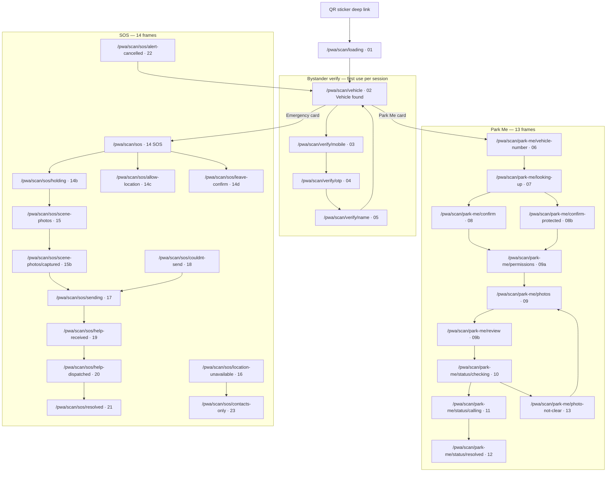
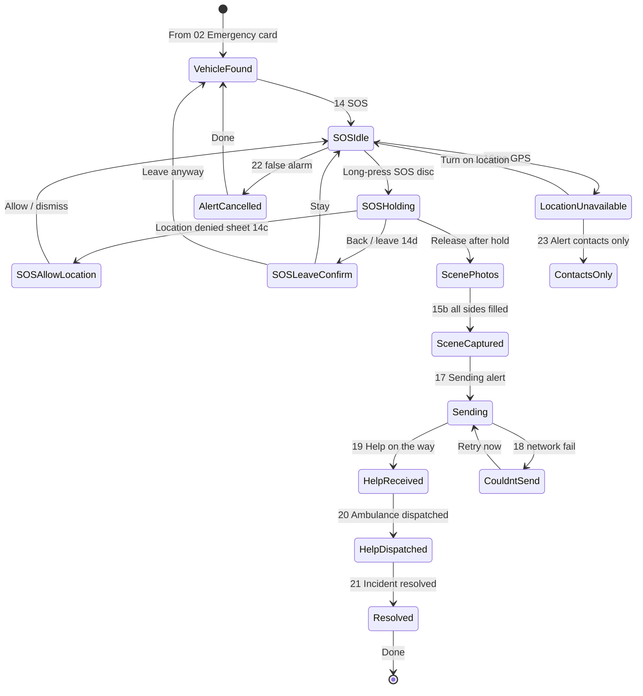
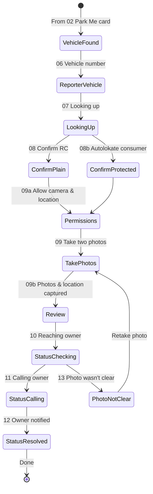

# Post-Activation QR Scan (Web PWA) — Audit Report

**Date:** 2026-06-17  
**Figma section:** `843:2079` · **Scanner · QR Scan (Post-Activation) · Web PWA · ✅ READY FOR DEV**  
**Figma file:** [Autolokate · Consumer App](https://www.figma.com/design/FtHCUnE0HH586PtG5yJyG0/Autolokate-%C2%B7-Consumer-App?node-id=843-2079)  
**Scope:** Audit only — no code, route, or component changes.

---

## Executive summary

Figma defines **30 frames** in the post-activation bystander PWA (scan a vehicle QR sticker → verify identity → **Park Me** or **SOS**). This surface is **not wired in production onboarding**. The consumer app implements activation/onboarding (`/journey/*`); this PWA is a **separate web entry** opened after scanning an activated vehicle sticker.

| Area | Figma | Codebase today |
|------|-------|----------------|
| Section frames | **30** | **0** mounted PWA routes |
| Park Me journey | **13 frames** | **0** |
| SOS journey | **14 frames** | **0** |
| Shared verify + hub | **5 frames** | Partial patterns only (auth + purchase vehicle) |
| QR camera scan | Implied pre-01 | `QrScanScreen` shell (dev preview only; no camera API) |

**Implementation note (project rules):** Figma includes `StatusBar` on every frame. Production must render **application UI only** — no fake device chrome (time, battery, carrier, notch).

---

## 1. Complete route graph (proposed)

Routes below are **recommended** for dev planning. **None exist in `JourneyRoutes.tsx` today.** This PWA must **not** be folded into the approved purchase/emergency onboarding journey.

### Current codebase routes (related, not PWA)

| Path | Behavior |
|------|----------|
| `/journey/qr-scan` | Redirect → `/journey` (no screen) |
| `/journey/purchase/qr-scan` | Redirect → `/journey/purchase/r03-vehicle` |
| `QrScanScreen` | Dev preview only (`?dev=1`); placeholder camera, no Web API |

---

## 2. SOS journey graph

**Ambient:** `AlScreenBg variant="emergency"` (red radial) on SOS + status frames.  
**Critical UX:** SOS dispatch must not wait on decorative animation (per design-system theming rules).

---

## 3. Park Me journey graph

**Ambient:** `AlScreenBg variant="protected"` (green) on Park Me frames.  
**Branch:** `08` vs `08b` depends on whether scanned vehicle is on Autolokate (green glow + “Protected by Autolokate · {plan}”).

---

## 4. Reusable components matrix

Legend: ✅ Exists and reusable · ⚠️ Partial · ❌ Missing

| Figma pattern | Onboarding / DS reuse | Location | Notes |
|---------------|----------------------|----------|-------|
| **Auth · Mobile** (`03`) | ⚠️ | `A1MobileScreen`, `AlTextField`, `InlineConsentBlock` | Copy/consent differ; Figma has language switcher (see conflicts) |
| **Auth · OTP** (`04`) | ✅ | `A2OtpScreen`, `EmergencyOtpScreen`, `AlOtpInput` | Amber errors per project rules |
| **Auth · Name** (`05`) | ✅ | `A3VehicleOwnerScreen`, `AlInput` | Same shell pattern |
| **Loading / spinner** (`01`, `07`, `17`) | ⚠️ | `R04FetchingVehicleScreen`, `PurchaseStatusShell` | Need PWA-specific copy |
| **Vehicle RC card** (`02`, `08`, `08b`) | ⚠️ | `R05ConfirmVehicleScreen`, `AlVehicleRcCard`, `VahanPreviewChips` | Hub card + “Protected by Autolokate” variant |
| **Dual action cards** (`02`) | ❌ | — | Park Me (green) + Emergency (red) option rows |
| **Plate input** (`06`) | ✅ | `R03VehicleNumberScreen`, `AlPlateInput` | Reporter’s blocked vehicle, not owner RC |
| **Photo capture slots** (`09`, `15`, `15b`) | ❌ | — | 2-up Park Me; 4-up SOS scene grid |
| **GPS placeholder box** (`09`, `09a`, `09b`) | ❌ | — | Dashed map-pin capture area |
| **Permission bottom sheet** (`09a`, `14c`) | ❌ | — | Scrim + sheet + primary CTA |
| **SOS hold button** (`14`, `14b`) | ❌ | — | Aura, ring track, progress arc, 72dp+ target |
| **Dispatch timeline (CC tracker)** (`10–12`, `19–21`, `23`) | ❌ | — | Vertical stepper with active glyph |
| **Vehicle chip header** (status frames) | ❌ | — | Compact plate + model in status screens |
| **Status hero + halo** (`16`, `18`, `22`) | ⚠️ | `PurchaseStatusShell`, halo icons | Emergency red ambient, not payment halos |
| **Primary / secondary CTA** | ✅ | `AlButton` | 58px height, 16px radius |
| **Back + logo header** | ⚠️ | `AuthStepShell`, `FlowStepShell` | PWA uses logo top-left, minimal chrome |
| **Checklist row** (`21`) | ⚠️ | `JourneyCompletedScreen` checklist | Similar card + circle-check |
| **Call 112 fallback** (`14*`) | ❌ | — | Text link under SOS disc |
| **Confetti / celebration** | ✅ | `ConfettiBurst`, `ConfettiLottie` | Not in Figma PWA section |
| **Icons** | ✅ | `@autolokate/icons` | `scan-line`, `square-parking`, `map-pin`, `shield-check`, `car`, `phone` |
| **Checkbox + legal** (`03`) | ✅ | `AlCheckbox`, `InlineConsentBlock` | Bystander-specific terms copy |
| **Chip / badge** | ✅ | `AlChip` | “Protected by Autolokate”, reassure chip on SOS |

### Onboarding screens **not** reused for this PWA

| Screen | Reason |
|--------|--------|
| Purchase R06–R10 | Payment flow; unrelated to bystander scan |
| Emergency E01–E10 | Owner onboarding suffix; different actor and goals |
| Journey `/journey/completed` | Owner activation complete, not bystander incident |
| `QrScanScreen` (activation) | Pre-auth demo shell; wrong copy and flow graph |

---

## 5. Components that should be promoted to core (≥2 flows / ≥2 uses)

| Candidate | Used by (Figma) | Rationale |
|-----------|-----------------|-----------|
| **`AlDispatchTimeline`** | Park Me 10–12; SOS 19–21, 23 | Same CC tracker component, different step sets |
| **`AlVehicleChip`** | All post-submit status frames | Plate + model compact header |
| **`AlActionOptionCard`** | 02 Vehicle found (×2) | Icon tile + title + subtitle + chevron; green/red variants |
| **`AlPhotoCaptureGrid`** | 09, 15, 15b | 2-up and 4-up layouts share cell chrome |
| **`AlPermissionSheet`** | 09a, 14c, 14d | Bottom sheet + scrim pattern |
| **`AlSosHoldButton`** | 14, 14b, 14c, 14d | Hero SOS control; design tokens exist (`--al-layout-touch-target-sos`) |
| **`AlGpsCaptureBox`** | 09, 09a, 09b | Map preview + pin; dashed vs filled states |
| **`AlStatusScreenShell`** | 16, 18, 22 + loading heroes | Extends `PurchaseStatusShell` pattern for PWA status/errors |

Existing inventory promotions still valid for shared primitives: `VehicleSummary`, `LegalConsentBlock`, `FormFieldStack` (`packages/onboarding/src/components/compositions/inventory.ts`).

---

## 6. Missing components

| Component | Frames | Priority |
|-----------|--------|----------|
| Live **QR / camera scanner** viewport | Pre-01 (implied) | P0 |
| **Vehicle found hub** with dual CTAs | 02 | P0 |
| **Bystander verify** flow (mobile → OTP → name) | 03–05 | P0 |
| **Reporter vehicle** entry + VAHAN lookup | 06–08, 08b | P0 |
| **Camera + location permission** sheet | 09a | P0 |
| **Two-photo capture** flow | 09, 09b | P0 |
| **Park Me live status** + timeline | 10–12 | P1 |
| **Photo not clear** recovery | 13 | P1 |
| **SOS hold-to-send** control | 14, 14b | P0 |
| **SOS location** sheet | 14c | P0 |
| **SOS leave confirm** sheet | 14d | P1 |
| **Four-photo scene capture** | 15, 15b | P0 |
| **Sending / error / cancel** states | 16–18, 22 | P1 |
| **Help on the way** progressive status | 19–21 | P1 |
| **Contacts-only fallback** (no GPS) | 23 | P1 |
| **Web APIs**: camera, geolocation, network retry | All | P0 |

---

## 7. State matrix

| Domain | State | Frame(s) | UI signals | Primary CTA |
|--------|-------|----------|------------|-------------|
| **Bootstrap** | Loading | 01 | Spinner, “Opening Autolokate” | — (auto-advance) |
| **Hub** | Vehicle resolved | 02 | RC card, shield row, two action cards | Tap card → flow |
| **Verify** | Mobile empty / filled | 03 | `AlTextField`, checkbox off/on | Continue (disabled → enabled) |
| **Verify** | OTP empty / partial / valid | 04 | `AlOtpInput`, resend timer | Verify (disabled → enabled) |
| **Verify** | Name empty / valid | 05 | `AlInput` | Continue |
| **Park Me** | Plate entry | 06 | `AlPlateInput`, disabled CTA | Continue |
| **Park Me** | Lookup | 07 | Spinner | — |
| **Park Me** | Confirm plain | 08 | RC card, “From your RC records” | Confirm |
| **Park Me** | Confirm protected | 08b | Green glow card, plan label | Confirm |
| **Park Me** | Permissions prompt | 09a | Sheet over dimmed photos | Allow access |
| **Park Me** | Capture photos | 09 | Two dashed camera boxes + GPS dashed box | Take photo (disabled until ready) |
| **Park Me** | Review | 09b | Filled photo thumbs + map preview | Send to owner |
| **Park Me** | Status checking | 10 | Timeline step 3 active | — |
| **Park Me** | Status calling | 11 | Timeline step 4 active | — |
| **Park Me** | Status resolved | 12 | All steps complete | Done |
| **Park Me** | Photo error | 13 | Amber timeline step | Retake photo |
| **SOS** | Idle | 14 | Red ambient, SOS disc, location chip | Hold SOS |
| **SOS** | Holding | 14b | Progress ring, “Keep holding” | — (release triggers) |
| **SOS** | Allow location | 14c | Sheet | Allow location |
| **SOS** | Leave confirm | 14d | Sheet | Stay / Leave anyway |
| **SOS** | Scene photos empty | 15 | Four dashed boxes | Send without photos |
| **SOS** | Scene photos captured | 15b | Four filled boxes | Send now |
| **SOS** | Location blocked | 16 | Halo hero | Turn on location / Alert contacts only |
| **SOS** | Sending | 17 | Spinner | Cancel alert (secondary) |
| **SOS** | Network fail | 18 | Halo hero | Retry now |
| **SOS** | Help received | 19 | Timeline in progress | Cancel alert |
| **SOS** | Dispatched | 20 | More steps complete | Cancel alert |
| **SOS** | Resolved | 21 | All steps green | Done |
| **SOS** | Cancelled | 22 | Halo hero | Done |
| **SOS** | Contacts only | 23 | Reduced timeline, no GPS | Turn on location |

---

## 8. Screen inventory (all 30 frames)

Figma link template: `https://www.figma.com/design/FtHCUnE0HH586PtG5yJyG0/?node-id={NODE}` (replace `:` with `-` in URL).

### Shared entry + verify

| # | Screen name | Node ID | Purpose | Entry condition | Exit condition | CTA(s) | Variants |
|---|-------------|---------|---------|-----------------|----------------|--------|----------|
| 01 | Loading | `928:2252` | PWA bootstrap after QR URL open | QR deep link hit | Session/token ready | — | Spinner only |
| 02 | Vehicle found | `843:2080` | Show scanned vehicle; choose Park Me or SOS | 01 complete + sticker decoded | User picks flow or leaves | **Park Me card**, **Emergency card** | Protected vs unprotected copy on card |
| 03 | Verify · Mobile | `978:2294` | Collect reporter mobile + consent | First action from 02 (if unverified) | Valid 10-digit mobile + consent | **Continue** | Disabled CTA; checkbox off/on; *Figma shows language switcher* |
| 04 | Verify · OTP | `978:2319` | WhatsApp OTP | 03 submitted | 6-digit OTP valid | **Verify** · **Change** link | Empty/partial/filled OTP; disabled/enabled CTA |
| 05 | Verify · Name | `978:2334` | Reporter display name | 04 success | Non-empty name | **Continue** | Disabled/enabled |

### Park Me (13 frames)

| # | Screen name | Node ID | Purpose | Entry | Exit | CTA(s) | Variants |
|---|-------------|---------|---------|-------|------|--------|----------|
| 06 | Vehicle number | `991:2328` | Reporter’s blocked vehicle plate | Park Me from 02 | Valid plate | **Continue** | Disabled/enabled |
| 07 | Looking up vehicle | `1038:2370` | VAHAN fetch | 06 submitted | Lookup result | — | Loading |
| 08 | Confirm vehicle | `1034:2351` | Confirm reporter vehicle (non-consumer) | 07 plain result | Confirmed | **Confirm** | Plain RC card |
| 08b | Confirm · Autolokate consumer | `1040:2374` | Confirm + protected badge | 07 consumer match | Confirmed | **Confirm** | Green glow + plan label |
| 09a | Allow camera & location | `1049:2422` | OS permission pre-prompt | Before capture | Permissions granted/denied | **Allow access** | Sheet over 09 layout |
| 09 | Take two photos | `847:278` | Front + rear capture | 08/08b confirmed | Both photos + GPS | **Take photo** (disabled) | Empty dashed boxes |
| 09b | Photos & location captured | `1044:2406` | Review before send | 09 complete | User sends | **Send to owner** | Filled previews + map |
| 10 | Status · checking | `982:2339` | Owner outreach started | 09b sent | Backend advances | — | Timeline step 3 active |
| 11 | Status · calling | `983:2349` | Calling owner | 10 → call phase | Connected | — | Timeline step 4 active |
| 12 | Status · resolved | `983:2410` | Owner notified | 11 success | User leaves | **Done** | All steps complete |
| 13 | Photo not clear | `984:2380` | QC failed | 10 failed validation | Retake | **Retake photo** | Amber error step |

### SOS (14 frames)

| # | Screen name | Node ID | Purpose | Entry | Exit | CTA(s) | Variants |
|---|-------------|---------|---------|-------|------|--------|----------|
| 14 | Emergency · SOS | `848:278` | Arm SOS; hold to send | Emergency from 02 | Hold / back | **Hold SOS** · **Call 112** | Location chip |
| 14b | SOS · holding | `1092:2499` | Hold progress | Finger down on 14 | Release / cancel | — | Progress ring |
| 14c | SOS · allow location | `1110:2471` | Location permission | GPS denied on 14 | Allow/dismiss | **Allow location** | Sheet |
| 14d | SOS · leave confirm | `1113:2486` | Prevent accidental exit | Back from 14 before send | Stay or leave | **Stay** · **Leave anyway** | Sheet |
| 15 | Add scene photo | `928:2267` | Optional 4-angle photos | Post-hold | Photos optional | **Send without photos** | Empty grid |
| 15b | Scene photos captured | `1148:2509` | Review photos | 15 filled | Submit alert | **Send now** | Filled grid |
| 16 | Location unavailable | `875:2189` | No GPS | SOS without location | Location or fallback | **Turn on location** · **Alert contacts only** | Error hero |
| 17 | Sending alert | `1177:2545` | Dispatch in flight | 15/15b submitted | Backend ack | **Cancel alert** (secondary) | Spinner |
| 18 | Couldn't send | `875:2215` | Network failure | 17 failed | Retry | **Retry now** | Error hero |
| 19 | Help on the way · received | `849:321` | Alert received | 17 success | Progress updates | **Cancel alert** | Timeline partial |
| 20 | Help on the way · dispatched | `870:2145` | Ambulance dispatched | 19 → dispatch | Monitoring | **Cancel alert** | More steps done |
| 21 | Incident resolved | `871:2151` | Closure | Help complete | Exit | **Done** | Full green timeline |
| 22 | Alert cancelled | `876:2208` | False alarm | User cancelled | Exit | **Done** | Neutral hero |
| 23 | Contacts alerted · no location | `1150:2527` | Fallback path | 16 → contacts-only | Monitoring | **Turn on location** | Short timeline |

---

## 9. Figma parity checklist

Use before marking any PWA screen complete.

### Global

- [ ] No fake status bar / device chrome in implementation
- [ ] `AlScreenBg` variant: `default`/protected (Park Me) vs `emergency` (SOS)
- [ ] Logo placement matches Figma (top area, not onboarding step chrome)
- [ ] Dark theme primary (`#0A0A0C` canvas); light theme parity verified
- [ ] Touch targets ≥ 48dp; SOS control ≥ 72dp
- [ ] Copy matches Figma exactly (no invented strings)
- [ ] Icons from `@autolokate/icons` only (no placeholders)

### Layout & typography

- [ ] Frame width 393px logical mobile
- [ ] Display/Headline/Body/Label tokens per Foundations
- [ ] 16px horizontal padding on primary content
- [ ] Card radius 16px; option cards 16px with 1px outline
- [ ] Primary button 58px height, 16px radius, full width 361px

### Per-pattern

- [ ] **02** Vehicle card: plate, model, “Protected by Autolokate” row
- [ ] **02** Action cards: green Park Me vs red Emergency styling
- [ ] **03–05** Verify: match auth screens but bystander copy + consent
- [ ] **06** Plate input: reporter vehicle, not owner R03 copy
- [ ] **08/08b** Confirm: plain vs green protected variant
- [ ] **09/09b** Two photo slots + GPS map preview
- [ ] **09a/14c/14d** Bottom sheet scrim, handle, primary + text actions
- [ ] **14/14b** SOS disc, aura, ring, hold progress, reassurance chip
- [ ] **15/15b** Four-up photo grid (Front/Rear/Left/Right)
- [ ] **10–12, 19–21, 23** CC tracker rails, active glyph, completed checks
- [ ] **16, 18, 22** Status halo heroes (attention/emergency ambient)
- [ ] **17** Sending spinner + secondary cancel

### Motion

- [ ] SOS dispatch not blocked by animation
- [ ] Hold progress ring smooth on 14b
- [ ] Timeline step transitions on status frames
- [ ] Sheet enter/exit (permission, leave confirm)
- [ ] Reduced motion: no essential info in motion-only cues

### Conflicts with approved consumer-app rules (resolve before dev)

| Figma element | Project rule | Recommendation |
|---------------|--------------|----------------|
| Language switcher on 03 | No language picker in auth | Omit for v1 unless product overrides for **PWA-only** |
| StatusBar on all frames | No fake device chrome | Strip in implementation |
| OTP on 04 | `123456` valid, `000000` expired, amber errors | Reuse auth validation |
| Mobile on 03 | Max 10 digits | Reuse `clampMobileInput` pattern |

---

## 10. Transition inventory

| From | To | Trigger | Transition type |
|------|-----|---------|-----------------|
| QR URL | 01 | Auto | Full-screen load |
| 01 | 02 | Token + vehicle resolve | Fade / replace |
| 02 | 03 | Unverified user taps action | Push |
| 03 | 04 | Continue | Push |
| 04 | 05 | OTP OK | Push |
| 05 | 02 | Continue | Pop to hub or replace |
| 02 | 06 / 14 | Card tap | Push (Park Me / SOS) |
| 06 | 07 | Continue | Push → loading |
| 07 | 08 / 08b | API result | Replace |
| 08* | 09a | Confirm | Push; may show sheet immediately |
| 09a | 09 | Allow / dismiss | Sheet dismiss |
| 09 | 09b | Both photos + GPS | Push |
| 09b | 10 | Send | Push → status |
| 10 | 11 | Backend phase | In-place timeline update |
| 11 | 12 | Success | In-place → Done CTA |
| 10 | 13 | QC fail | Push error |
| 13 | 09 | Retake | Back |
| 14 | 14b | Touch down | In-place (hold) |
| 14b | 15 | Release after hold | Push |
| 14 | 14c | Location denied | Sheet |
| 14 | 14d | Back gesture | Sheet |
| 15 | 15b | Photos taken | In-place grid fill |
| 15/15b | 17 | Send | Push loading |
| 17 | 19 / 18 | API result | Replace |
| 19 | 20 | Dispatch event | In-place timeline |
| 20 | 21 | Resolved | Replace |
| 17 | 22 | Cancel | Replace |
| 16 | 23 | Alert contacts only | Push |
| Any SOS status | 14 | Cancel alert | Confirm → 22 or 14 |

---

## 11. Recommended implementation phasing (informational)

| Phase | Frames | Depends on |
|-------|--------|------------|
| **P0** | 01, 02, 03–05, QR API | Deep link + sticker decode |
| **P1** | Park Me 06–09b | Camera, geolocation, VAHAN |
| **P2** | Park Me 10–13 | Backend Park Me + polling |
| **P3** | SOS 14–15b, 17 | Hold interaction + media upload |
| **P4** | SOS 16–23, 18, 22 | Dispatch API + timeline polling |

---

## 12. Codebase cross-reference (audit snapshot)

| Asset | Path | Relevance |
|-------|------|-----------|
| Dev QR shell | `apps/onboarding/src/features/qr-activation/screens/qr-scan/QrScanScreen.tsx` | Wrong flow; camera placeholder only |
| Auth screens | `apps/onboarding/src/features/shared-auth/screens/` | Pattern reuse for 03–05 |
| Vehicle confirm | `apps/onboarding/src/features/qr-purchase/screens/r05-confirm/` | Pattern for 08/08b |
| Fetching | `r04-fetching/` | Pattern for 07, 17 |
| Status shell | `apps/onboarding/src/components/compositions/purchase-status-shell/` | Pattern for 16, 18, 22 |
| Halos | `packages/icons/src/generated/*-halo.tsx` | May need PWA-specific halos |
| Design tokens | `packages/design-system/`, `AlScreenBg` | emergency + protected ambients |

---

## Sign-off

| Item | Count |
|------|-------|
| Figma frames inventoried | **30** |
| Proposed PWA routes | **~30** |
| Reusable onboarding patterns | **~12 partial/full** |
| Net-new compositions required | **~8 promoted candidates** |
| Production routes today | **0** |

**Audit complete.** No code changes made. Ready for dev planning against Figma `843:2079`.
