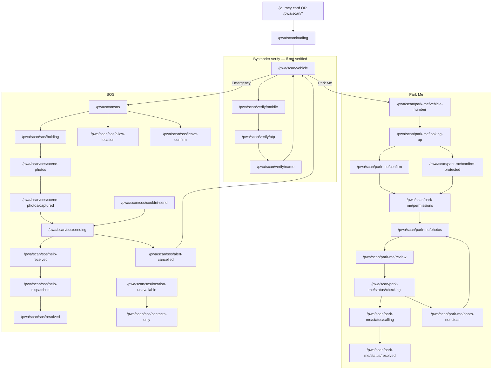
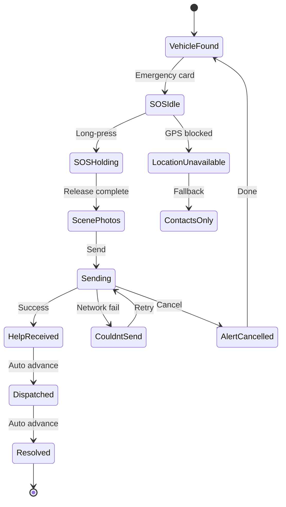
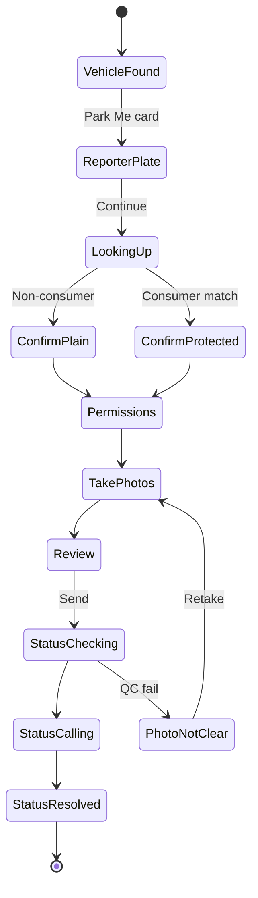

# Post-Activation PWA — Route Graph

**Base:** `/pwa/scan`  
**Provider:** `PwaScanProvider` (isolated from `JourneyProvider`)

---

## Complete route graph



---

## SOS journey (state machine)



---

## Park Me journey (state machine)



---

## Path constants

Defined in `apps/onboarding/src/features/post-activation-pwa/constants/pwa-scan-paths.ts`

---

## Orchestrator wiring

```
BrowserRouter
├── /pwa/scan/*  → PwaScanRoutes (PwaScanProvider)
└── /*           → JourneyProvider → JourneyRoutes
```

Onboarding routes under `/journey/*` are **unchanged**.
