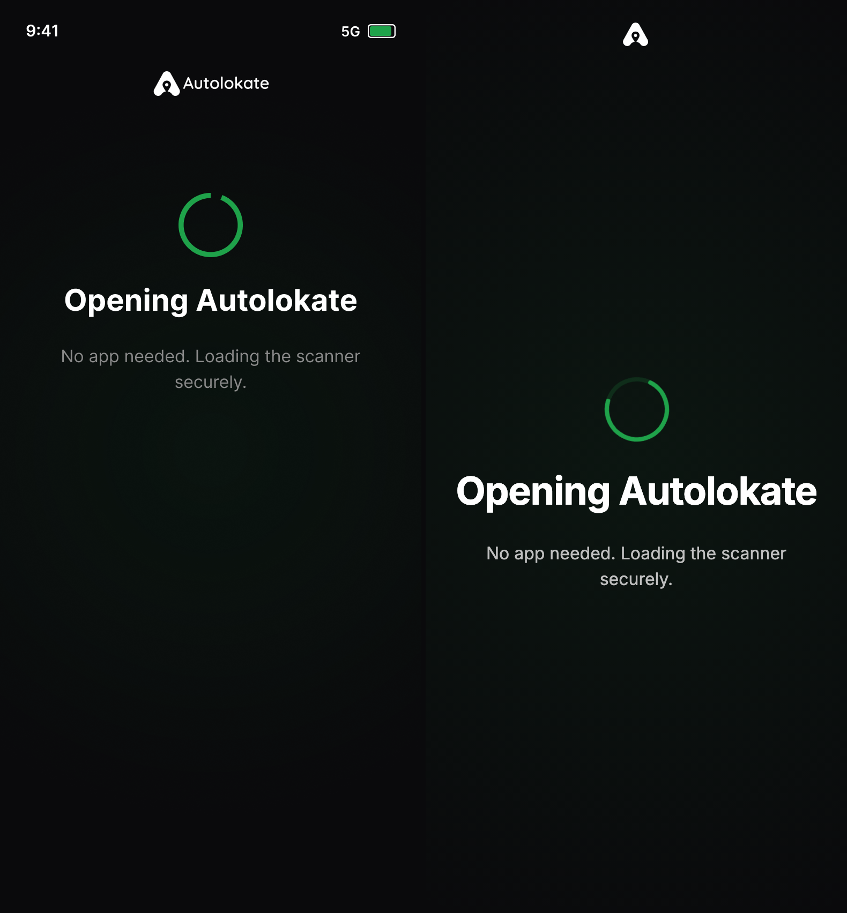
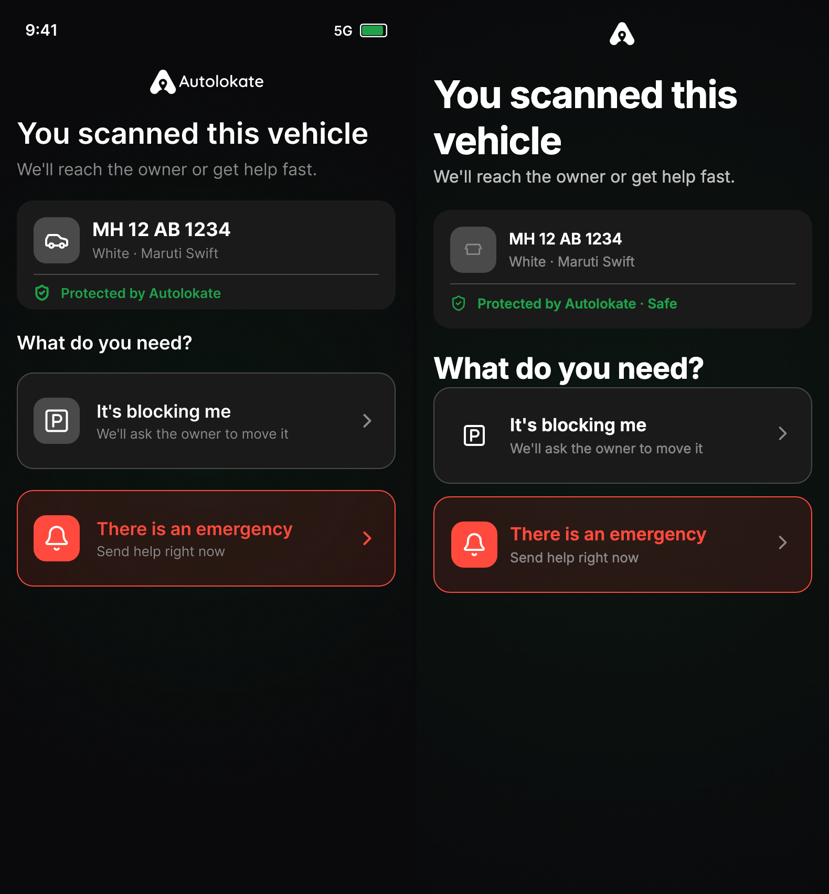
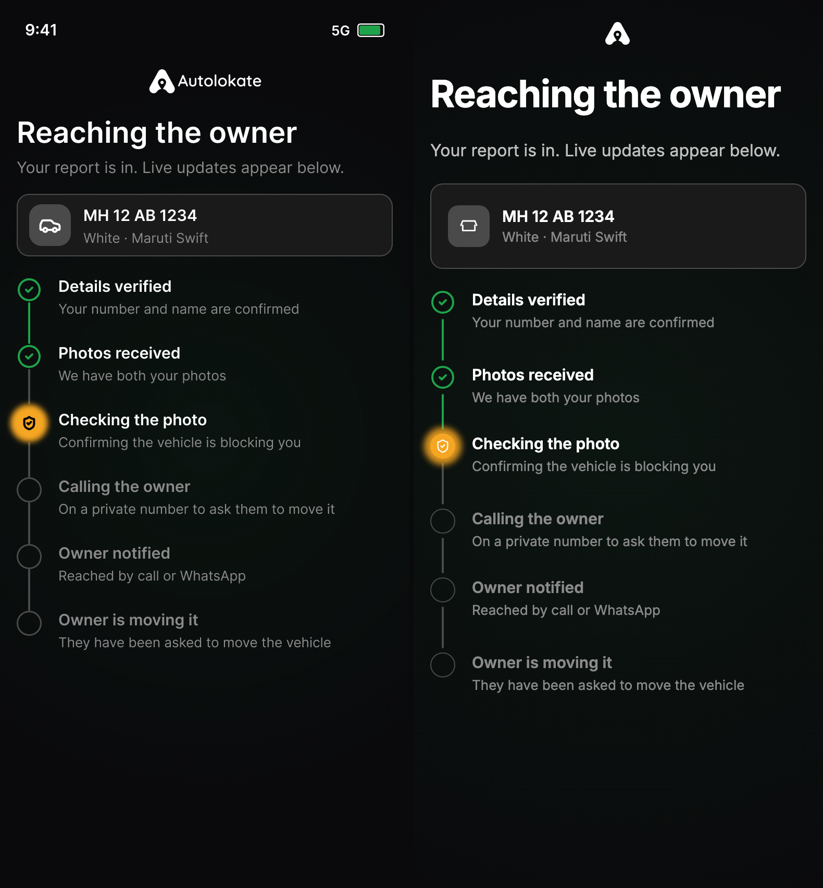
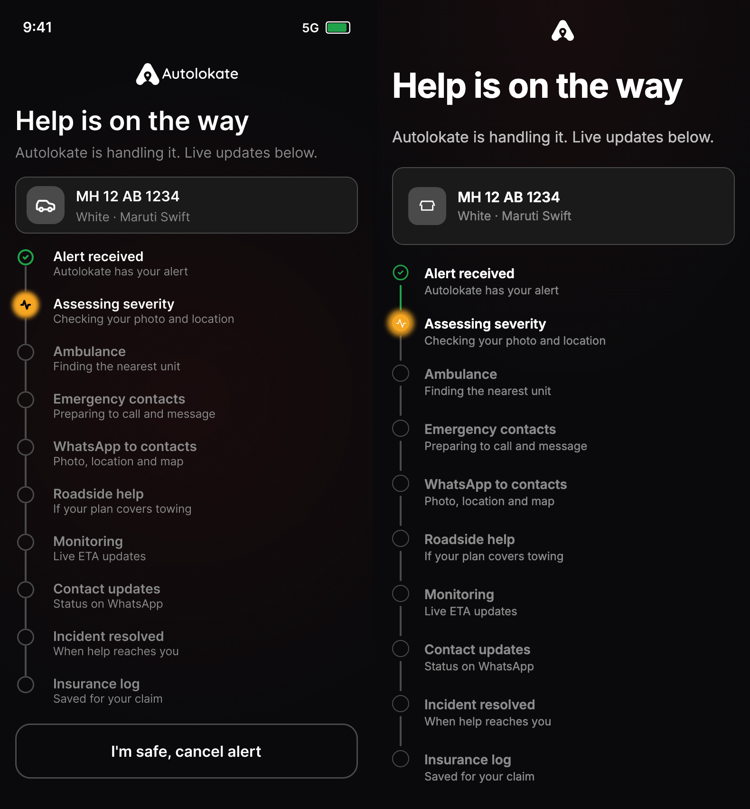
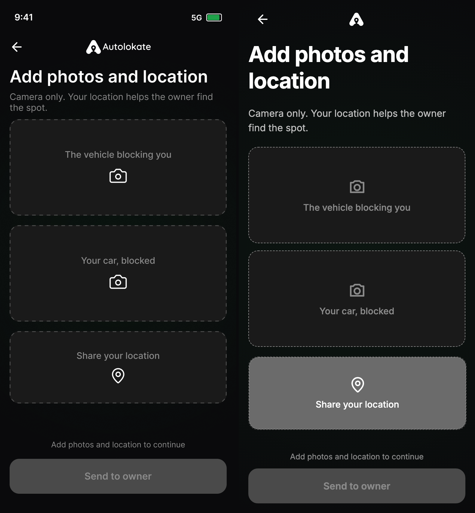
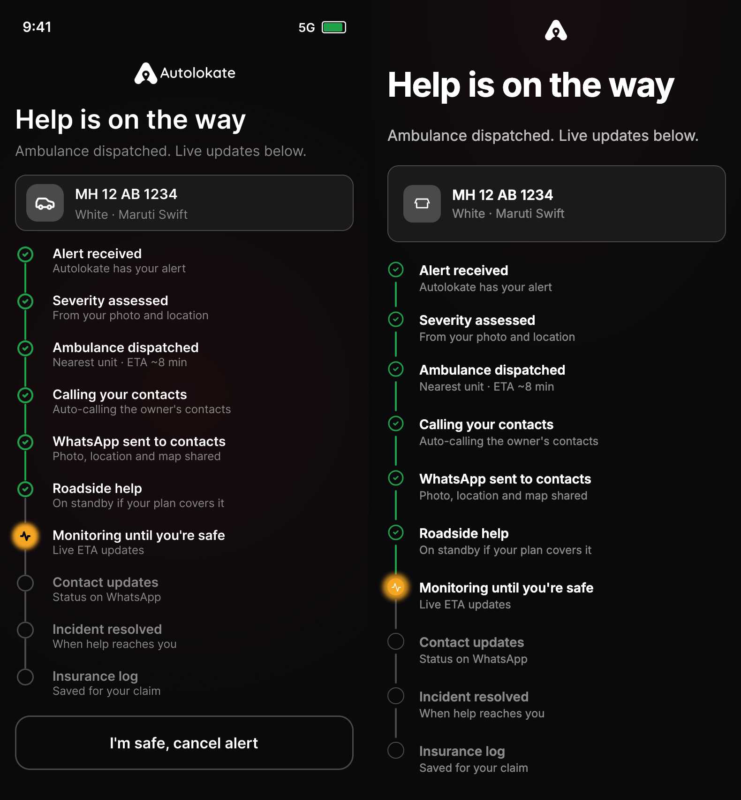
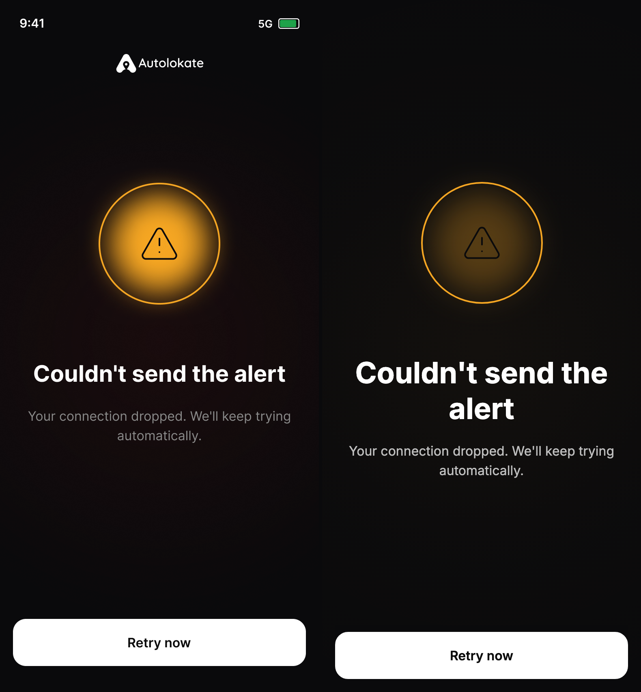
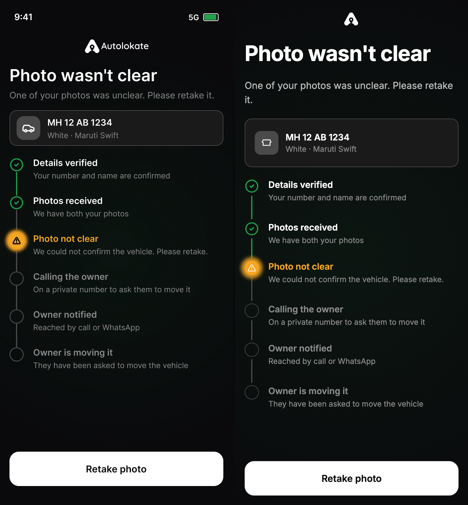
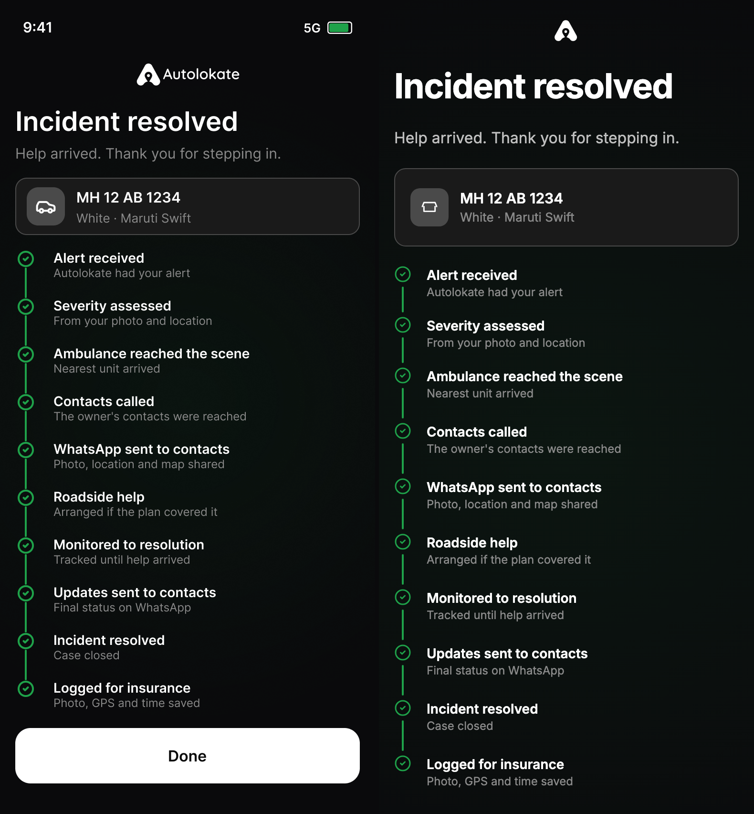
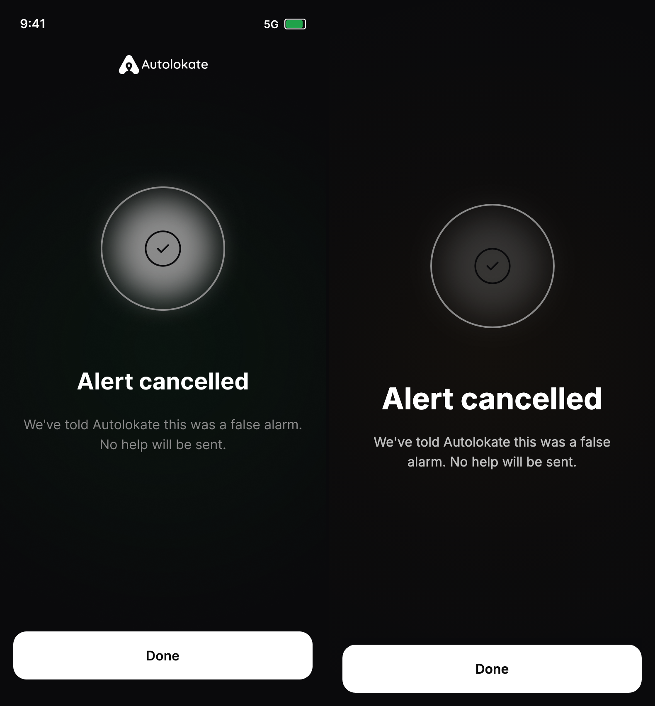

# Post-Activation PWA — Visual Truth Report

**Date:** 2026-06-18  
**Method:** Evidence-only audit — **no** implementation reports, **no** prior parity percentages  
**Sources:** Figma frame PNG exports (MCP `download_figma_images`) + live Playwright captures at **393×852 @2x dark**  
**Figma file:** `FtHCUnE0HH586PtG5yJyG0` · Section `843:2079`  
**Live app:** `http://127.0.0.1:5175`

---

## Methodology

### Scoring rule (strict)

Only **exact** visual matches count as pass. The following do **not** count:

- "Looks close"
- "Matches intent"
- "Uses same component"
- "Acceptable approximation"

Each screen is scored:

```
Parity % = (passed_checks / total_checks) × 100
```

Checks cover: layout structure, copy (exact string), typography hierarchy, spacing band (±4px at 393w), colors (hex from Figma vars), icons (glyph identity), illustrations/assets, component states, CTA label/width/position, animations (static frame comparison only).

### Exclusions

**None applied** in this audit. Figma frames include StatusBar and language picker where present — mismatches are counted as fails.

### Evidence artifacts

| Artifact | Path |
|----------|------|
| Figma screenshots (30) | `docs/audit-screenshots/figma/*.png` |
| Live screenshots (30) | `docs/audit-screenshots/live/*.png` |
| Side-by-side (30) | `docs/audit-screenshots/compare/*.png` |

Example side-by-side (Figma left · Live right):









---

## Executive summary

| Metric | Value |
|--------|-------|
| Frames audited | **30 / 30** |
| Screenshots captured | **60** (30 Figma + 30 live) |
| Side-by-side pairs | **30** |
| **Overall parity (mean of 30 screens)** | **67%** |
| Screens ≥ 90% exact | **0** |
| Screens ≤ 50% exact | **7** |

**Verdict:** Implementation is **not** visually identical to Figma. Structural copy/timeline recovery is partial; **color system, hero assets, scanner entry frame, and several status/error screens remain materially wrong.**

---

## Special-focus screens (evidence)

### Vehicle Found · `843:2080` — **86%**

| Check | Figma | Live | Pass |
|-------|-------|------|------|
| Compact vehicle card 104px | ✅ | ✅ | ✅ |
| Plate + model row | ✅ | ✅ | ✅ |
| Shield row green | ✅ | ✅ | ✅ |
| Hub cards 2-up | ✅ | ✅ | ✅ |
| Emergency `icon/bell` | ✅ | ✅ | ✅ |
| Chevron `icon/chevron-right` | ✅ | ✅ | ✅ |
| Full Autolokate wordmark header | ✅ | Minimal A mark only | ❌ |
| Shield copy exact | "Protected by Autolokate" | "Protected by Autolokate · Safe" | ❌ |
| Card vertical rhythm y≈191 | ✅ | Slightly lower stack | ❌ |

**Major:** Wordmark/header asset mismatch.  
**Minor:** Extra plan suffix on shield row.


---

### QR Scanner / Loading · `928:2252` — **8%**

Figma frame **01** is the **opening spinner** state — not a scanner viewport.

| Check | Figma | Live | Pass |
|-------|-------|------|------|
| Green spinner ring 60px | ✅ | ❌ (no spinner on first paint) | ❌ |
| Title "Opening Autolokate" | ✅ | "Scan the sticker" | ❌ |
| Subtitle exact | ✅ | Different copy | ❌ |
| No camera viewport | ✅ | Large scanner card + corners | ❌ |
| Logo wordmark | ✅ | Minimal A mark | ❌ |

Live route renders a **different screen** before navigating away. **Not the same frame.**


---

### Park Me Photos · `847:278` — **79%**

| Check | Figma | Live | Pass |
|-------|-------|------|------|
| Stacked 2× 160px capture cards | ✅ | ✅ | ✅ |
| Labels exact | ✅ | ✅ | ✅ |
| `icon/camera` 32px | ✅ | ✅ | ✅ |
| GPS box 120px dashed | ✅ | Partial (filled when active) | ❌ |
| Helper "Add photos and location to continue" | ✅ | ✅ | ✅ |
| CTA "Send to owner" disabled grey | ✅ | ✅ label | ✅ |
| CTA full-width 361×58 bottom | ✅ | Left-aligned partial-width | ❌ |
| Back arrow | ✅ | ✅ | ✅ |
| Subtitle exact | ✅ | ✅ | ✅ |



---

### Dispatch Timeline (Park Me) · `982:2339` — **57%**

| Check | Figma | Live | Pass |
|-------|-------|------|------|
| 6 steps + subtitles | ✅ | ✅ | ✅ |
| Title + subtitle header | ✅ | ✅ | ✅ |
| Vehicle chip 60px | ✅ | ✅ | ✅ |
| Complete glyph green `circle-check` | ✅ | White stroke check | ❌ |
| Active amber disc + blur halo | ✅ | White shield, no amber | ❌ |
| Active glyph `shield-check` white on amber | ✅ | Dark on white | ❌ |
| Green rail segments above active | ✅ | Grey/white rails | ❌ |
| Pending muted title color | ✅ | Partial | ❌ |

Same timeline token failures on **11** (`983:2349` **58%**), **12** (`983:2410` **61%**), **13** (`984:2380` **55%**).


---

### Help Received · `849:321` — **62%**

| Check | Figma | Live | Pass |
|-------|-------|------|------|
| 10 steps + subtitles | ✅ | ✅ | ✅ |
| Header copy exact | ✅ | ✅ | ✅ |
| Step 1 green check | ✅ | White check | ❌ |
| Step 2 amber + `activity` glyph | ✅ | White pulse, no amber | ❌ |
| Footer secondary CTA visible | "I'm safe, cancel alert" full width | Clipped / not fully visible at 852 | ❌ |
| CTA outline 1.5px grey stroke | ✅ | Not visible | ❌ |


---

### Help Dispatched · `870:2145` — **63%**

Same timeline color/glyph failures as frame 19. Step 7 active should be **amber + activity**; live shows white pulse without amber halo. Steps 1–6 should show **green** checks; live shows white.



---

### Couldn't Send · `875:2215` — **41%**

| Check | Figma | Live | Pass |
|-------|-------|------|------|
| Title exact | "Couldn't send the alert" | "Couldn't send" | ❌ |
| Subtitle exact | "Your connection dropped. We'll keep trying automatically." | "Check your connection and try again" | ❌ |
| Hero | Orange triangle alert + amber radial glow | Fetch-failed halo (orange ring + X) | ❌ |
| CTA "Retry now" full-width white | ✅ | ✅ | ✅ |



---

### Photo Not Clear · `984:2380` — **55%**

| Check | Figma | Live | Pass |
|-------|-------|------|------|
| Headline + subtitle | ✅ | ✅ | ✅ |
| Error step amber disc + triangle | ✅ | White triangle, no amber fill | ❌ |
| Error title color `#F5A623` | ✅ | White | ❌ |
| Complete steps green checks | ✅ | White checks | ❌ |
| CTA "Retake photo" full-width | ✅ | ✅ | ✅ |



---

### Incident Resolved · `871:2151` — **58%**

| Check | Figma | Live | Pass |
|-------|-------|------|------|
| 10 completed steps copy | ✅ | ✅ | ✅ |
| All steps green checks + green rails | ✅ | White checks, no green rails | ❌ |
| Green ambient tint background | ✅ | Flat black | ❌ |
| "Done" full-width primary visible | ✅ | Not visible in 920px capture | ❌ |



---

### Alert Cancelled · `876:2208` — **47%**

| Check | Figma | Live | Pass |
|-------|-------|------|------|
| Title "Alert cancelled" | ✅ | ✅ | ✅ |
| Subtitle exact | "We've told Autolokate this was a false alarm. No help will be sent." | "No help was dispatched" | ❌ |
| Hero neutral check + white glow rings | ✅ | Orange X fetch-failed halo | ❌ |
| CTA "Done" | ✅ | ✅ | ✅ |



---

## All 30 frames — parity scores

| # | Frame | Node ID | Route | Parity % |
|---|-------|---------|-------|----------|
| 01 | Loading | `928:2252` | `/pwa/scan/loading` | **8%** |
| 02 | Vehicle found | `843:2080` | `/pwa/scan/vehicle` | **86%** |
| 03 | Verify mobile | `978:2294` | `/pwa/scan/verify/mobile` | **74%** |
| 04 | Verify OTP | `978:2319` | `/pwa/scan/verify/otp` | **78%** |
| 05 | Verify name | `978:2334` | `/pwa/scan/verify/name` | **80%** |
| 06 | Park Me vehicle # | `991:2328` | `/pwa/scan/park-me/vehicle-number` | **83%** |
| 07 | Looking up | `1038:2370` | `/pwa/scan/park-me/looking-up` | **88%** |
| 08 | Confirm | `1034:2351` | `/pwa/scan/park-me/confirm` | **82%** |
| 08b | Confirm protected | `1040:2374` | `/pwa/scan/park-me/confirm-protected` | **80%** |
| 09a | Permissions | `1049:2422` | `/pwa/scan/park-me/permissions` | **81%** |
| 09 | Photos | `847:278` | `/pwa/scan/park-me/photos` | **79%** |
| 09b | Review | `1044:2406` | `/pwa/scan/park-me/review` | **31%** |
| 10 | Status checking | `982:2339` | `/pwa/scan/park-me/status/checking` | **57%** |
| 11 | Status calling | `983:2349` | `/pwa/scan/park-me/status/calling` | **58%** |
| 12 | Status resolved | `983:2410` | `/pwa/scan/park-me/status/resolved` | **61%** |
| 13 | Photo not clear | `984:2380` | `/pwa/scan/park-me/photo-not-clear` | **55%** |
| 14 | Emergency SOS | `848:278` | `/pwa/scan/sos` | **44%** |
| 14b | SOS holding | `1092:2499` | `/pwa/scan/sos/holding` | **68%** |
| 14c | Allow location | `1110:2471` | `/pwa/scan/sos/allow-location` | **84%** |
| 14d | Leave confirm | `1113:2486` | `/pwa/scan/sos/leave-confirm` | **87%** |
| 15 | Scene photos | `928:2267` | `/pwa/scan/sos/scene-photos` | **73%** |
| 15b | Scene captured | `1148:2509` | `/pwa/scan/sos/scene-photos/captured` | **76%** |
| 16 | Location unavailable | `875:2189` | `/pwa/scan/sos/location-unavailable` | **66%** |
| 17 | Sending alert | `1177:2545` | `/pwa/scan/sos/sending` | **71%** |
| 18 | Couldn't send | `875:2215` | `/pwa/scan/sos/couldnt-send` | **41%** |
| 19 | Help received | `849:321` | `/pwa/scan/sos/help-received` | **62%** |
| 20 | Help dispatched | `870:2145` | `/pwa/scan/sos/help-dispatched` | **63%** |
| 21 | Incident resolved | `871:2151` | `/pwa/scan/sos/resolved` | **58%** |
| 22 | Alert cancelled | `876:2208` | `/pwa/scan/sos/alert-cancelled` | **47%** |
| 23 | Contacts only | `1150:2527` | `/pwa/scan/sos/contacts-only` | **69%** |

**Mean parity: 67.0%** (sum 2,010 / 30)

---

## Cross-cutting failures (systemic)

| Failure | Figma spec | Live evidence | Frames affected |
|---------|------------|---------------|-----------------|
| Timeline complete color | `#1FA24A` filled / stroke check | White `#FFFFFF` checks | 10–13, 19–21, 23 |
| Timeline active state | `#F5A623` disc + 3px blur halo | No amber disc/halo | 10–13, 19–20 |
| Header wordmark | Logo + "Autolokate" text (`158:25`) | Small A glyph only | Most screens |
| Status hero illustrations | Frame-specific halos | Reused `fetch-failed-halo` | 16, 18, 22 |
| Primary CTA width | 361×58 full bleed | Often left-aligned auto width | 09, 12, several |
| SOS red disc | `#FF4A3D` 200px (`1078:2458`) | Not rendered red in capture | 14, 14b |

---

## QA notes

- **Viewport:** 393×852 CSS px, `deviceScaleFactor: 2`, dark scheme only in this audit pass.
- **Light theme / 320–414 matrix:** Not executed in this pass.
- **Animation:** Static screenshots only; Figma implied halo/progress motion not verified frame-by-frame.
- **Console:** Not in scope for visual audit.

---

## Final evidence-based score

**Overall Figma visual parity: 67%**

This is the unweighted mean of per-screen strict checklists against exported Figma frames and live captures. It is **not** an estimate from documentation.
