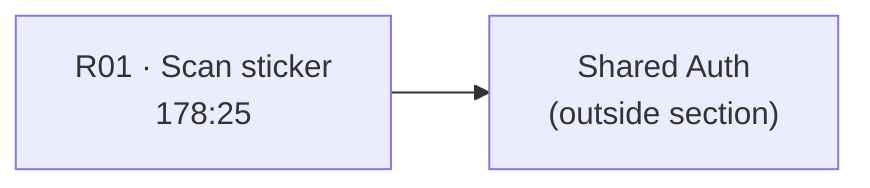
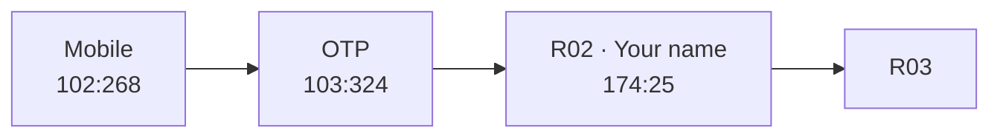
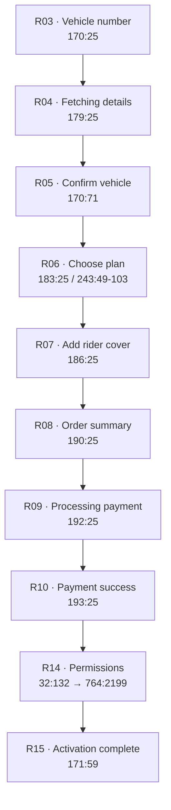
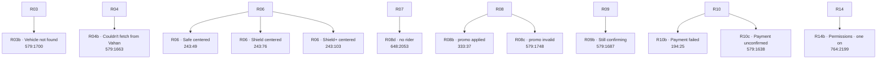

# Purchase Figma Audit

**Date:** 2026-06-17  
**Source of truth:** Figma · [Autolokate · Consumer App](https://www.figma.com/design/FtHCUnE0HH586PtG5yJyG0/Autolokate-%C2%B7-Consumer-App)  
**Section:** `167:434` · **Consumer · QR Activation + Purchase · ✅ READY FOR DEV**  
**Scope:** Audit only — no routes, no UI implementation

---

## Entry context (product, not Figma)

Shared Auth is complete separately. Current app entry:

```
Mobile → OTP → Name (A3 · Figma 174:25) → Purchase Flow
```

Figma section `167:434` still contains **R01 · Scan sticker** (pre-app QR entry) and **R02 · Your name** (now owned by Shared Auth). Both are documented below with boundary notes.

---

## Section inventory summary

| Metric | Count |
|--------|------:|
| Top-level frames in section | **24** |
| Happy-path steps (post-auth) | **12** |
| Variant / error / empty frames | **12** |
| Bottom sheets | **0** |
| Modals | **0** |
| Separate plan-detail screen | **0** |

All frame names, node IDs, and copy below are extracted directly from Figma MCP (`get_figma_data`, fileKey `FtHCUnE0HH586PtG5yJyG0`).

---

## Complete route graph

### Pre-app (Figma only — QR entry mechanism)



### Shared Auth boundary (implemented separately)



> **Note:** `174:25` appears in section `167:434` as **R02 · Your name** but is implemented in Shared Auth (`A3VehicleOwnerScreen`), not Purchase.

### Purchase happy path (post-auth entry = R03)



### Branch / error graph



### Figma canvas order (left → right in section)

This is the authoritative sequence of frames as laid out in section `167:434`:

| # | Node | Frame name |
|---|------|------------|
| 1 | `178:25` | R01 · Scan sticker |
| 2 | `174:25` | R02 · Your name |
| 3 | `170:25` | R03 · Vehicle number |
| 4 | `579:1700` | R03b · Vehicle not found |
| 5 | `179:25` | R04 · Fetching details |
| 6 | `579:1663` | R04b · Couldn't fetch from Vahan |
| 7 | `170:71` | R05 · Confirm vehicle |
| 8 | `183:25` | R06 · Choose plan · Secure centered |
| 9 | `243:49` | R06 · Choose plan · Safe centered |
| 10 | `243:76` | R06 · Choose plan · Shield centered |
| 11 | `243:103` | R06 · Choose plan · Shield+ centered |
| 12 | `186:25` | R07 · Add rider cover |
| 13 | `190:25` | R08 · Order summary |
| 14 | `333:37` | R08b · Order summary · promo applied |
| 15 | `579:1748` | R08c · Order summary · promo invalid |
| 16 | `648:2053` | R08d · Order summary · no rider |
| 17 | `192:25` | R09 · Processing payment |
| 18 | `579:1687` | R09b · Still confirming |
| 19 | `193:25` | R10 · Payment success |
| 20 | `194:25` | R10b · Payment failed |
| 21 | `579:1638` | R10c · Payment unconfirmed |
| 22 | `32:132` | R14 · Permissions |
| 23 | `764:2199` | R14b · Permissions · one on |
| 24 | `171:59` | R15 · Activation complete |

---

## Screen inventory

### R01 · Scan sticker — `178:25`

| Field | Value |
|-------|-------|
| **Purpose** | QR sticker camera entry (pre-onboarding) |
| **Title** | Scan your sticker |
| **Description** | Point your camera at the QR on your Autolokate sticker |
| **CTA** | None (camera viewport only) |
| **States** | Default only |
| **Components** | StatusBar, back arrow, `scan viewport` (361×300, dashed 2px `#1FA24A`, r28), `icon/scan-line` |
| **Overlays** | `ambientTint` radial green gradient |
| **Dependencies** | Device camera / QR decode (out of scope for static frames) |
| **Boundary** | Pre-app entry; not part of post-auth Purchase route |

---

### R02 · Your name — `174:25` ⚠️ Shared Auth

| Field | Value |
|-------|-------|
| **Purpose** | Capture owner display name |
| **Title** | What should we call you? |
| **Description** | So we can personalise your alerts and dashboard |
| **Input** | `AlInput` placeholder: Your name |
| **CTA** | Add my name (`AlButton/Primary·Disabled` in default frame) |
| **States** | Empty (disabled CTA) |
| **Dependencies** | Shared Auth session |
| **Boundary** | **Implemented in Shared Auth (A3)** — frame retained in Purchase section for journey context only |

---

### R03 · Vehicle number — `170:25`

| Field | Value |
|-------|-------|
| **Purpose** | Capture license plate; trigger Vahan fetch |
| **Title** | Add your vehicle |
| **Description** | Type your plate number, we'll pull the rest from Vahan |
| **Input** | `AlPlateInput` (62px, plate `#E4E4E8`, shadow) |
| **Preview chips** | Make & model · Year · Fuel · Insurance · PUC · Owner name (placeholder pills, `#1A1A1A`) |
| **Trust** | We only read your RC details · encrypted |
| **CTA** | Fetch from Vahan (`AlButton/Primary·Disabled`) |
| **ctaHelper** | Enter your number to continue |
| **States** | Default / empty plate |
| **Dependencies** | Post-auth session; Vahan API |
| **Purchase entry** | **First Purchase screen after Shared Auth** |

---

### R03b · Vehicle not found — `579:1700`

| Field | Value |
|-------|-------|
| **Purpose** | Plate not found in Vahan |
| **Title / Description** | Same as R03 |
| **Error** | We couldn't find that number, check and try again (`plate error helper`, Body style, `#F5A623`) |
| **Input error** | `AlPlateInput` 2px border `#F5A623` |
| **CTA** | Fetch from Vahan (`AlButton/Primary` enabled) |
| **States** | Error |

---

### R04 · Fetching details — `179:25`

| Field | Value |
|-------|-------|
| **Purpose** | Vahan fetch in progress |
| **Title** | Fetching your vehicle details (Display 36/44, centered) |
| **Description** | Reading your RC from Vahan, one moment |
| **Loader** | `spinner` ellipse 60×60 `#1FA24A` |
| **CTA** | None |
| **Back** | None |
| **States** | Loading |

---

### R04b · Couldn't fetch from Vahan — `579:1663`

| Field | Value |
|-------|-------|
| **Purpose** | Vahan network / API failure |
| **Title** | We couldn't fetch your details |
| **Description** | Your number is saved. Check your connection and try again |
| **CTA** | Try again |
| **Hotspot** | Enter manually (R04b) — prototype only, no separate frame in section |
| **States** | Error / retry |

---

### R05 · Confirm vehicle — `170:71`

| Field | Value |
|-------|-------|
| **Purpose** | Confirm Vahan RC data |
| **Title** | Confirm your vehicle |
| **Description** | We fetched these details from Vahan. Tap to confirm |
| **RC card** | `RC card` frame — `#1A1A1A`, 1px `#4A4A4A`, r16 |
| **Card header** | RC badge · Registration Certificate · Verified chip (`icon/circle-check`) |
| **Plate** | MH 12 AB 3456 (29px bold) |
| **Fields (`AlField`)** | Owner · Class · Maker · Model · Fuel · Colour · Registered · Valid till |
| **CTA** | Looks right |
| **States** | Success / filled |

---

### R06 · Choose plan — `183:25` · `243:49` · `243:76` · `243:103`

| Field | Value |
|-------|-------|
| **Purpose** | Plan selection via horizontal carousel |
| **Title** | Choose your plan |
| **Description** | From daily essentials to full crash protection |
| **Carousel hint** | ‹ Tap a card to compare · 4 plans › |
| **Plans (`AlPlanCardW`)** | Safe ₹99/yr · Secure ₹999/yr (MOST POPULAR) · Shield ₹1,999/yr · Shield+ ₹2,999/yr |
| **Selection** | `selectionRing` 2px `#1FA24A` + shadow `0 0 18px rgba(31,163,74,0.28)` on selected card |
| **CTA (per variant)** | Choose Safe / Choose Secure / Choose Shield / Choose Shield+ |
| **Carousel** | Horizontal scroll, 270×340 cards, 14px gap, overflow-x |
| **States** | Safe centered · Secure centered · Shield centered · Shield+ centered |
| **Note** | **No separate plan-details screen exists in this section** — comparison happens in-carousel |

---

### R07 · Add rider cover — `186:25`

| Field | Value |
|-------|-------|
| **Purpose** | Optional rider add-on selection |
| **Title** | Add rider cover? |
| **Description** | Cover whoever rides with you. Same ₹1L cover, bundled at a discount |
| **Options** | 1 rider (5% OFF · ₹949/yr, strikethrough ₹999) · 2 riders (10% OFF · ₹1,798/yr, strikethrough ₹1,998) |
| **Skip** | Skip, I'll ride solo (centered link) |
| **CTA** | Add 1 rider · ₹949 (updates with selection) |
| **States** | 1 rider selected (2px green border) · 2 riders unselected (1px `#4A4A4A`) |

---

### R08 · Order summary — `190:25`

| Field | Value |
|-------|-------|
| **Purpose** | Checkout review before payment gateway |
| **Title** | Review & pay |
| **Description** | Check your order, then pay securely |
| **Promo field** | Have a promo code? + Apply link |
| **Summary rows** | Secure plan ₹999/yr · Rider cover × 1 +₹949 · Total ₹1,948 |
| **GST note** | Inclusive of 18% GST (₹297) |
| **Gateway note** | Pay securely by UPI, card or netbanking on the next screen |
| **CTA** | Pay ₹1,948 |
| **States** | Default (with rider) |

---

### R08b · Order summary · promo applied — `333:37`

| Field | Value |
|-------|-------|
| **States** | Promo applied |
| **Promo** | FRIEND50 chip + Remove link |
| **Summary** | Promo · FRIEND50 −₹100 |
| **Total** | ₹1,848 |
| **CTA** | Pay ₹1,848 |

---

### R08c · Order summary · promo invalid — `579:1748`

| Field | Value |
|-------|-------|
| **States** | Promo error |
| **Input** | FREIND50 (typo in Figma sample) + Apply |
| **Error** | That code isn't valid, check and try again |
| **CTA** | Pay ₹1,948 |

---

### R08d · Order summary · no rider — `648:2053`

| Field | Value |
|-------|-------|
| **States** | Skipped rider cover (from R07 skip) |
| **Summary** | Secure plan ₹999/yr only |
| **Total** | ₹999 · GST ₹152 |
| **CTA** | Pay ₹999 |
| **Note** | No promo field in this variant |

---

### R09 · Processing payment — `192:25`

| Field | Value |
|-------|-------|
| **Purpose** | Payment gateway in progress |
| **Title** | Processing your payment (Display, centered) |
| **Description** | Securing your payment. You haven't been charged yet |
| **Loader** | `spinner` 60×60 `#1FA24A` |
| **CTA** | None |
| **States** | Loading |

---

### R09b · Still confirming — `579:1687`

| Field | Value |
|-------|-------|
| **Purpose** | Payment confirmation timeout |
| **Title** | Still confirming your payment |
| **Description** | This is taking longer than usual. Your payment is safe, please don't pay again |
| **Loader** | `spinner` |
| **Hotspot** | Check status (R09b) |
| **States** | Extended loading |

---

### R10 · Payment success — `193:25`

| Field | Value |
|-------|-------|
| **Purpose** | Payment confirmed |
| **Title** | Payment successful (Display, centered) |
| **Description** | ₹1,848 paid · your Secure plan is now active |
| **Hero** | `halo` SVG 240×240 + green blur |
| **CTA** | Continue |
| **States** | Success |

---

### R10b · Payment failed — `194:25`

| Field | Value |
|-------|-------|
| **Title** | Payment didn't go through |
| **Description** | You haven't been charged. Want to try again? |
| **CTA** | Retry payment |
| **States** | Error |

---

### R10c · Payment unconfirmed — `579:1638`

| Field | Value |
|-------|-------|
| **Title** | We couldn't confirm your payment |
| **Description** | If money was deducted, don't pay again. We'll verify and update you on WhatsApp within a few minutes |
| **CTA** | Check status |
| **States** | Ambiguous / pending |

---

### R14 · Permissions — `32:132`

| Field | Value |
|-------|-------|
| **Purpose** | OS permission priming (Location, Crash detection, Notifications) |
| **Title** | A few permissions |
| **Description** | Each has a clear job, and you can change them anytime |
| **Rows** | 3 permission cards with icon tile + title + recommended copy + off-consequence (`#F5A623`) + `AlToggle/Off` |
| **ctaHelper** | Turn on all permissions to continue |
| **CTA** | **None** (all toggles off) |
| **States** | All off |

---

### R14b · Permissions · one on — `764:2199`

| Field | Value |
|-------|-------|
| **States** | At least one toggle on (Notifications shown as `AlToggle/On`) |
| **CTA** | Allow & continue |
| **Note** | Off-consequence amber text hidden when toggle on |

---

### R15 · Activation complete — `171:59`

| Field | Value |
|-------|-------|
| **Purpose** | Purchase flow terminal screen |
| **Title** | Secure is active (Display, centered) |
| **Description** | MH 12 AB 3456 is now protected by Secure. Crash detection is live |
| **Chip** | `AlChip/Green` · Secure · active |
| **Hero** | `halo` 240×240 radial green |
| **CTA** | Go to home |
| **Back** | None |
| **States** | Success / complete |

---

## State inventory

| State type | Frames | Visual treatment |
|------------|--------|------------------|
| **Default / empty** | R01, R02, R03, R06 (unselected cards), R07, R08, R14 | Disabled CTAs where applicable |
| **Loading** | R04, R09, R09b | Centered Display title + 60px green spinner |
| **Error** | R03b, R04b, R08c, R10b | Amber `#F5A623` for plate/promo errors; copy-specific for payment/Vahan |
| **Success** | R05, R10, R15 | Verified chip / halo hero / active chip |
| **Ambiguous** | R10c | Pending payment copy, Check status CTA |
| **Selection** | R06 variants, R07 | Green selection ring / 2px green card border |
| **Inline promo** | R08, R08b, R08c | Promo field row (not a bottom sheet) |
| **Permissions gating** | R14 → R14b | ctaHelper until toggles on; then Allow & continue |

### Bottom sheets, modals, overlays

| Type | In section? | Details |
|------|-------------|---------|
| Bottom sheets | **No** | None named or structured as sheets |
| Modals | **No** | None in section |
| Overlays | **Yes** | `ambientTint` on every frame; `selectionRing` on R06; `halo` on R10/R15; prototype `hotspot` rects (transparent, for Figma prototype links) |
| Animations (static spec) | **Yes** | Carousel horizontal scroll (R06); spinner states (R04/R09/R09b); selection ring glow; halo blur (`filter: blur(40px)` on R10) |

---

## Component inventory (Figma components used)

| Figma component | ID | Used on screens |
|-----------------|-----|-----------------|
| StatusBar | `9:2` | All 24 frames |
| icon/arrow-left | `19:5` | All except R04, R09, R09b, R10, R10b, R10c, R15 |
| AlPlateInput | `74:23` | R03, R03b |
| AlField | `83:38` | R05 (RC card grid) |
| AlPlanCardW | `231:80` | R06 (×4 cards per variant) |
| AlButton/Primary | `6:2` | Most actionable screens |
| AlButton/Primary·Disabled | `53:17` | R02, R03 |
| AlInput | `173:27` | R02 only |
| AlToggle/Off | `81:21` | R14 |
| AlToggle/On | `81:19` | R14b |
| AlChip/Green | `83:21` | R15 |
| icon/scan-line | `17:28` | R01 |
| icon/car | `18:24` | R05 (watermark) |
| icon/circle-check | `181:28` | R05, R06, R07 |
| icon/shield-check | `18:11` | R03, R03b, R14 |
| icon/user · icon/users | `19:13` · `17:16` | R07 |
| icon/map-pin · icon/bell | `19:17` · `18:18` | R14, R14b |

### Screen-local compositions (not Figma components)

| Composition | Frames | Description |
|-------------|--------|-------------|
| `scan viewport` | R01 | Dashed camera frame |
| `RC card` | R05 | Vehicle confirmation block |
| `carousel` / `row` | R06 | Plan comparison scroller |
| `rider options` / `opt` | R07 | Rider tier selector cards |
| `promo field` | R08 variants | Inline promo input row |
| `summary` | R08 variants | Checkout line-item card |
| Permission row | R14, R14b | Icon + copy + toggle row |
| `halo` | R10, R15 | Success hero graphic |

---

## Promotion candidates (core UI vs composition)

| Candidate | Reuse count in section | Recommendation |
|-----------|------------------------|----------------|
| **Checkout summary card** (`summary` + line rows) | 4 frames (R08 family) | **Promote to composition** — `CheckoutSummaryCard` |
| **Payment / order line rows** | 4+ rows across R08 variants | **Part of summary composition** — not standalone core |
| **Plan comparison carousel** | 4 R06 variants, 4 plans each | **Promote to composition** — wraps existing `AlPlanCardW` |
| **AlPlanCardW** | R06 (already DS component `231:80`) | **Keep in `@autolokate/ui`** — do not duplicate |
| **Vehicle confirmation / RC card** | 1 screen (R05) | **Composition only** — promote when second flow reuses (e.g. B2B2C) |
| **Success hero (halo + Display)** | 2 screens (R10, R15) | **Composition candidate** — `SuccessHero` if pattern holds in Emergency |
| **Rider option card** | 1 screen (R07) | **Screen-local** — not promoted yet |
| **Permission row** | 2 screens (R14/R14b) | **Composition candidate** if Emergency permissions reuse |
| **Plan selectors (R07)** | 1 screen | **Not promoted** — unique to rider add-on |
| **Vahan preview chips** | 2 screens (R03/R03b) | **Composition candidate** — `VahanPreviewChips` |

**Do not promote to core UI unless reused ≥2 times across product areas.**

---

## Parity risks (Figma vs current codebase)

| ID | Risk | Figma | Current code | Severity |
|----|------|-------|--------------|----------|
| PR-1 | **Screen IDs mismatch** | R03–R15 naming | P01–P06 naming | P0 |
| PR-2 | **Missing vehicle flow** | R03 → R04 → R05 | P01 starts at plan selection | P0 |
| PR-3 | **Invented plan detail screen** | No P02 equivalent in section | `P02PlanDetailsScreen` exists | P0 |
| PR-4 | **Plan tier count** | 4 plans (Safe/Secure/Shield/Shield+) | Implementation may expose 2 | P0 |
| PR-5 | **Missing permissions + activation** | R14, R14b, R15 | Not in active Purchase routes | P0 |
| PR-6 | **Step progress bar** | Not present on Purchase frames | Code adds 6-step `AlStepProgress` | P1 |
| PR-7 | **R02 duplication** | R02 in section | A3 in Shared Auth | P1 (boundary) |
| PR-8 | **R01 QR scan** | In section | Removed from active graph | P1 (intentional — pre-app) |
| PR-9 | **Error color on plate** | `#F5A623` border + Body error | Must match auth validation pattern | P1 |
| PR-10 | **R14 gating** | No CTA until toggles on | Easy to implement wrong | P1 |
| PR-11 | **Dynamic CTA labels** | Choose {Plan}, Pay ₹{amount}, Add {n} rider · ₹{price} | Static labels break parity | P1 |
| PR-12 | **Carousel scroll position** | 4 centered variants with selectionRing | Single static carousel insufficient | P2 |
| PR-13 | **Hotspot-only actions** | Enter manually, Check status | Need real routes or inline handling | P2 |

---

## Implementation order

### Phase A — Vehicle activation (R03–R05 + Vahan states)

| Step | Figma | Deliverable |
|------|-------|-------------|
| A1 | `170:25` R03 | Plate entry + preview chips + disabled CTA gating |
| A2 | `579:1700` R03b | Plate not-found error (`#F5A623`) |
| A3 | `179:25` R04 | Vahan fetching loader (spinner + Display) |
| A4 | `579:1663` R04b | Vahan failure + Try again (+ manual entry TBD) |
| A5 | `170:71` R05 | RC confirmation card + Looks right |

**Exit criteria:** User can enter plate → fetch → confirm vehicle before plan selection.

---

### Phase B — Plan, rider, checkout (R06–R08)

| Step | Figma | Deliverable |
|------|-------|-------------|
| B1 | `183:25` + `243:49-103` R06 | 4-plan carousel, selection ring, dynamic Choose {plan} CTA |
| B2 | `186:25` R07 | Rider add-on cards + skip path |
| B3 | `190:25` R08 | Order summary default |
| B4 | `333:37` R08b | Promo applied state |
| B5 | `579:1748` R08c | Promo invalid state |
| B6 | `648:2053` R08d | No-rider checkout variant |

**Exit criteria:** User can select plan → optional rider → review order with promo handling.

---

### Phase C — Payment, permissions, completion (R09–R15)

| Step | Figma | Deliverable |
|------|-------|-------------|
| C1 | `192:25` R09 | Payment processing loader |
| C2 | `579:1687` R09b | Still confirming state |
| C3 | `193:25` R10 | Payment success hero |
| C4 | `194:25` R10b | Payment failed |
| C5 | `579:1638` R10c | Payment unconfirmed |
| C6 | `32:132` + `764:2199` R14/R14b | Permissions gating |
| C7 | `171:59` R15 | Activation complete → Go to home |

**Exit criteria:** Full Purchase flow from R03 through R15 with all Figma states.

---

## Screens explicitly NOT in this section

Do not implement from assumptions — these are **not** in `167:434`:

- Separate plan detail / P02 screen
- Bottom sheet promo entry
- QR scan screen (R01 is pre-app; separate from in-app onboarding)
- Mobile / OTP screens (Shared Auth section `91:268`)
- Emergency contact flows (separate Figma section)

---

## Figma links (section + frames)

| Resource | Link |
|----------|------|
| Section | [167:434](https://www.figma.com/design/FtHCUnE0HH586PtG5yJyG0/?node-id=167-434) |
| R01 Scan | [178:25](https://www.figma.com/design/FtHCUnE0HH586PtG5yJyG0/?node-id=178-25) |
| R02 Name | [174:25](https://www.figma.com/design/FtHCUnE0HH586PtG5yJyG0/?node-id=174-25) |
| R03 Vehicle | [170:25](https://www.figma.com/design/FtHCUnE0HH586PtG5yJyG0/?node-id=170-25) |
| R05 Confirm | [170:71](https://www.figma.com/design/FtHCUnE0HH586PtG5yJyG0/?node-id=170-71) |
| R06 Plan | [183:25](https://www.figma.com/design/FtHCUnE0HH586PtG5yJyG0/?node-id=183-25) |
| R07 Rider | [186:25](https://www.figma.com/design/FtHCUnE0HH586PtG5yJyG0/?node-id=186-25) |
| R08 Summary | [190:25](https://www.figma.com/design/FtHCUnE0HH586PtG5yJyG0/?node-id=190-25) |
| R10 Success | [193:25](https://www.figma.com/design/FtHCUnE0HH586PtG5yJyG0/?node-id=193-25) |
| R14 Permissions | [32:132](https://www.figma.com/design/FtHCUnE0HH586PtG5yJyG0/?node-id=32-132) |
| R15 Complete | [171:59](https://www.figma.com/design/FtHCUnE0HH586PtG5yJyG0/?node-id=171-59) |

---

**Audit complete.** No routes modified. No UI implemented. All 24 frames in section `167:434` mapped with node IDs, copy, CTAs, states, and dependencies sourced from Figma.
