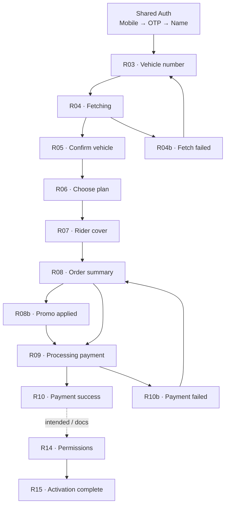
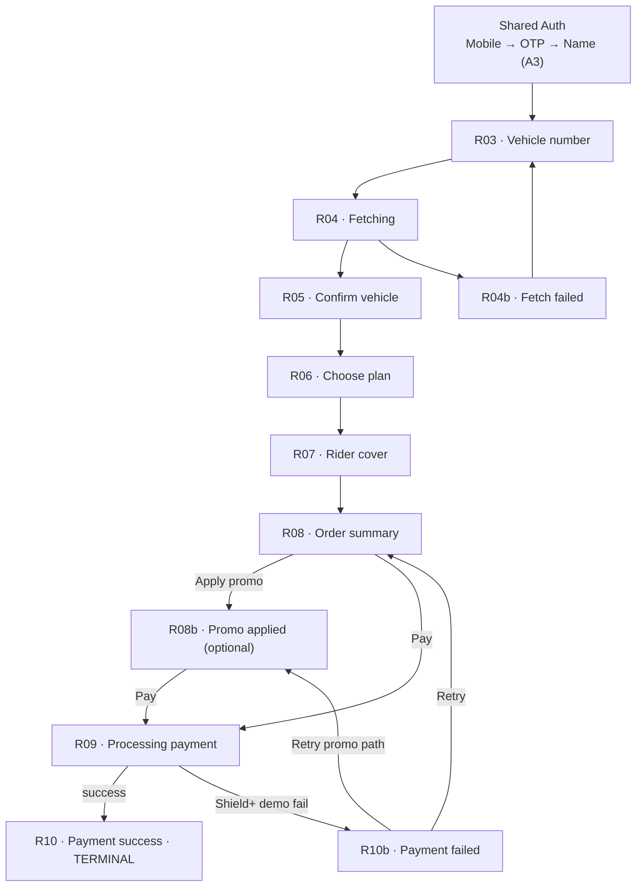

# Purchase Flow Correction Report

**Date:** 2026-06-18  
**Scope:** Align purchase journey with product spec — terminal at **R10 Payment Success**  
**Method:** Route removal · session trim · flow config update · dev preview regroup

---

## Summary

The purchase flow now **ends at R10 Payment Success**. R14 (Permissions), R14b, and R15 (Activation Complete) are **removed from purchase routing** but **retained in the repository** for archived dev preview only.

R01 Scan Sticker remains a **pre-auth marketing frame** — not part of the onboarding runtime journey (existing redirects preserved).

---

## Old graph



**Problems with old graph:**
- R14/R15 routes existed but **redirected to R10** (never rendered)
- Flow config listed **R01 QR scan + legacy P01–P06** as active purchase steps
- Session tracked `permissions`, `permissionOutcome`, `activationComplete` — no longer product-relevant
- Documentation implied R10 → R14 → R15 happy path

---

## New graph



**Terminal:** R10 · Payment Success — **Continue does not navigate anywhere.**

**Not in runtime journey:**
- R01 · Scan sticker (`/journey/qr-scan` → auth mobile; `/journey/purchase/qr-scan` → R03)
- R14 · Permissions (archived dev preview only)
- R14b · Permissions one-on (archived dev preview only)
- R15 · Activation complete (archived dev preview only)

---

## Removed routes

| Route path | Previous behavior | Now |
|------------|-------------------|-----|
| `/journey/purchase/r14-permissions` | Redirect stub → R10 | **Removed** — 404 falls through to R03 index redirect |
| `/journey/purchase/r15-activation-complete` | Redirect stub → R10 | **Removed** |

### Removed from purchase path constants

- `purchaseJourneyPaths.r14Permissions`
- `purchaseJourneyPaths.r15ActivationComplete`

### Removed from session (`PurchaseCheckoutSession`)

- `permissions`
- `permissionOutcome`
- `activationComplete`
- `permissionsStepReached`

> R14/R15 **screen components**, permission types, and `DEFAULT_PURCHASE_PERMISSIONS` remain for archived dev preview.

---

## Remaining route inventory

### Active purchase journey (`/journey/purchase/*`)

| Frame | Path | Reachable | Notes |
|-------|------|-----------|-------|
| Index | `/journey/purchase` | ✅ | Redirects → `r03-vehicle` |
| R03 | `r03-vehicle` | ✅ | Entry after Shared Auth |
| R04 | `r04-fetching` | ✅ | Transient loader |
| R04b | `r04b-fetch-failed` | ✅ | Branch · retry → R03 |
| R05 | `r05-confirm` | ✅ | |
| R06 | `r06-choose-plan` | ✅ | |
| R07 | `r07-rider-cover` | ✅ | |
| R08 | `r08-order-summary` | ✅ | |
| R08b | `r08b-promo-applied` | ✅ | Optional branch |
| R09 | `r09-processing-payment` | ✅ | Transient · 3s demo timer |
| R10 | `r10-payment-success` | ✅ | **Terminal success** |
| R10b | `r10b-payment-failed` | ✅ | Branch · retry → R08/R08b |
| `*` fallback | any unknown | ✅ | Redirects → `r03-vehicle` |

### Pre-auth redirects (not in journey)

| Path | Redirect |
|------|----------|
| `/journey/qr-scan` | → `/journey/auth/mobile` |
| `/journey/purchase/qr-scan` | → `/journey/purchase/r03-vehicle` |

### Legacy orphan routes (dev / deep-link only)

| Path | Label |
|------|-------|
| `p01-plan-selection` | P01 · Plan Selection |
| `p02-plan-details` | P02 · Plan Details |
| `p03-rider-selection` | P03 · Rider Selection |
| `p04-checkout-summary` | P04 · Checkout Summary |
| `p05-payment-processing` | P05 · Payment Processing |
| `p06-payment-success` | P06 · Payment Success |

### Archived screens (dev preview only · `?dev=1`)

| Dev ID | Component | Group |
|--------|-----------|-------|
| `r14` | R14PermissionsScreen | Purchase · Archived |
| `r14b` | R14PermissionsScreen (all on) | Purchase · Archived |
| `r15` | R15ActivationCompleteScreen | Purchase · Archived |
| `qr-scan` | QrScanScreen (R01) | Shared · pre-auth preview |

---

## Flow config changes

### `flows.config.ts` — purchase flow steps (before → after)

| Before | After |
|--------|-------|
| `purchase.qr-scan` | *(removed)* |
| `purchase.plan-select` (P01) | `purchase.vehicle-number` (R03) |
| `purchase.plan-details` (P02) | `purchase.fetching-vehicle` (R04) |
| `purchase.rider-select` (P03) | `purchase.confirm-vehicle` (R05) |
| `purchase.checkout-summary` (P04) | `purchase.choose-plan` (R06) |
| `purchase.payment-processing` (P05) | `purchase.rider-cover` (R07) |
| `purchase.payment-success` (P06) | `purchase.order-summary` (R08) |
| — | `purchase.processing-payment` (R09) |
| — | `purchase.payment-success` (R10 terminal) |

Shared pipeline unchanged: `shared.mobile` → `shared.otp` → `shared.account` (A3 Name).

### `purchaseStepPathSequence`

Unchanged terminus — already ended at R10:

```
r03-vehicle → r04-fetching → r05-confirm → r06-choose-plan →
r07-rider-cover → r08-order-summary → r09-processing-payment →
r10-payment-success
```

Branch paths (R04b, R08b, R10b) remain outside linear sequence helpers.

---

## Files modified

| File | Change |
|------|--------|
| `journey/routes/PurchaseRoutes.tsx` | Removed R14/R15 routes; trimmed session patches; R10 terminal (no `onContinue`) |
| `journey/purchase/purchase-routing.ts` | Removed r14/r15 path constants |
| `journey/progress/purchase-route-progress.ts` | Removed r14/r15 progress entries |
| `features/qr-purchase/types-checkout.ts` | Removed permission/activation session fields |
| `types/flow.ts` | Added R03–R10 step IDs; deprecated legacy IDs |
| `flow/registry/config/flows.config.ts` | Updated purchase step sequence |
| `flow/registry/config/steps.config.ts` | Added R03–R10 step definitions |
| `features/qr-purchase/types.ts` | Updated `PurchaseStepId` union |
| `router/routes.schema.ts` | Added R03–R10 journey route catalog |
| `journey/routes/JourneyRoutes.tsx` | Clarified R01 pre-auth redirect comment |
| `dev/ScreenDevApp.tsx` | Moved R14/R15 to Archived group; R10 labeled terminal |

## Files retained (unchanged components)

| Path | Purpose |
|------|---------|
| `features/qr-purchase/screens/r14-permissions/` | Archived dev preview |
| `features/qr-purchase/screens/r15-activation-complete/` | Archived dev preview |
| `features/qr-purchase/data/purchase-permissions.ts` | R14 screen data |
| `features/qr-purchase/screens/index.ts` | Still exports R14/R15 |

---

## Verification

```bash
pnpm --filter @autolokate/onboarding build
```

**Result:** ✅ Pass

### Manual checklist

- [x] R10 `onContinue` does not navigate to R14
- [x] No `/journey/purchase/r14-*` or `r15-*` routes registered
- [x] Session no longer writes permission/activation fields on Pay or R05 reset
- [x] Flow registry builds with R03–R10 steps (no `purchase.qr-scan` in active flow)
- [x] R01 QR scan not in runtime journey (redirect only)
- [x] R14/R15 previewable in dev under **Purchase · Archived**

---

**Correction complete.** Purchase journey terminates at R10 Payment Success.
