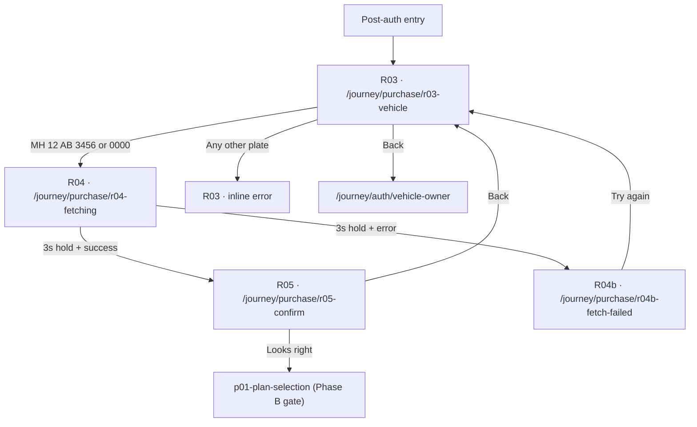
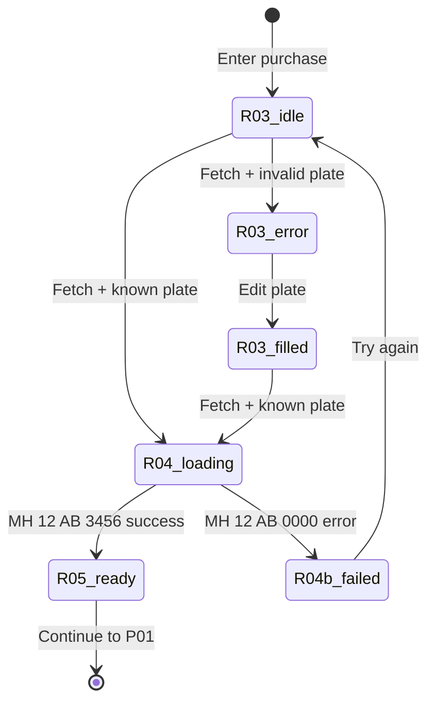

# Purchase Journey Wiring Report

**Date:** 2026-06-17  
**Scope:** R03–R05 vehicle activation journey (Phase A)  
**Verdict:** **FLOW COMPLETE**

---

## Issues fixed

| Issue | Root cause | Fix |
|-------|------------|-----|
| R04 stops indefinitely | `fetchStarted` ref blocked React Strict Mode second effect run | Removed ref; rely on `cancelled` flag only |
| Unknown plates reached R04 | Fetch triggered before plate classification | Validate on R03; invalid stays inline |
| R04 hold too short | 1600ms delay | **3000ms** minimum on R04 (`VAHAN_FETCH_HOLD_MS`) |
| R04b Retry → R04 | Wrong retry target | Retry navigates to **R03** |

---

## Route graph



---

## State graph



### Session fields (`JourneySession.vehicle`)

| Field | Values |
|-------|--------|
| `plate` | Normalized plate string |
| `fetchStatus` | `idle` · `fetching` · `success` · `not-found` · `error` |
| `fields` | RC data (success only) |
| `confirmed` | `true` after R05 CTA |

---

## Plate rules (demo Vahan)

| Plate | Intent | R03 | R04 (3s) | Destination |
|-------|--------|-----|----------|-------------|
| `MH 12 AB 3456` | `success` | Navigate | Hold | **R05 Confirm** |
| `MH 12 AB 0000` | `fetch-error` | Navigate | Hold | **R04b Fetch failed** |
| Any other (≥8 chars) | `invalid` | **Inline error** | Never reached | Stay on **R03** |

Error copy (R03): *We couldn't find that number, check and try again*

---

## Success path

```
R03 Vehicle
  → User enters MH 12 AB 3456
  → CTA: Fetch from Vahan
  → R04 Fetching (3 seconds, spinner)
  → R05 Confirm Vehicle
  → CTA: Looks right
  → p01-plan-selection (Phase B — not implemented)
```

**URLs:**
```
/journey/purchase/r03-vehicle
→ /journey/purchase/r04-fetching
→ /journey/purchase/r05-confirm
```

---

## Failure path (fetch error)

```
R03 Vehicle
  → User enters MH 12 AB 0000
  → CTA: Fetch from Vahan
  → R04 Fetching (3 seconds)
  → R04b Fetch Failed
  → CTA: Try again
  → R03 Vehicle (fetchStatus reset to idle)
```

**URLs:**
```
/journey/purchase/r03-vehicle
→ /journey/purchase/r04-fetching
→ /journey/purchase/r04b-fetch-failed
→ /journey/purchase/r03-vehicle
```

---

## Retry path

| Step | Screen | Action | Next |
|------|--------|--------|------|
| 1 | R04b | Tap **Try again** | R03 |
| 2 | R03 | Plate preserved; user may edit | — |
| 3 | R03 | Tap **Fetch from Vahan** | R04 (if known plate) |

Retry does **not** return to R04 directly — user must re-submit from R03.

---

## Screen audit

### R03 · Vehicle number

| Check | Behavior | Status |
|-------|----------|--------|
| CTA disabled when empty | `isPlateEntryReady` (≥8 chars) | ✅ |
| CTA **Fetch from Vahan** | Classifies plate before navigate | ✅ |
| Invalid plate | Inline amber error, no navigation | ✅ |
| Known plates | Navigate to R04 | ✅ |
| Back | → `/journey/auth/vehicle-owner` | ✅ |
| Progress bar | Hidden (Figma) | ✅ |

### R04 · Fetching

| Check | Behavior | Status |
|-------|----------|--------|
| Auto navigation | After **3s** + fetch result | ✅ |
| Never indefinite | Strict Mode safe (no fetchStarted guard) | ✅ |
| No CTA / no back | Transient loader only | ✅ |
| Invalid plate guard | Redirect to R03 if reached without intent | ✅ |
| Success exit | → R05 replace | ✅ |
| Error exit | → R04b replace | ✅ |

### R05 · Confirm vehicle

| Check | Behavior | Status |
|-------|----------|--------|
| Guard | Redirect to R03 if no success data | ✅ |
| CTA **Looks right** | → p01-plan-selection, `confirmed: true` | ✅ |
| Back | → R03 | ✅ |
| RC card | `AlVehicleRcCard` + demo fields | ✅ |

### R04b · Fetch failed

| Check | Behavior | Status |
|-------|----------|--------|
| CTA **Try again** | → R03, `fetchStatus: idle` | ✅ |
| No back button | Figma centered error | ✅ |

---

## Implementation files

| File | Role |
|------|------|
| `features/qr-purchase/data/vahan-demo.ts` | Plate intent, 3s hold, mock Vahan |
| `journey/routes/PurchaseRoutes.tsx` | Route orchestration R03–R05 |
| `journey/purchase/purchase-routing.ts` | Absolute paths |

---

## Manual test checklist

| # | Steps | Expected |
|---|-------|----------|
| 1 | R03 → `MH 12 AB 3456` → Fetch | R04 ~3s → R05 |
| 2 | R03 → `MH 12 AB 0000` → Fetch | R04 ~3s → R04b |
| 3 | R03 → `DL 01 CA 9999` → Fetch | Error on R03, no R04 |
| 4 | R04b → Try again | R03 with plate preserved |
| 5 | R05 → Back | R03 |
| 6 | R05 → Looks right | p01-plan-selection |

---

## Remaining (out of R03–R05 scope)

| Item | Notes |
|------|-------|
| Real Vahan API | Mock `fetchVahanDetails` |
| R04b Enter manually | Figma hotspot only — no route |
| P01+ screens | Phase B — gated after R05 |
| Offline on R04 | Routes to R04b via `navigator.onLine` |

---

## Verdict

**FLOW COMPLETE**

R03–R05 journey transitions are wired: transient R04 (3s), success → R05, fetch failure → R04b, invalid → inline R03 error, retry → R03. Safe to proceed to R06 planning after product QA sign-off on manual checklist above.
