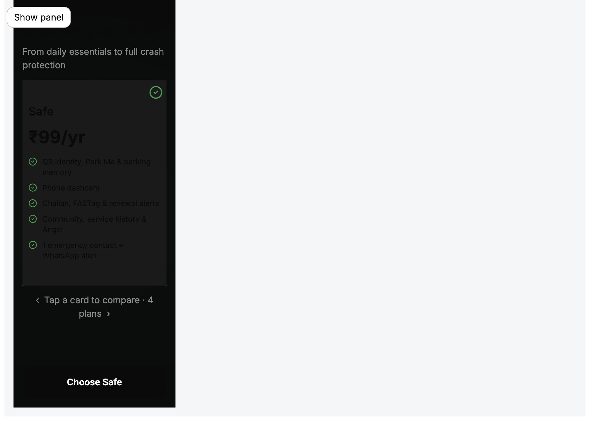
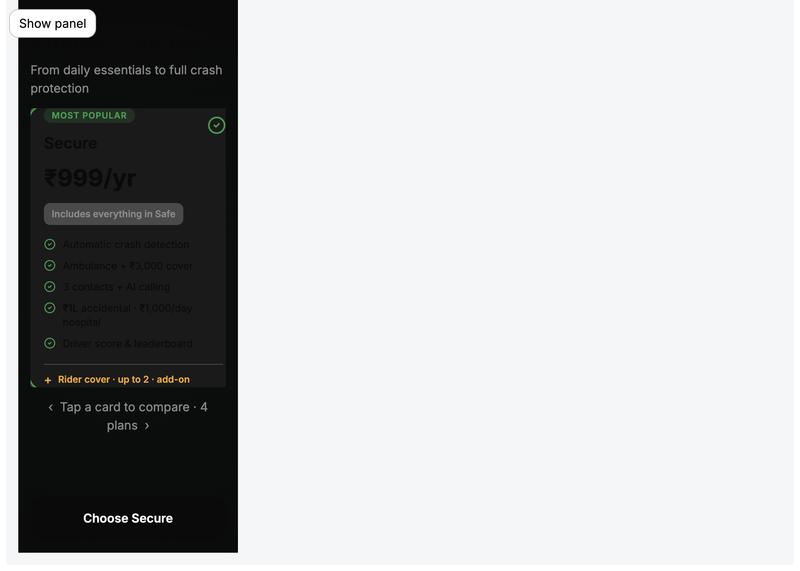
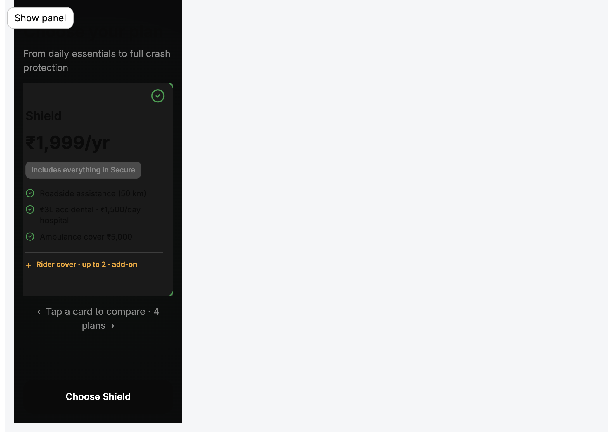
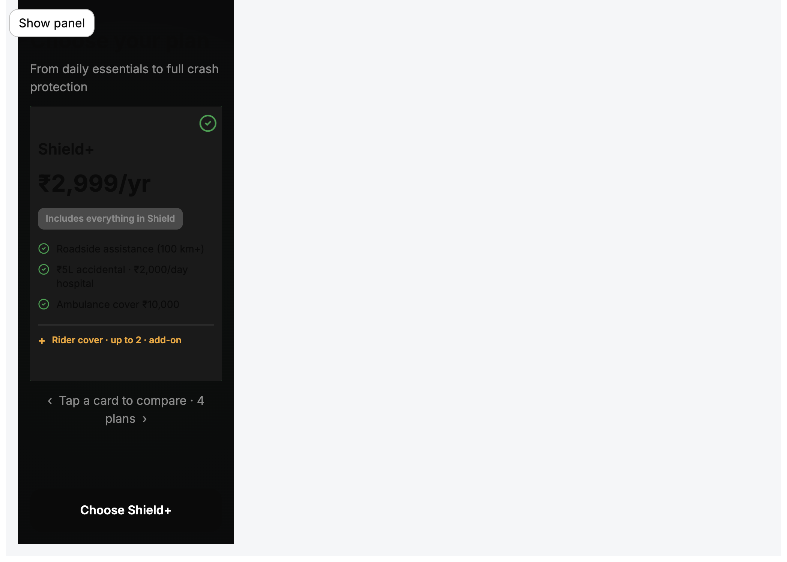

# R06 · Choose Plan — Motion & Layout Report

**Audit date:** 2026-06-18  
**Viewport:** 390px dark · dev preview `http://127.0.0.1:5175/?dev=1`  
**Scope:** Layout hierarchy, carousel interaction, motion system — no routing, business logic, or pricing/content changes

---

## Summary

| Area | Before | After |
|------|--------|-------|
| Feature rows | Ellipsis + 13px compressed line-height | Full text, 13/18 line-height, wrap allowed |
| Card hierarchy | flex-grow features + overflow clip | Figma column: badge → name → price → includes → features → addon |
| Selected card | Static | scale **1.03**, glow fade-in **220ms** |
| Neighbors | Full opacity | opacity **0.75**, scale **0.96** |
| Check icon | Instant | Pop **0→1**, **180ms** |
| Carousel scroll | Instant jump | **Smooth** one-step (±1) or smooth center (±2+) |
| CTA | Static label swap | Label fade-in + pulse on plan change |

---

## Layout fixes

### Feature visibility restored

- Removed `white-space: nowrap`, `text-overflow: ellipsis`, features list `overflow: hidden`
- Restored readable line-heights: name **24px**, price **36px**, features **18px**, includes **16px**
- Figma content hierarchy preserved: **14px** section gap, **9px** feature gap, **18×20** card padding
- Card remains fixed **270×366** selected / **270×340** unselected; content centered as a block (`justify-content: center`) per Figma `layout_JG9P27`

### Verified — Secure features (no truncation)

| Feature | Truncated |
|---------|-----------|
| Automatic crash detection | No |
| Ambulance + ₹3,000 cover | No |
| 3 contacts + AI calling | No |
| ₹1L accidental · ₹1,000/day hospital | No |
| Driver score & leaderboard | No |

Long strings wrap naturally (e.g. Shield+ hospital line) instead of ellipsizing.

---

## Motion system

### Tokens

```css
--ob-plan-motion-ease: cubic-bezier(0.22, 1, 0.36, 1);
--ob-plan-motion-select: 220ms;
--ob-plan-motion-check: 180ms;
```

### Selected card

| Property | Value |
|----------|-------|
| Scale | **1.03** |
| Glow | `::after` ring opacity **0 → 1** |
| Duration | **220ms** |
| Easing | `cubic-bezier(0.22, 1, 0.36, 1)` |

### Check icon

| Property | Value |
|----------|-------|
| Animation | scale **0 → 1**, opacity **0 → 1** |
| Duration | **180ms** |
| Easing | `cubic-bezier(0.22, 1, 0.36, 1)` |

### Neighbor cards

| Property | Value |
|----------|-------|
| Opacity | **0.75** |
| Scale | **0.96** |
| Transition | **220ms** shared ease |

### Carousel

| Behavior | Implementation |
|----------|----------------|
| Snap one card | `scroll-snap-type: x mandatory` + `scroll-snap-stop: always` |
| Adjacent select | `scrollBy(±284px, smooth)` — one card step |
| Distant select | `scrollTo(center, smooth)` — no instant full-track jump |
| Initial mount | `behavior: auto` (no flash) |
| Selected centers | `offsetLeft − (clientWidth − slideWidth) / 2` |

### CTA

| Behavior | Implementation |
|----------|----------------|
| Label transition | `ob-plan-cta-label-in` — opacity + 4px translateY, **220ms** |
| Pulse on plan change | `ob-plan-cta-pulse` — scale to **1.02**, **320ms** |
| Trigger | `footerCtaKey={selectedPlanId}` remounts CTA |

All motion respects `prefers-reduced-motion: reduce`.

---

## Screenshots — all four selected states

### Safe



- Full 5-feature list visible
- CTA: **Choose Safe**
- Centered content block in 366px selected card

### Secure



- MOST POPULAR badge top-left
- All 5 features + includes pill + rider addon visible
- CTA: **Choose Secure**
- No ellipsis on `₹1L accidental · ₹1,000/day hospital`

### Shield



- 3 features + includes + rider addon fully visible
- Neighbor Secure card partially visible (opacity 0.75, scale 0.96)
- CTA: **Choose Shield**

### Shield+



- 3 features wrap where needed (hospital line)
- Intentional vertical balance per Figma center layout
- CTA: **Choose Shield+**

---

## Motion capture

Animated GIF export requires `ffmpeg` (not available in audit environment). Motion is implemented in CSS and can be recorded locally:

```bash
pnpm --filter @autolokate/onboarding dev --port 5175 --host 127.0.0.1
# Open ?dev=1 → R06 · Choose plan → tap adjacent cards to observe:
#   · 220ms scale + glow on select
#   · 180ms check pop
#   · smooth one-step carousel scroll
#   · CTA pulse + label fade
```

Screenshot sequence above documents static end-states for all four plans.

---

## Files changed

| File | Changes |
|------|---------|
| `plan-carousel.css` | Layout hierarchy, motion keyframes, neighbor opacity/scale |
| `PlanCarousel.tsx` | One-step smooth scroll, initial mount handling |
| `auth-step-shell.css` | CTA pulse + label transition |
| `AuthStepShell.tsx` | Optional `footerCtaKey` for CTA remount |
| `R06ChoosePlanScreen.tsx` | Pass `footerCtaKey={selectedPlanId}` |

**Not modified:** routing, session, plan data, pricing copy

---

## Re-verify

```bash
pnpm --filter @autolokate/onboarding build
pnpm --filter @autolokate/onboarding dev --port 5175 --host 127.0.0.1
```

Dev preview: **R06 · Choose plan** → View state `safe | secure | shield | shield-plus` @ **390px** dark.

**Verdict:** Full feature visibility restored with Figma hierarchy; motion and carousel interaction pass implemented per spec.
