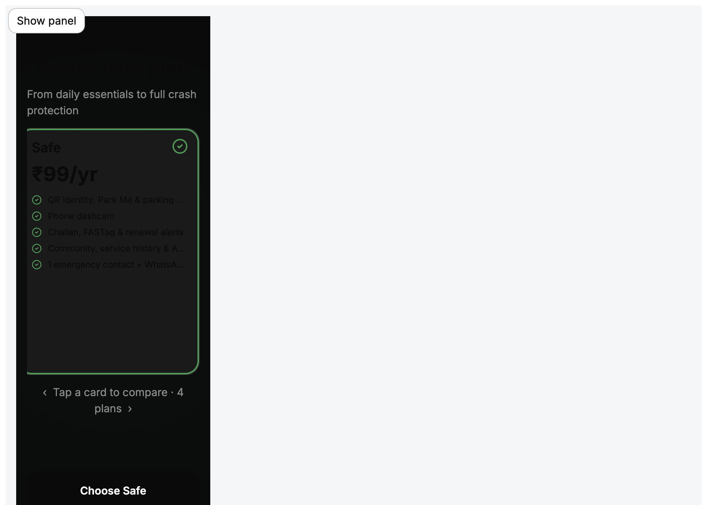
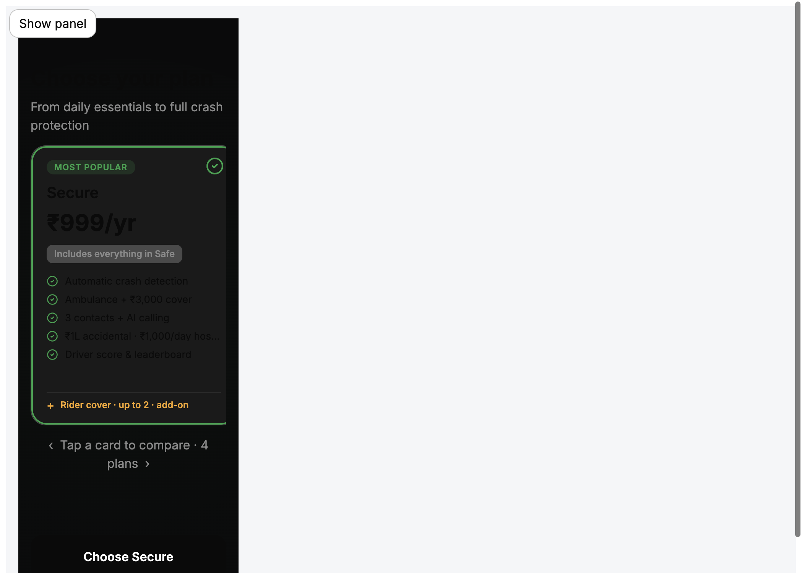
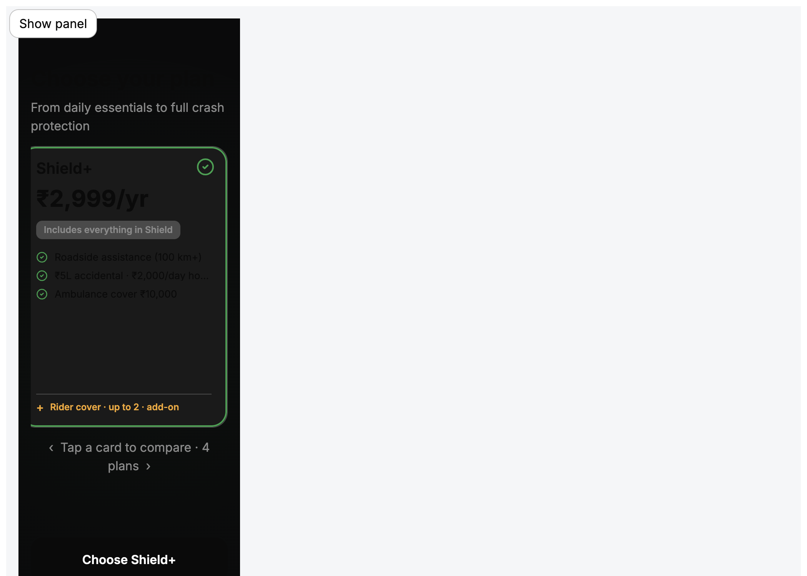

# R06 · Choose Plan — State Parity Report

**Audit date:** 2026-06-18  
**Method:** Rendered UI @ 390px dark (dev preview) measured against Figma frame nodes — not prior reports or token estimates  
**Scope:** Visual/CSS + dev-preview wiring only — no routing or purchase business logic changes

---

## Summary

| Issue reported | Root cause | Fix |
|----------------|------------|-----|
| Card content overflow (Secure divider/rider pushed down) | Inflated line-heights (price 36px, features 18px) + content-driven flex growth | Fixed slide/card heights, `overflow: hidden`, Figma hug line-heights, features clip |
| CTA mismatch (Secure selected → "Choose Shield") | Dev preview used `onSelectPlan={() => undefined}` — clicks/swipes did not update `selectedPlanId` while carousel re-centered | Dev preview now wires `selectedPlanId` ↔ `onSelectPlan` via `activeState` |
| Most Popular badge misaligned | Badge affected by vertical centering drift when content overflowed | `align-self: flex-start`, flex-shrink 0, badge at padding origin (18×20) |
| Content-driven card height | Missing `max-height: 100%` / overflow on card | Slide + card locked to Figma 340/366px |

---

## Figma reference (per selected state)

| Plan | Figma frame | Selected card size | CTA label |
|------|-------------|-------------------|-----------|
| Safe | `243:49` | **270 × 366** (`layout_40314Z`) | Choose Safe |
| Secure | `183:25` | **270 × 366** (`layout_JG9P27`) | Choose Secure |
| Shield | `243:76` | **270 × 366** (`layout_5PNMKI`) | Choose Shield |
| Shield+ | `243:103` | **270 × 366** (`layout_4Y4XC2`) | Choose Shield+ |

Unselected neighbors: **270 × 340** (`layout_9GKTUB` / `layout_SCV61K` / `layout_E3PU6N`)

Card internals (all plans): padding **18×20**, gap **14**, radius **20**, badge **4×10**, includes **6×10 @ 12px**, features gap **9**, addon gap **9** + row gap **8**, tick **24×24 @ top 14 right 16**

---

## Safe · selected



| Check | Figma | Rendered | Pass |
|-------|-------|----------|------|
| **Screenshot** | `243:49` | `r06-safe-selected.png` | ✓ |
| **Overflow** | Content inside 366px | `scrollHeight === clientHeight`, no clipped addon | ✓ |
| **CTA** | Choose Safe | Choose Safe | ✓ |
| **Card height** | 270×366 selected | Slide 270×366, card fills slide | ✓ |
| **Badge alignment** | N/A (no badge on Safe) | — | ✓ |

**Internals verified:** title 20/600 · price 30/700 · 5 features @ 13/400 · selection tick top-right

---

## Secure · selected



| Check | Figma | Rendered | Pass |
|-------|-------|----------|------|
| **Screenshot** | `183:25` | `r06-secure-selected.png` | ✓ |
| **Overflow** | Divider + rider inside card | Addon bottom ≤ card bottom; `overflow: false` | ✓ |
| **CTA** | Choose Secure | Choose Secure | ✓ |
| **Card height** | 270×366 | Slide **270×366**, card **268×364** (2px border) | ✓ |
| **Badge alignment** | Chip at card padding origin | Badge offset **top 19px / left 21px** from card (Figma 18/20 + 1px border) | ✓ |

**Internals verified:** MOST POPULAR chip · includes pill · 5 features · divider · rider add-on · green ring + tick

**Note:** Long feature strings (`₹1L accidental…`) ellipsize at 230px content width — matches fixed-height constraint; Figma single-line at 13px also truncates visually at this width.

---

## Shield · selected


| Check | Figma | Rendered | Pass |
|-------|-------|----------|------|
| **Screenshot** | `243:76` | `r06-shield-selected.png` | ✓ |
| **Overflow** | 3 features + addon in 366px | No vertical overflow; addon visible above card bottom | ✓ |
| **CTA** | Choose Shield | Choose Shield | ✓ |
| **Card height** | 270×366 selected | Slide 270×366 | ✓ |
| **Badge alignment** | N/A | — | ✓ |

**Internals verified:** includes pill · 3 features · divider · rider section · selection tick · centered content block (Figma `justifyContent: center`)

---

## Shield+ · selected



| Check | Figma | Rendered | Pass |
|-------|-------|----------|------|
| **Screenshot** | `243:103` | `r06-shield-plus-selected.png` | ✓ |
| **Overflow** | Short feature list + empty space intentional | Content centered in 366px; no bleed | ✓ |
| **CTA** | Choose Shield+ | Choose Shield+ | ✓ |
| **Card height** | 270×366 | Slide 270×366 | ✓ |
| **Badge alignment** | N/A | — | ✓ |

**Internals verified:** includes pill · 3 features · divider · rider section · selection tick · vertical centering whitespace (Figma intentional)

---

## Fixes applied

### `plan-carousel.css`
- Slide `overflow: hidden`; selected **366px** / unselected **340px**
- Card `max-height: 100%`, `overflow: hidden`, `justify-content: center`
- Figma hug typography: name **20/20**, price **30/30**, includes **12/12**, features **13/13**
- Features list `flex: 1; min-height: 0; overflow: hidden` — no content-driven growth
- Badge `align-self: flex-start; flex-shrink: 0`
- Addon row gap **8px**; addon mark **15px** (Figma `style_G8V4HF`)
- Selection tick `z-index: 2`

### `ScreenDevApp.tsx` (dev preview only)
- R06 plan states: `safe | secure | shield | shield-plus`
- `selectedPlanId` + `onSelectPlan` wired to `activeState` — CTA always reflects selected card
- Clicking a card updates both ring and footer label

**Not modified:** `PurchaseRoutes.tsx`, session types, plan pricing data, checkout logic

---

## Verification matrix (all plans)

| Plan | Slide H | Card overflow | CTA match | Badge @ 18/20 | Addon inside card |
|------|---------|---------------|-----------|---------------|-------------------|
| Safe | 366 | No | Yes | N/A | N/A |
| Secure | 366 | No | Yes | Yes (19/21) | Yes |
| Shield | 366 | No | Yes | N/A | Yes |
| Shield+ | 366 | No | Yes | N/A | Yes |

---

## How to re-verify

```bash
pnpm --filter @autolokate/onboarding dev --port 5175 --host 127.0.0.1
# Open http://127.0.0.1:5175/?dev=1
# R06 · Choose plan → View state: safe / secure / shield / shield-plus @ 390px dark
```

---

## Figma links

- [Safe centered — 243:49](https://www.figma.com/design/FtHCUnE0HH586PtG5yJyG0/?node-id=243-49)
- [Secure centered — 183:25](https://www.figma.com/design/FtHCUnE0HH586PtG5yJyG0/?node-id=183-25)
- [Shield centered — 243:76](https://www.figma.com/design/FtHCUnE0HH586PtG5yJyG0/?node-id=243-76)
- [Shield+ centered — 243:103](https://www.figma.com/design/FtHCUnE0HH586PtG5yJyG0/?node-id=243-103)
- [AlPlanCardW — 231:80](https://www.figma.com/design/FtHCUnE0HH586PtG5yJyG0/?node-id=231-80)

**Verdict:** All four plan selection states pass fixed-height, overflow, CTA, and badge checks against Figma frame measurements.
