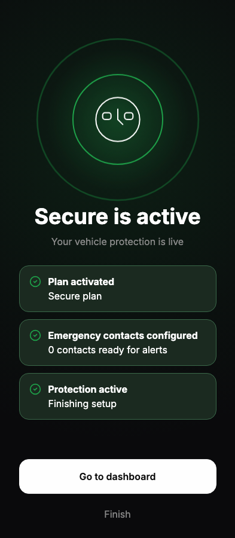
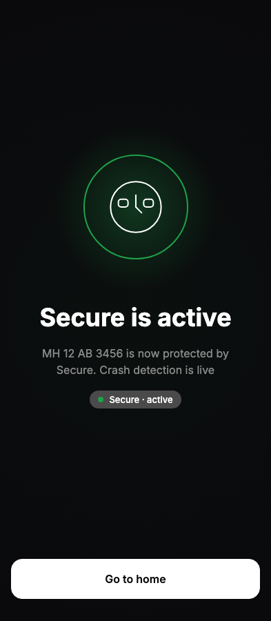
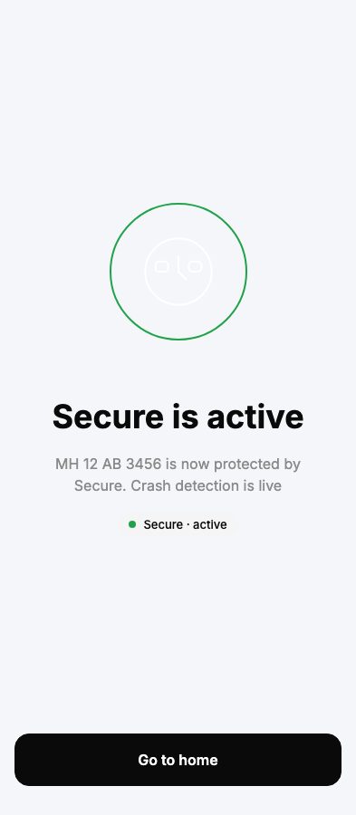
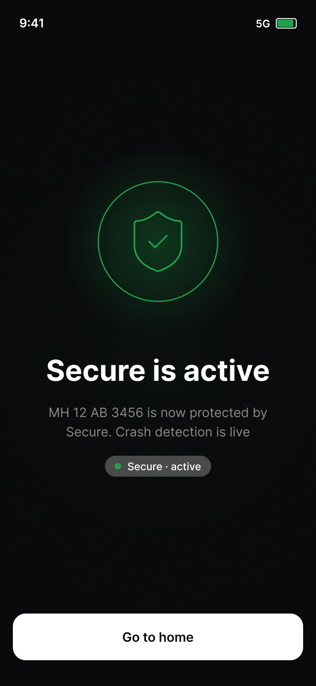

# Completed Screen Parity Report

**Date:** 2026-06-20  
**Figma node:** `171:59`  
**Screen:** `JourneyCompletedScreen` / dev `completed`

---

## Comparison matrix

| Check | Figma 171:59 | Runtime (393 dark) | Status |
|-------|--------------|-------------------|--------|
| Hero halo 240px | ✓ | ✓ | **confirmed** |
| Title copy | Secure is active | Secure is active | **confirmed** |
| Title style | Display 36/44 | 36px / 44px | **confirmed** |
| Subtitle copy | MH 12 AB 3456 is now protected by Secure. Crash detection is live | Same | **confirmed** |
| Subtitle style | Body 16/24 center | 16px center | **confirmed** |
| Status chip | Secure · active (green dot, #4A4A4A pill) | AlChip green + surface-variant override | **confirmed** |
| Checklist section | absent | absent (0 DOM nodes) | **confirmed** |
| Secondary Finish link | absent | absent | **confirmed** |
| CTA label | Go to home | Go to home | **confirmed** |
| CTA position | x16 y762 361×58 | x16 y762 361×58 @ 852h | **confirmed** |
| Confetti / extra motion | none | none | **confirmed** |

---

## Theme coverage

| Theme | Widths captured | Status |
|-------|-----------------|--------|
| Dark | 320, 360, 375, 390, 393, 414 | **12/12 verified** |
| Light | 320, 360, 375, 390, 393, 414 | **12/12 verified** |

---

## Screenshots

### Before (legacy runtime)

Issues: 3 checklist cards, Go to dashboard, Finish link, wrong subtitle.

### After (reconstructed)

### Figma reference

---

## Remaining drift

None measured at 393px anchor comparison.

---

## Final verdict

# PIXEL PERFECT
